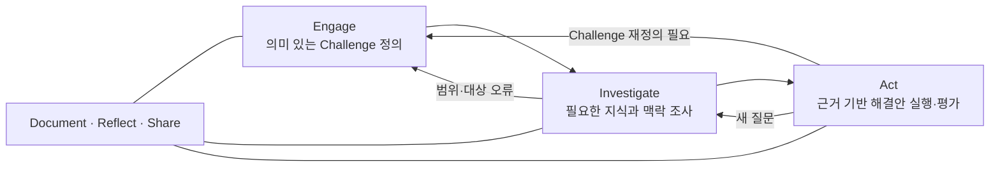

# CBL 러너 플레이북

> [!abstract] 이 플레이북의 목적
> 이 문서는 CBL을 설명하는 읽을거리가 아니라, 러너가 **지금 무엇을 하고, 무엇을 근거로 판단하며, 어떤 결론을 내야 하는지** 안내하는 실행 시스템이다. 시작할 때, 막혔을 때, 단계 전환 전, 멘토 체크인 전후에 반복해서 사용한다.

## 1. 60초 요약

Challenge Based Learning(CBL)은 실제 세계의 Challenge를 다루면서 배우는 반복적 프레임워크다.

- **Engage의 결론:** 우리가 소유감을 갖고 조사할 구체적이고 실행 가능한 Challenge
- **Investigate의 결론:** 증거로 지지되는 연구 결론, 남은 미지와 모순, 해결안이 만족해야 할 기준
- **Act의 결론:** 실제 시험 결과, 영향과 한계, 유지·수정·전환·중단 결정
- **전 과정의 결론:** 무엇을 배웠고, 어떻게 판단했으며, 어떤 증거가 그 학습을 보여 주는가

> [!warning] CBL의 가장 흔한 실패
> 문제를 충분히 이해하기 전에 앱·기능·기술을 고르고, 그것을 정당화할 자료만 찾는 것이다. `Investigate`가 끝나기 전의 해결안은 모두 **가설/보류 아이디어**로 취급한다.

## 2. 지금 어느 단계인가

아래에서 가장 먼저 `아니오`가 나오는 지점이 현재 해야 할 일이다.

### Engage 진단

- [ ] 팀이 공통 용어, 기대, 시간, 역할, 의사결정 규칙에 합의했다.
- [ ] Big Idea가 우리에게 왜 중요한지 각자가 설명할 수 있다.
- [ ] 해결안 이름 없이 Essential Question을 말할 수 있다.
- [ ] Challenge의 영향을 받는 주체와 맥락을 구체적으로 말할 수 있다.
- [ ] Challenge가 실제적이고 개방적이며 기간·권한 안에서 조사 가능하다.
- [ ] 지금 알고 있는 사실, 가설, 미지, 제약을 분리했다.

하나라도 핵심 항목이 비면 → [[02 Engage 실전 가이드]]

### Investigate 진단

- [ ] 해결안을 판단하는 데 필요한 Guiding Questions가 범주별로 있다.
- [ ] 각 질문에 담당자, 조사 방법, 출처, 완료 기준이 있다.
- [ ] 사용자·맥락·원인·기존 대안·이해관계자·제약을 여러 관점에서 조사했다.
- [ ] 증거와 해석, 인사이트와 가설을 분리했다.
- [ ] 반대 증거와 모순을 숨기지 않고 기록했다.
- [ ] 발견 목록을 넘어 Challenge에 대한 연구 결론을 작성했다.
- [ ] 결론에서 해결안 기준이 도출되며, 특정 아이디어에 맞춘 기준이 아니다.

하나라도 핵심 항목이 비면 → [[03 Investigate 실전 가이드]]

### Act 진단

- [ ] 여러 해결안 후보가 조사 결론과 연결되어 있다.
- [ ] 선택 기준과 결정 근거가 기록되어 있다.
- [ ] 가장 위험한 가정을 식별했다.
- [ ] 가정별로 가장 작고 저렴한 프로토타입·실험을 설계했다.
- [ ] 시험 전에 성공·실패·중단 기준과 측정 방법을 정했다.
- [ ] 실제 청중 또는 권한 있는 이해관계자의 반응·행동을 관찰했다.
- [ ] 결과를 근거로 유지·수정·전환·중단 중 하나를 결정했다.

하나라도 핵심 항목이 비면 → [[04 Act 실전 가이드]]

### 전 과정 진단

- [ ] 개인이 매일 또는 중요한 사건 후 학습을 기록한다.
- [ ] 팀이 결정, 근거, 이견, 피드백, 실험 결과를 기록한다.
- [ ] 멘토와 이해관계자 피드백을 명령이 아닌 증거로 분류한다.
- [ ] 현재 상태와 다음 행동을 팀원 모두 같은 언어로 설명할 수 있다.

비면 → [[05 기록·성찰·공유와 학습 증거]], [[06 팀 운영·멘토·이해관계자 협업]]

## 3. 전체 단계 게이트

| 단계 | 반드시 도출할 결론 | 최소 증거 | 다음 단계 통과 조건 |
|---|---|---|---|
| Engage | 누구의 어떤 맥락에서 무엇을 더 낫게 만들 Challenge인가 | 팀 관심, 초기 맥락 조사, 이해관계자·제약 지도 | 해결안 없이 설명 가능하고 조사 가능하며 팀이 소유함 |
| Investigate | Challenge의 원인·맥락·사용자·기존 대안에 대해 지금 무엇을 말할 수 있는가 | 복수 출처, 직접/간접 현장 근거, 모순·한계 | 핵심 질문이 답변·보류·미지로 정리되고 해결안 기준이 도출됨 |
| Act-개념 | 어떤 해결안이 왜 기준을 가장 잘 만족하는가 | 후보 비교, 위험 가정, 이해관계자 피드백 | 선택 근거가 조사 결론에 추적 가능함 |
| Act-실험 | 어떤 가정이 지지·기각·미결인가 | 사전 지표, 관찰/측정, 정성·정량 결과 | 결과에 따른 다음 결정이 명시됨 |
| Act-구현 | 실제 맥락에서 무엇이 얼마나 바뀌었는가 | 기준선·사후 데이터, 부작용, 한계 | 영향·한계·지속/수정/종료 계획이 있음 |
| Reflection | 나·팀·과제·영향에 관해 무엇을 배웠는가 | 저널, 결정 로그, 산출물, 피드백 | 주장마다 구체적 사건·증거가 있음 |

> [!tip] `Go / Iterate / Stop`의 뜻
> - **Go:** 핵심 불확실성이 다음 단계에서 더 잘 풀린다.
> - **Iterate:** 현재 단계의 증거·범위·합의가 부족하므로 보완한다.
> - **Stop:** 안전, 윤리, 권한, 시간, 가치 측면에서 이 경로를 계속할 이유가 없다. Stop도 학습에 근거한 정상 결정이다.

## 4. 파일 지도

### 개념과 전체 흐름

- [[01 CBL 핵심 원리와 전체 프로세스]] — CBL의 원리, 역할, 반복 구조, 다른 방법론과의 관계

### 단계별 실행

- [[02 Engage 실전 가이드]] — Big Idea에서 Challenge까지
- [[03 Investigate 실전 가이드]] — Guiding Questions에서 연구 결론까지
- [[04 Act 실전 가이드]] — 해결안에서 실제 실행·효과 평가까지

### 전 과정 운영

- [[05 기록·성찰·공유와 학습 증거]] — 저널, 로그, 포트폴리오, 회고
- [[06 팀 운영·멘토·이해관계자 협업]] — 팀 규칙, 코어타임, 갈등, 피드백, 파트너십
- [[07 CBL 실행 템플릿 모음]] — 바로 복사해 쓰는 워크시트

### Challenge 6와 근거

- [[08 Challenge 6 헬스케어 적용 가이드]] — 현재 단계 진단, 다음 리서치, 병원 협업·안전 경계
- [[09 근거와 참고자료]] — 공식 가이드, 연구 결과와 한계, 법·윤리 확인 경로

## 5. 권장 사용 리듬

### Challenge 시작일

1. [[01 CBL 핵심 원리와 전체 프로세스]]를 팀이 함께 읽는다.
2. [[06 팀 운영·멘토·이해관계자 협업#2. 팀을 시작할 때 합의할 것|팀 운영 합의]]를 작성한다.
3. [[02 Engage 실전 가이드]]의 시작 조건을 확인한다.
4. 개인별 학습 목표와 관심을 기록한다.

### 매일

1. 오늘 답하려는 질문 또는 검증하려는 가정을 한 문장으로 쓴다.
2. 작업 후 사실·해석·다음 질문을 분리해 기록한다.
3. 코어타임에서 `완료 / 근거 / 막힘 / 다음`만 공유한다.
4. 중요한 결정은 [[07 CBL 실행 템플릿 모음#16. 결정 로그|결정 로그]]에 남긴다.

### 매주

1. 현재 단계 게이트를 다시 채점한다.
2. 가장 큰 미지와 가장 위험한 가정을 하나씩 고른다.
3. 하지 않을 일과 중단할 조사도 결정한다.
4. 개인 기여·학습·에너지·갈등을 회고한다.
5. 다음 주의 학습 질문과 증거 목표를 합의한다.

### 멘토 체크인 전

- 현재 Challenge/질문/가정을 한 문장으로 정리한다.
- 확인된 사실 3개, 미지 3개, 결정이 필요한 것 1개를 준비한다.
- `어떻게 생각하세요?` 대신 판단에 필요한 구체적 질문을 준비한다.
- 팀이 원하는 피드백 종류를 명시한다: 프레임, 출처, 방법, 위험, 의사결정 중 무엇인가?

### 멘토 체크인 후

- 피드백을 `사실 / 관점 / 제약 / 아이디어 / 지시 / 확인 필요`로 분류한다.
- 즉시 수용하지 말고 기존 근거와의 일치·충돌을 본다.
- 바뀐 결정과 이유를 로그에 기록한다.

## 6. 막혔을 때의 복구 프로토콜

| 증상 | 가능한 원인 | 돌아갈 곳 | 30분 안에 할 일 |
|---|---|---|---|
| 아이디어가 너무 많다 | Challenge·기준이 불명확 | Engage/Investigate | 해결안 이름을 지우고 사용자·맥락·원인 질문 10개 생성 |
| 조사만 계속된다 | 의사결정과 무관한 질문이 많음 | Investigate | 각 질문 옆에 `이 답이 바꾸는 결정`을 쓰고 없는 질문 중단 |
| 인터뷰마다 말이 다르다 | 역할·맥락 차이 또는 표본 편향 | Investigate | 화자 역할, 상황, 이해관계, 예외 조건으로 분해 |
| 병원/멘토가 주제를 정해 준다 | 파트너 문제와 팀 Challenge 혼동 | Engage | 요청·사용자 필요·학습 목표를 세 열로 분리 |
| 프로토타입이 커진다 | 위험 가정 대신 제품을 만들고 있음 | Act | 가장 위험한 가정 하나와 이를 반증할 최소 시험 정의 |
| 팀원이 기다리기만 한다 | 작업이 질문·산출물 단위로 나뉘지 않음 | Team | 각자 소유할 질문과 완료 증거를 지정 |
| 논의가 반복된다 | 결정 규칙·기록이 없음 | Team | 선택지·기준·근거·반대·결정 시각을 한 표에 기록 |
| 결과가 좋지 않아 숨기고 싶다 | 성공을 제품 완성과 동일시 | Act/Reflect | 기대-실제-이유-배움-다음 결정 순으로 실패 보고 작성 |
| 헬스케어 조사 범위가 불안하다 | 동의·민감정보·IRB·기관 권한 불명확 | Safety | 사람/데이터 접촉을 멈추고 멘토·기관 담당자에게 방법 승인 확인 |

## 7. 러너의 최소 품질 기준

### 좋은 러너는

- 모른다는 사실을 숨기지 않고 `미지`로 관리한다.
- 자신이 좋아하는 아이디어를 반증할 질문을 만든다.
- 말한 사람의 직함보다 증거의 맥락과 한계를 본다.
- 회의 참석이 아니라 질문·증거·결론·학습으로 기여를 설명한다.
- 빠르게 만드는 것과 성급히 결정하는 것을 구분한다.
- 실패한 실험에서도 결론과 다음 행동을 남긴다.
- 안전·윤리·접근성·권한을 제품 기능과 동등한 설계 조건으로 본다.

### 위험 신호

- `일단 앱을 만들고 사용자에게 물어보자.`
- `의사 한 분이 그렇다고 했으니 문제는 검증됐다.`
- `인터뷰를 많이 했으니 리서치는 끝났다.`
- `다들 공감했으니 근거가 있다.`
- `프로토타입이 작동하니 해결됐다.`
- `결과가 안 좋아서 테스트가 잘못됐다.`
- `시간이 없으니 기록은 나중에 한다.`

## 8. Challenge 6 빠른 시작

현재 회의록만으로 보면 팀은 **Engage 후반과 Investigate 초입 사이**에 있다. `퇴원 후 케어 공백`은 유망한 문제 방향이지만 아직 사용자·상황·원인·빈도·기존 대안이 충분히 검증된 Challenge가 아니다. `웨어러블`, `앱`, `시스템 연동`은 해결안이 아니라 가설이다.

오늘 바로 할 일:

1. [[08 Challenge 6 헬스케어 적용 가이드#2. 현재 CBL 단계 진단|현재 CBL 단계 진단]]을 읽는다.
2. 팀원 각자가 해결안 단어 없이 문제를 2문장으로 쓴다.
3. 사실·가설·미지를 합친다.
4. 가장 중요한 Guiding Questions 5개를 선택한다.
5. 환자·건강정보 없이 안전하게 답할 수 있는 조사부터 시작한다.
6. 병원 미팅은 아이디어 승인 자리가 아니라 맥락·제약·기존 시도·권한을 배우는 조사 활동으로 설계한다.

> [!danger] 헬스케어 안전선
> 환자 모집, 건강정보 수집, 진료기록 접근, 임상적 주장, 실제 치료·관리 개입은 팀이 자체 판단하지 않는다. 멘토·기관·IRB·개인정보 담당자의 사전 확인이 필요한지 먼저 묻고, 확인 전에는 공개 자료·전문가 관점·비환자 시뮬레이션 등 낮은 위험의 학습 활동으로 제한한다. 자세한 근거는 [[09 근거와 참고자료#6. 헬스케어 안전·윤리의 국내 공식 확인 경로|헬스케어 안전·윤리 근거]]를 본다.

## 9. 이 플레이북의 근거와 한계

이 문서 체계는 [공식 CBL Framework](https://www.challengebasedlearning.org/framework/), [Challenge Based Learner User Guide](https://www.challengebasedlearning.org/wp-content/uploads/2019/02/CBL_Guide2016.pdf), [2025 실천 가이드](https://doi.org/10.1007/978-3-031-67011-4), 최신 체계적 문헌고찰과 Challenge 6 내부 회의록을 종합했다.

CBL 연구는 동기·협업·문제해결·자기주도 학습의 가능성을 보고하지만, 연구 규모와 방법이 이질적이고 장기·비교 근거가 부족하다. 이 플레이북은 성공을 보장하는 공식이 아니라, **더 명료하고 검증 가능하게 배우고 결정하기 위한 구조**다. 자세한 근거와 한계는 [[09 근거와 참고자료]]에 있다.
