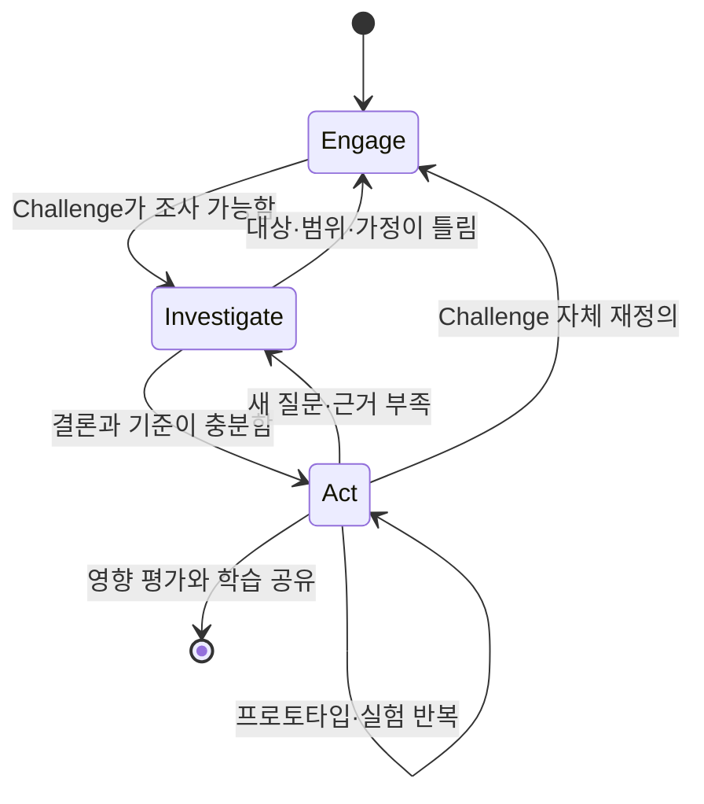

# CBL 핵심 원리와 전체 프로세스

> [!summary] 한 문장 정의
> Challenge Based Learning(CBL)은 러너가 실제적이고 개방적인 Challenge를 공동으로 정의하고, 필요한 지식과 맥락을 엄밀히 조사한 뒤, 근거 기반 해결안을 실제 청중과 시험·실행·평가하면서 배우는 반복적 프레임워크다.

[[00 CBL 러너 플레이북|← 인덱스]] · [[02 Engage 실전 가이드|Engage →]]

## 1. CBL을 결과물 제작법으로 오해하지 않기

CBL의 단위는 `프로젝트`나 `앱`이 아니라 **학습과 행동의 순환**이다.

- Challenge는 학습을 촉발하는 현실의 부름이다.
- 조사 과정에서 필요한 도메인 지식·기술·방법을 배운다.
- 해결안은 조사 결과로부터 나와야 한다.
- 프로토타입은 결과물을 보여 주기보다 불확실성을 줄인다.
- 실행은 실제 맥락과 청중에서 이루어진다.
- 평가는 제품 완성도뿐 아니라 지식·과정·역량·영향·성찰을 다룬다.
- 실패와 되돌아감은 결함이 아니라 프레임워크의 정상 작동이다.

> [!warning] `만들었으므로 배웠다`는 충분하지 않다
> 무엇을 몰랐고, 어떤 증거를 얻었으며, 판단이 어떻게 바뀌었는지 설명할 수 있어야 학습이 증명된다.

## 2. CBL의 구조

공식 프레임워크는 세 단계와 하나의 지속 과정으로 구성된다.

| 단계 | 핵심 움직임 | 러너의 중심 질문 | 종료 시 결론 |
|---|---|---|---|
| Engage | 추상적 Big Idea를 구체적 Challenge로 | `우리에게 왜 중요하며 무엇을 변화시키려는가?` | 소유감 있고 실행·조사 가능한 Challenge |
| Investigate | 질문으로 학습 경로를 만들고 증거를 합성 | `해결안을 판단하려면 무엇을 알아야 하는가?` | 연구 결론, 미지·모순, 해결안 기준 |
| Act | 근거 기반 해결안을 시험·구현·평가 | `무엇이 실제로 작동하며 어떤 영향을 만드는가?` | 가설 결과, 영향·한계, 다음 결정 |
| Document·Reflect·Share | 전 과정을 증거화하고 의미화 | `무엇을 어떻게 배웠으며 누구와 나눌 것인가?` | 학습 증거와 다음 학습 경로 |

## 3. 핵심 어휘

### Big Idea

여러 관점과 Challenge를 품을 수 있는 넓은 개념이다. 예: 건강, 연결, 신뢰, 회복, 접근성, 지속가능성.

Big Idea는 제품 카테고리나 기능이 아니다.

- 좋음: `회복`, `돌봄의 연속성`, `건강 정보 접근성`
- 나쁨: `헬스케어 앱`, `Apple Watch 연동`, `AI 알림`

### Essential Question

Big Idea를 팀과 공동체의 맥락에 연결하는 하나의 핵심 질문이다. 단답형이 아니라 탐구와 대화를 일으켜야 한다.

- 예: `치료가 병원 밖에서도 이어지려면 무엇이 필요한가?`
- 기능을 숨긴 예: `어떻게 앱으로 퇴원 환자를 관리할까?` → 이미 해결 수단을 고정했다.

### Challenge

Essential Question을 즉각적이고 실행 가능한 행동의 부름으로 바꾼 문장이다. 좋은 Challenge는 현실적·개방적·의미 있고 여러 해결 경로를 허용한다.

### Guiding Questions

Challenge에 대해 충분히 이해하고 해결안을 판단하려면 답해야 하는 질문들이다. 사용자, 맥락, 원인, 규모, 기존 대안, 행동, 시스템, 기술, 비용, 윤리, 측정 등 다양한 범주를 포함한다.

### Guiding Activities and Resources

질문에 답하는 실제 활동과 출처다. 문헌, 공개 데이터, 인터뷰, 관찰, 설문, 실험, 전문가 검토, 시스템 맵, 유사 사례 분석 등이 포함된다.

### Research Conclusion

여러 증거를 합성해 Challenge에 대해 현재 시점에 말할 수 있는 답이다. 단일 인용이나 인터뷰 발언이 아니다.

### Solution

조사 결론과 제약을 만족하도록 설계하고 실제 시험·실행할 수 있는 하나의 대응이다. 앱일 수도 있지만 캠페인, 서비스, 운영 변화, 교육, 정책 제안, 물리적 도구, 조합형 개입일 수도 있다.

### Authentic Audience

해결안의 결과에 실제 이해관계가 있고 의미 있는 피드백 또는 행동을 제공할 수 있는 사람·집단이다. 발표를 듣기만 하는 동료가 자동으로 진짜 청중이 되는 것은 아니다.

## 4. 러너 주도성의 정확한 뜻

CBL에서 러너는 학습 여정의 공동 소유자·공동 저자다. 이는 `하고 싶은 것만 한다` 또는 `멘토가 개입하지 않는다`는 뜻이 아니다.

### 러너가 소유해야 하는 것

- 왜 이 Challenge를 선택했는가
- 무엇을 배워야 하는가
- 어떤 질문이 중요한가
- 어떤 증거가 충분한가
- 자신의 편향과 선호는 무엇인가
- 무엇을 만들고 시험할 것인가
- 결과에 따라 어떤 결정을 내릴 것인가
- 개인과 팀이 무엇을 배웠는가

### 멘토·퍼실리테이터가 제공하는 것

- 안전과 윤리의 경계
- 학습 목표와 품질 기준
- 질문·방법·출처·전문가에 대한 스캐폴딩
- 정기 체크포인트와 피드백
- 팀이 보지 못한 가정·모순·관점
- 답이 아니라 더 나은 판단 구조

### 이해관계자가 제공하는 것

- 실제 맥락과 제약
- 문제 경험 또는 운영 관점
- 기존 시도와 실패의 역사
- 해결안의 관련성·실현 가능성 피드백
- 경우에 따라 시험·구현 환경

> [!important] 권한을 구분한다
> 사용자 경험을 말할 권한, 임상 지식을 말할 권한, 조직 운영을 결정할 권한, 데이터 접근을 허가할 권한, 연구를 승인할 권한은 서로 다르다. `병원 관계자` 한 명이 이 모든 관점을 대표하지 않는다.

## 5. CBL의 10가지 작동 원리

### 5.1 모두가 러너다

러너, 멘토, 전문가, 이해관계자는 서로 다른 지식과 미지를 가진다. 직함이 높은 사람이 모든 답을 가진다는 가정을 버린다.

### 5.2 실제 세계와 연결한다

Challenge와 해결안은 교실 밖의 실제 필요·맥락·제약과 연결된다. `현실적으로 보이는 가상의 문제`와 `실제 당사자가 경험하는 문제`를 구분한다.

### 5.3 소유감은 선택권과 의미에서 나온다

팀이 왜 중요한지 납득하지 못하거나 외부 기관의 과제를 받아 적기만 하면 CBL의 동력이 약해진다. 외부 Challenge Provider의 요청도 팀의 질문과 학습 목표를 통해 재해석해야 한다.

### 5.4 Boundaries of Adventure를 설정한다

자율성에는 안전한 경계가 필요하다.

- 시간과 예산
- 접근 가능한 사람·장소·데이터
- 법·윤리·기관 정책
- 필요한 기술 수준
- 반드시 달성할 학습 목표
- 하지 않을 일과 중단 조건

역량과 근거가 늘면 경계를 넓힐 수 있다.

### 5.5 실패할 공간을 만든다

아이디어·가설·프로토타입의 실패는 허용하되, 사람의 안전·권리·신뢰를 위험에 빠뜨리는 실패는 허용하지 않는다. 안전한 실패는 작고, 되돌릴 수 있고, 사전 기준이 있으며, 학습이 기록된다.

### 5.6 때로는 의도적으로 느리게 간다

질문 생성, 관점 수집, 반대 증거 검토, 성찰에서는 속도를 늦춘다. 이는 실행을 지연하는 낭비가 아니라 잘못된 문제에 빠르게 투자하는 위험을 줄인다.

### 5.7 과정과 제품을 함께 본다

좋은 제품이 나왔더라도 근거·학습·협업이 부실할 수 있다. 반대로 제품이 실패해도 중요한 지식과 방법 역량을 획득할 수 있다.

### 5.8 기술은 목적이 아니라 수단이다

기술은 조사, 분석, 협업, 시각화, 프로토타이핑, 공유에 사용한다. 기술을 먼저 고른 뒤 문제를 끼워 맞추지 않는다.

### 5.9 기록·성찰·공유는 병렬 트랙이다

마지막 보고서를 위해 기억을 복구하지 않는다. 모든 단계에서 결정 당시의 근거와 생각을 남긴다.

### 5.10 실제 행동으로 닫는다

제안서나 발표만으로 끝내지 않는다. 가능한 범위에서 실제 청중의 반응·행동·결과를 관찰하고 평가한다. 다만 헬스케어처럼 위험이 큰 분야에서는 `실제 행동`의 범위가 기관 승인과 안전 경계 안에 있어야 한다.

## 6. 선형 프로세스가 아닌 반복 시스템

되돌아갈 신호:

| 발견 | 돌아갈 단계 | 이유 |
|---|---|---|
| 실제 영향을 받는 주체가 처음 생각과 다름 | Engage | Challenge의 대상이 바뀜 |
| 문제의 빈도·심각도가 매우 낮거나 기존 대안이 충분함 | Engage | 할 가치와 범위를 재검토 |
| 이해관계자 설명이 충돌함 | Investigate | 맥락·역할·예외 조건을 더 조사 |
| 해결안의 핵심 가정을 시험할 수 없음 | Investigate/Engage | 권한·자원·Challenge 범위 재검토 |
| 프로토타입에서 새로운 행동·제약이 드러남 | Investigate | 새 Guiding Questions 생성 |
| 결과가 목표와 반대 | Act | 원인 분석 후 해결안·가정 수정 |
| 윤리·법·안전 경계가 불명확 | 중지 후 확인 | 진행보다 보호와 승인 우선 |

## 7. CBL과 유사 접근법의 관계

| 접근법 | 중심 | CBL에서의 위치 |
|---|---|---|
| Problem-Based Learning | 설계된 문제를 통해 지식을 획득 | 문제 탐구 원리를 Engage·Investigate에 활용 가능 |
| Project-Based Learning | 장기간 프로젝트와 산출물 | CBL 해결안을 구현하는 프로젝트가 될 수 있음 |
| Design Thinking | 공감·정의·아이디어·프로토타입·테스트 | 특히 Investigate 후반과 Act에 강하게 결합 |
| Lean Startup | 가설·MVP·Build-Measure-Learn | Act의 위험 가정 검증과 반복에 활용 |
| Agile/Scrum | 짧은 반복, 우선순위, 팀 가시성 | Act의 제작·실행 관리에 활용 |
| Service Learning | 지역사회 서비스와 학습 | 실제 공동체 Challenge와 학습 목표 연결에 활용 |
| Systems Thinking | 관계·피드백·구조·지연 이해 | 복합 Challenge의 Investigate에 활용 |

> [!note] 명칭보다 충실도가 중요하다
> 실제 프로젝트들은 방법론을 섞는다. `CBL이므로 이 도구를 쓰면 안 된다`보다, Challenge가 실제적인지, 러너가 소유하는지, 조사·행동·평가가 연결되는지를 본다.

## 8. Challenge의 수준과 크기

[2016 Learner Guide](https://www.challengebasedlearning.org/wp-content/uploads/2019/02/CBL_Guide2016.pdf)는 구현 맥락에 따라 Nano, Mini, Standard, Capstone 등 다양한 크기를 설명한다.

| 수준 | 대략적 특성 | 적합한 목적 | 주의점 |
|---|---|---|---|
| Nano | 짧고 범위가 좁으며 안내가 많음 | 기술·개념·도구 연습 | 전체 CBL을 경험했다고 과대평가하지 않기 |
| Mini | 약 2-4주, 전체 프레임을 축소 경험 | 새 팀의 연습, 작은 실제 문제 | 조사·실행이 형식적이 되지 않기 |
| Standard | 1개월 이상, 높은 러너 소유권과 실제 구현 | 복합·다학제 Challenge | 일정·파트너·평가 설계 필요 |
| Capstone | 축적된 지식·역량을 종합 | 최종 Challenge, 포트폴리오 | 화려한 결과물보다 학습·영향 증거 유지 |

기간이 짧으면 Challenge를 좁혀야지 조사와 평가를 생략해서는 안 된다.

## 9. CBL에서 다루는 학습 결과

### 도메인 지식

- Challenge와 관련된 개념·이론·사례
- 조사·설계·개발에 필요한 방법 지식
- 제도·윤리·운영·비즈니스 맥락

### 실세계 역량

- 문제 구성과 질문 설계
- 정보 탐색과 출처 평가
- 정성·정량 조사
- 비판적 사고와 증거 합성
- 협업·소통·리더십·갈등 해결
- 창의적 아이디어와 의사결정
- 프로토타이핑·실험·측정
- 이해관계자 관계와 실행 관리

### 자기주도 학습

- 자신의 지식 격차 인식
- 학습 목표·전략·시간 조절
- 도움과 자원 요청
- 피드백 해석과 적용
- 자신의 편향·감정·기여 성찰

### 영향과 시민성

- 실제 공동체의 관점 존중
- 안전·윤리·접근성·지속가능성 고려
- 의도하지 않은 결과 인식
- 결과와 한계를 정직하게 공유

## 10. 평가의 구조

CBL 평가는 마지막 발표만 채점하지 않는다.

| 차원 | 핵심 질문 | 증거 예시 |
|---|---|---|
| 지식 | 무엇을 정확히 이해하고 적용했는가 | 개념 설명, 조사 보고, 설계 근거 |
| 과정 | 어떻게 질문·조사·판단·반복했는가 | 질문 맵, 연구 로그, 결정 로그 |
| 역량 | 협업·소통·연구·제작 능력이 어떻게 변했는가 | 자기/동료 평가, 관찰, 산출물 변화 |
| 제품 | 해결안이 기준과 제약을 얼마나 충족하는가 | 프로토타입, 품질 기준, 전문가 피드백 |
| 영향 | 실제 맥락에서 무엇이 변했는가 | 기준선·사후 지표, 행동, 정성 피드백 |
| 성찰 | 무엇을 배웠고 다음에는 무엇을 바꿀 것인가 | 개인 저널, 단계 회고, 최종 내러티브 |

형성평가는 과정 중 조정을 위해, 총괄평가는 특정 시점의 성취 판단을 위해 쓴다. 자세한 운영은 [[05 기록·성찰·공유와 학습 증거#8. 형성평가와 총괄평가|형성평가와 총괄평가]]와 [[06 팀 운영·멘토·이해관계자 협업]]을 본다.

## 11. 연구에서 말할 수 있는 것과 없는 것

2024년 고등교육 체계적 문헌고찰은 20편을 분석해 CBL 교수 실천을 학습 촉진, 기술 통합, 산업 협력, 지원·개발의 네 영역으로 정리했다. 2026년 K-12 체계적 문헌고찰은 1,209개 검색 결과 중 16편만 포함했으며, 문제해결·협업·발견학습과 다양한 평가가 흔했지만 이론적 기반, 장기 평가, 포용성, 교사 연수와 파트너십 보고의 부족을 지적했다.

따라서 다음처럼 표현한다.

- 가능: `CBL은 실제 문제와 협업을 통해 동기·문제해결·자기주도 학습을 지원할 가능성이 있다.`
- 불가: `CBL은 전통 수업보다 항상 우수하다.`
- 가능: `효과는 Challenge 품질, 스캐폴딩, 팀 운영, 평가, 파트너십에 의존한다.`
- 불가: `CBL을 사용하면 혁신적인 제품이 나온다.`

세부 출처와 한계는 [[09 근거와 참고자료]]에 정리했다.

## 12. Challenge 6에 적용할 때의 핵심 관점

Apple Developer Academy @ POSTECH는 공개적으로 러너가 팀 구성, 실제 문제 식별, 조사, 해결안 구축을 주도한다고 설명한다. 현재 Challenge 6 회의록의 헬스케어 방향에 이를 적용하면 다음을 구분해야 한다.

| 현재 표현 | CBL상 지위 | 다음에 필요한 것 |
|---|---|---|
| 헬스케어 | Big Idea 후보 | 개인적 의미·팀 관심·사회 맥락 |
| 퇴원 후 케어 공백 | 문제 방향/Challenge 후보 | 당사자·상황·원인·규모·기존 대안 검증 |
| 재활 | 병원이 제안한 프레임/맥락 후보 | 퇴원 후 공백과의 실제 관계 확인 |
| 병원 협업 | 조사·실행 자원 또는 제약 | 상대의 역할·권한·기대·접근 범위 확인 |
| 앱·웨어러블·시스템 연동 | 해결안 가설 | 선호 보류, 문제·행동·시스템 증거 우선 |
| 환자 인터뷰·건강정보 | 고위험 조사 영역 | 멘토·기관·IRB·개인정보 담당자 사전 확인 |

자세한 현재 상태와 다음 행동은 [[08 Challenge 6 헬스케어 적용 가이드]]에서 다룬다.

## 13. 단계 전환 전 최종 질문

### Engage → Investigate

`해결안 이름을 모두 지워도, 누구의 어떤 현실을 왜 조사해야 하는지 팀 모두 설명할 수 있는가?`

### Investigate → Act

`우리와 반대 의견을 가진 사람이 보더라도, 결론과 해결안 기준이 어떤 증거에서 나왔는지 추적할 수 있는가?`

### Act → 완료/다음 반복

`우리가 만든 것보다, 무엇이 지지·기각·미결인지와 실제로 무엇이 변했는지를 설명할 수 있는가?`

---

[[00 CBL 러너 플레이북|← 인덱스]] · [[02 Engage 실전 가이드|다음: Engage →]] · [[09 근거와 참고자료|근거]]
