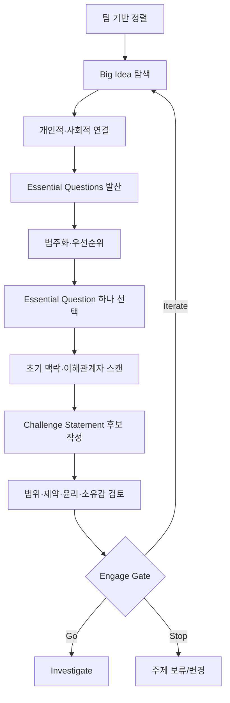

# Engage 실전 가이드

> [!summary] 단계 한 줄 정의
> **Big Idea를 팀과 공동체의 삶에 연결하고, 많은 질문을 거쳐, 소유감 있고 구체적이며 조사·행동 가능한 Challenge를 정의하는 단계다.**

[[01 CBL 핵심 원리와 전체 프로세스|← 전체 프로세스]] · [[03 Investigate 실전 가이드|Investigate →]] · [[07 CBL 실행 템플릿 모음#1. Challenge 캔버스|템플릿]]

## 1. Engage의 목적

Engage의 목적은 아이디어를 결정하거나 제품 범위를 정하는 것이 아니다.

1. 팀 구성원 각자가 Big Idea와 개인적 연결을 만든다.
2. 서로 다른 관점과 관심을 드러낸다.
3. 공동체·현장의 실제 맥락과 연결한다.
4. 넓은 Big Idea를 하나의 Essential Question으로 좁힌다.
5. Essential Question을 즉각적이고 실행 가능한 Challenge로 바꾼다.
6. 조사 전에 필요한 안전·윤리·시간·권한 경계를 확인한다.

> [!important] Engage의 최종 산출물
> 해결안이 아니라 **Challenge Statement + 왜 중요한가 + 누구와 어떤 맥락인가 + 무엇을 아직 모르는가 + 어디까지 조사할 수 있는가**다.

## 2. 시작 조건과 준비물

### 팀 준비

- [ ] 팀원과 참여 의사가 확인됐다.
- [ ] 각자의 관심·강점·학습 목표를 공유했다.
- [ ] Challenge 기간과 주요 일정이 보인다.
- [ ] 코어타임, 비동기 소통, 의사결정, 갈등 규칙이 있다.
- [ ] 개인 기록과 팀 기록 공간이 있다.

팀 준비가 부족하면 [[06 팀 운영·멘토·이해관계자 협업#2. 팀을 시작할 때 합의할 것|팀 운영 합의]]부터 진행한다.

### 작업 공간

- Big Idea·질문을 모두 보이는 보드
- 개인 메모 공간과 팀 통합 공간
- 가설/보류 아이디어 저장소
- 사실·해석·가설·미지·제약을 분리한 표
- 의사결정 로그
- 일정과 단계 게이트

### 시작 전 선언

팀원이 함께 읽고 동의한다.

> `Engage가 끝날 때까지 해결안을 확정하지 않는다. 떠오른 아이디어는 버리지 않고 보류 저장소에 두되, Challenge를 그 아이디어에 맞추지 않는다.`

## 3. 전체 진행 순서

## 4. Step 0 — 팀 기반 정렬

### 해야 할 일

각자 5분 동안 다음을 쓰고 한 사람씩 공유한다.

1. 이번 Challenge에서 배우고 싶은 것 2개
2. 잘할 수 있는 것 2개
3. 의도적으로 연습할 약점 1개
4. 관심 있는 현실 문제 2개
5. 절대 피하고 싶은 방식 또는 위험 1개
6. 가용 시간과 제약

공유 후 팀 차원에서 정한다.

- 공통 학습 목표
- 차이가 큰 기대
- 역할은 고정 직책보다 상황에 따라 순환한다는 원칙
- 팀이 보호할 가치: 예. 정직한 근거, 안전, 존중, 투명한 기여

### 도출해야 하는 결론

`우리 팀은 이번 Challenge에서 ___을 배우고, ___한 방식으로 일하며, ___은 하지 않는다.`

### 위험 신호

- 기술 역할만 배분하고 관심·학습 목표는 공유하지 않는다.
- 말이 많은 사람이 문제와 방향을 사실상 결정한다.
- `일단 진행하면서 맞추자`며 갈등 규칙과 가용 시간을 숨긴다.

## 5. Step 1 — Big Idea 탐색

### Big Idea의 품질 기준

좋은 Big Idea는:

- 여러 분야와 관점을 허용한다.
- 팀원 삶 또는 공동체와 연결된다.
- 하나의 기능·제품으로 답이 고정되지 않는다.
- 현재와 미래에 중요한 질문을 만든다.
- 사람·제도·기술·환경을 함께 볼 수 있다.

### 진행법

1. 개인별로 후보 Big Idea 3개를 적는다.
2. 각 후보마다 `왜 나에게 중요한가`를 1분간 쓴다.
3. 비슷한 후보를 묶되 소수 의견을 지우지 않는다.
4. 후보마다 개인적 의미, 사회적 의미, 접근 가능성, 학습 가능성을 간단히 평가한다.
5. 1-3개를 남겨 Essential Question을 생성해 본다.

### 예시

| 수준 | 예 | 판단 |
|---|---|---|
| Big Idea | 회복, 돌봄, 연결, 자율성 | 좋음: 다양한 질문 가능 |
| 영역 | 헬스케어, 재활, 고령자 서비스 | 시작점은 가능하나 아직 영역에 가까움 |
| 문제 방향 | 퇴원 후 케어 공백 | 이미 구체화된 문제 후보; 근거 확인 필요 |
| 해결안 | 웨어러블 모니터링 앱 | Big Idea 아님; 보류 아이디어로 이동 |

### 도출해야 하는 결론

- 선택 Big Idea
- 팀원별 개인적 연결
- 공동체·사회적 연결
- 이 Big Idea가 열어 주는 관점과 제한하는 관점

## 6. Step 2 — Essential Questions 발산

### 개인 발산을 먼저 하는 이유

처음부터 그룹 브레인스토밍을 하면 빠른 발언자·전문 지식이 있는 사람·기존 아이디어가 질문 공간을 장악할 수 있다. 공식 Learner Guide도 개인별 질문 생성 후 공유를 권한다.

### 질문 생성 라운드

각자 질문을 최소 10개 만든다. 아래 렌즈를 차례로 사용한다.

| 렌즈 | 질문 시작문 |
|---|---|
| 개인적 의미 | 왜 이것이 나에게 중요한가? |
| 경험 | 언제 이것을 직접 보거나 느꼈는가? |
| 사람 | 누가 영향을 받고 누가 보이지 않는가? |
| 맥락 | 어디서, 언제, 어떤 조건에서 달라지는가? |
| 원인 | 왜 반복되며 무엇이 유지시키는가? |
| 가치 | 어떤 상태가 더 낫다고 볼 것인가? |
| 형평성 | 누구에게 더 어렵거나 불리한가? |
| 시스템 | 어떤 조직·정책·자원·관계가 얽혀 있는가? |
| 미래 | 그대로 두면 무엇이 일어나는가? |
| 가능성 | 무엇이 달라질 수 있는가? |

### 얕은 질문과 깊은 질문

- 얕은 정보 질문: `퇴원 환자는 몇 명인가?`
- 맥락 질문: `어떤 퇴원 상황에서 돌봄 공백이 가장 크게 체감되는가?`
- 구조 질문: `공백을 유지시키는 비용·권한·인력·정보 구조는 무엇인가?`
- 가치 질문: `병원, 환자, 보호자가 각각 '안전한 회복'을 어떻게 다르게 정의하는가?`

얕은 질문도 필요하지만 Essential Question은 여러 하위 질문을 낳는 깊이를 가져야 한다.

## 7. Step 3 — 질문 통합·범주화·우선순위화

### 통합

- 같은 의미의 질문을 합친다.
- 너무 큰 질문은 나눈다.
- 해결안을 포함한 질문은 해결안 단어를 제거한다.
- 답이 자명하거나 예/아니오로 끝나는 질문은 깊게 바꾼다.

예:

- 전: `Apple Watch가 퇴원 환자에게 도움이 될까?`
- 후: `퇴원 후 위험이나 불안을 줄이기 위해 어떤 정보·행동·지원이 언제 필요한가?`

### 범주화

질문을 내용이 아니라 **학습 영역**으로 묶는다.

- 경험과 필요
- 행동과 맥락
- 원인과 시스템
- 기존 대안과 실패
- 형평성·접근성
- 권한·제도·윤리
- 기술·실현 가능성
- 영향과 측정

### 우선순위 기준

각 질문을 1-5점으로 평가한다.

| 기준 | 1점 | 5점 |
|---|---|---|
| 중요성 | 답이 결정에 거의 영향 없음 | Challenge 방향을 바꿈 |
| 불확실성 | 이미 신뢰 가능한 답이 있음 | 팀이 추측만 함 |
| 파급력 | 국소적 세부 | 다수 질문·가정에 영향 |
| 답변 가능성 | 현재 범위에서 불가능 | 기간·권한 안에서 가능 |
| 안전성 | 높은 위험·승인 불명 | 낮은 위험·명확한 승인 |

점수가 높아도 안전성이 낮으면 먼저 승인·대체 방법을 찾는다.

## 8. Step 4 — Essential Question 하나 선택

### 선택 기준

- Big Idea와 명확히 연결된다.
- 팀원 모두 의미를 설명할 수 있다.
- 실제 공동체 필요를 탐구한다.
- 하나의 해결안으로 답이 고정되지 않는다.
- 연구로 더 깊어질 수 있다.
- Challenge로 바꿀 수 있다.
- 너무 추상적이거나 너무 좁지 않다.

### 좋은 예와 나쁜 예

| 유형 | 문장 | 문제 |
|---|---|---|
| 너무 넓음 | `사람은 어떻게 건강해질 수 있는가?` | 범위·맥락 없음 |
| 해결안 고정 | `웨어러블로 환자를 어떻게 관리할까?` | 기술과 사용자 역할을 선결정 |
| 기관 중심 | `병원의 퇴원 관리를 어떻게 개선할까?` | 환자·보호자·지역사회 관점이 사라질 수 있음 |
| 탐구 가능 | `치료가 병원 밖의 일상에서도 안전하게 이어지려면 무엇이 필요한가?` | 다양한 관점·해결 경로 허용 |

### 도출해야 하는 결론

`우리의 Essential Question은 ___이다. 이 질문은 Big Idea ___를 ___의 맥락에 연결하며, 우리 팀에게 중요한 이유는 ___이다.`

## 9. Step 5 — 초기 맥락·이해관계자 스캔

Challenge 문장을 확정하기 전에 최소한의 현실 점검을 한다. 이는 본격 Investigate가 아니라 명백히 잘못된 범위·대상·권한을 거르기 위한 빠른 스캔이다.

### 이해관계자 구분

| 유형 | 예 | 무엇을 알 수 있는가 | 무엇을 대표하지 않는가 |
|---|---|---|---|
| 직접 경험자 | 환자, 보호자 | 경험·필요·행동·감정 | 임상적 일반화·조직 권한 |
| 현장 실무자 | 간호사, 재활치료사, 코디네이터 | 실제 업무 흐름·예외·부담 | 병원 전체 정책 |
| 도메인 전문가 | 의사, 연구자 | 임상·전문 지식 | 모든 환자의 삶·운영 권한 |
| 운영 결정자 | 부서장, 관리자 | 자원·성과·프로세스 | 개인 경험 전체 |
| 승인·보호 주체 | IRB, 개인정보, 법무 | 허용 범위·절차 | 사용자 필요·제품 가치 |
| 지불·정책 주체 | 보험, 정부, 기관 | 인센티브·제도 | 현장 경험 전체 |
| 주변 영향자 | 가족, 지역사회, 지원기관 | 비공식 돌봄·연결 | 임상 판단 |

### 빠른 스캔 질문

- 이 문제가 실제로 발생한다는 공개 근거나 신뢰할 수 있는 관찰이 있는가?
- 어떤 사람·상황에서 두드러지는가?
- 지금 어떻게 해결하고 있는가?
- 누가 문제라고 느끼고 누가는 그렇지 않은가?
- 접근 가능한 이해관계자는 누구이며 어떤 관점만 제공할 수 있는가?
- 조사·실행에서 허용되지 않거나 승인 필요한 것은 무엇인가?

### 증거 수준

초기 스캔의 목적은 `문제 검증 완료`가 아니라 다음 중 하나를 결정하는 것이다.

- 이 방향을 더 조사할 가치가 있다.
- 범위·대상을 바꿔야 한다.
- 접근·안전 제약 때문에 다른 방법이 필요하다.
- 현재 자원으로는 중단·보류해야 한다.

## 10. Step 6 — Challenge Statement 작성

### 기본 형식

공식 가이드는 Challenge를 행동의 부름으로 설명한다. 실전에서는 다음을 함께 기록하면 모호함이 줄어든다.

> **Challenge:** `[대상/공동체]가 [맥락]에서 [바람직한 변화]를 만들 수 있도록 하자.`
>
> **설명:** 지금 중요한 이유, 현재 경계, 조사해야 할 미지를 2-3문장으로 덧붙인다.

Challenge 문장에 대상이 항상 직접 들어갈 필요는 없지만 팀 문서에는 반드시 대상·맥락·변화를 명시한다.

### 품질 기준 10개

각 항목을 0(아님), 1(부분), 2(명확)로 평가한다.

1. **실제성:** 현실의 필요·맥락과 연결되는가?
2. **의미:** 팀과 공동체에 중요한가?
3. **개방성:** 여러 해결 경로가 가능한가?
4. **행동성:** 단순 학습 주제가 아니라 행동을 촉발하는가?
5. **구체성:** 대상·맥락·변화가 충분히 보이는가?
6. **조사 가능성:** 중요한 질문에 답할 방법이 있는가?
7. **범위 적합성:** 시간·자원·역량 안에 있는가?
8. **권한 적합성:** 팀이 조사·시험할 정당한 범위가 있는가?
9. **안전·윤리:** 사람·데이터·환경을 부당하게 위험에 빠뜨리지 않는가?
10. **학습성:** 필요한 지식·역량을 깊게 배울 수 있는가?

핵심 항목(실제성, 개방성, 조사 가능성, 안전·윤리)이 0이면 문장을 다시 작성한다.

### 해결안 냄새 테스트

아래 단어가 들어가면 삭제해도 Challenge가 유지되는지 본다.

- 앱, 플랫폼, AI, 웨어러블, 알림, 커뮤니티, 챗봇
- 연결한다, 자동화한다, 추천한다, 추적한다
- MVP, 기능, 온보딩, 대시보드

삭제했을 때 문장이 무너지면 문제보다 해결안을 정의한 것이다.

### 좋은/나쁜 예

| 문장 | 평가 |
|---|---|
| `퇴원 환자를 위한 웨어러블 앱을 만들자.` | 해결안·사용자·기술을 선결정 |
| `병원의 재활 시스템을 개선하자.` | 기관 중심, 범위가 너무 크고 변화가 모호 |
| `퇴원 후 회복 과정의 단절을 줄이자.` | 방향은 좋지만 대상·맥락·측정 가능성을 조사해야 함 |
| `치료에서 일상으로 전환하는 사람들이 필요한 지원을 제때 이해하고 이용할 수 있도록 하자.` | 경험과 변화 중심, 여러 해결 경로 허용; 조사로 대상·범위 구체화 필요 |

## 11. Step 7 — 범위·제약·윤리 화면

### Scope Box

| 안에 포함 | 인접하지만 제외 | 승인 전 금지 | 나중에 확장 |
|---|---|---|---|
| 이번에 조사·시험할 대상과 상황 | 관련 있지만 기간상 다루지 않을 영역 | 사람·데이터·임상·시설 관련 금지 활동 | Challenge 후속 가능성 |

### 제약 분류

- **시간:** 실제로 사용할 수 있는 주·일·시간
- **인력:** 팀 구성, 역량, 공백
- **접근:** 만날 수 있는 이해관계자·장소
- **데이터:** 공개/비공개, 개인정보·민감정보 여부
- **권한:** 누가 조사·시험·구현을 허가할 수 있는가
- **안전:** 신체·정신·사회·평판·정보 위험
- **법·윤리:** 동의, IRB, 개인정보, 저작권, 의료 주장
- **기술:** 장비·API·개발 계정·통합 가능성
- **지속성:** Challenge 종료 후 유지 주체

### 헬스케어 사전 질문

- 사람을 연구대상으로 모집하거나 상호작용하는가?
- 건강상태·질병·약물·의료 이용 등 민감정보를 묻거나 기록하는가?
- 병원 환자·직원·시설·기록에 접근하는가?
- 실제 진료·돌봄 판단에 영향을 주는가?
- 의료적 효능·안전성을 주장하려 하는가?
- 결과를 교육 외 연구·발표·출판에 사용할 가능성이 있는가?

하나라도 `예/모름`이면 팀이 자체 결정하지 않고 멘토·기관 담당자에게 방법과 승인 필요성을 먼저 확인한다. [[09 근거와 참고자료#6. 헬스케어 안전·윤리의 국내 공식 확인 경로|헬스케어 안전·윤리 근거]] 참조.

## 12. Step 8 — 소유감과 반대 관점 확인

각 팀원이 독립적으로 답한다.

1. 내가 이 Challenge를 중요하다고 보는 개인적 이유는?
2. 내가 가진 선입견과 선호 해결안은?
3. 이 Challenge가 중요하지 않거나 다르게 정의돼야 한다는 가장 강한 반론은?
4. 내가 대표할 수 없는 관점은?
5. 이번에 배우고 싶은 지식·역량은?
6. 이 Challenge를 중단해야 할 증거는 무엇인가?

답을 비교한다. 소유감의 차이는 억지 합의로 숨기지 않는다. 팀원이 문제를 다르게 보는 이유가 학습의 중요한 출발점이 될 수 있다.

## 13. Engage에서 도출해야 하는 결론

### 필수 결론 1 — Big Idea와 의미

`우리의 Big Idea는 ___이며, 개인적으로 ___, 공동체적으로 ___ 때문에 중요하다.`

### 필수 결론 2 — Essential Question

`우리가 계속 탐구할 하나의 질문은 ___이다.`

### 필수 결론 3 — Challenge

`우리는 ___의 ___한 변화를 만들자는 Challenge를 선택했다.`

### 필수 결론 4 — 현재 근거 상태

- 확인된 사실
- 아직 해석에 불과한 것
- 검증할 가설
- 답하지 못한 미지
- 충돌하는 관점

### 필수 결론 5 — 경계

`이번 Challenge에서 다룰 범위는 ___이고, 다루지 않을 범위는 ___이며, ___은 승인 전 진행하지 않는다.`

### 필수 결론 6 — 학습 목표

`팀은 도메인 지식 ___과 역량 ___을 배우고, 개인은 ___을 증명한다.`

## 14. 필수 산출물

- [ ] 팀 계약과 작업 리듬
- [ ] Big Idea 선택 근거
- [ ] Essential Question 후보와 선택 기록
- [ ] Challenge Statement와 2-3문장 설명
- [ ] 초기 이해관계자 지도
- [ ] 사실·가설·미지·제약 표
- [ ] Scope Box와 윤리·안전 스크린
- [ ] 팀·개인 학습 목표
- [ ] Guiding Question 씨앗 목록
- [ ] Engage 성찰

템플릿: [[07 CBL 실행 템플릿 모음#1. Challenge 캔버스|Challenge 캔버스]]

## 15. Engage Gate — Go / Iterate / Stop

### Go: Investigate로 이동

- [ ] 해결안 단어를 지워도 Challenge가 성립한다.
- [ ] 누가·어떤 맥락에서 영향을 받는지 조사할 수 있다.
- [ ] 팀원 각자가 왜 중요한지 자기 언어로 말할 수 있다.
- [ ] 여러 해결 경로가 열려 있다.
- [ ] 초기 현실 근거가 있고, 추측은 별도로 표시했다.
- [ ] 중요한 미지가 Guiding Question 후보로 바뀌었다.
- [ ] 시간·접근·권한·윤리 경계가 보인다.
- [ ] 안전하지 않거나 승인 불명인 활동을 시작하지 않기로 했다.

### Iterate: Engage 보완

- 팀원마다 다른 문제를 말한다.
- 대상·맥락이 `모든 사람`, `병원`, `환자`처럼 지나치게 넓다.
- 특정 기술이나 파트너가 빠지면 Challenge가 무너진다.
- 중요성은 주장하지만 실제 근거가 전혀 없다.
- 팀이 접근할 수 없는 사람·데이터·기관만을 전제로 한다.
- 학습 목표가 결과물 제작으로만 표현된다.

### Stop/보류

- 문제의 실재성·중요성을 뒷받침할 초기 근거가 없다.
- 필요한 활동이 현재 권한·안전 경계에서 불가능하다.
- 시간·자원에 맞게 좁혀도 의미 있는 학습·행동이 불가능하다.
- 팀이 소유하지 않으며 외부 요청을 수행하는 데만 의미가 있다.

## 16. 흔한 실패와 교정

| 실패 | 진단 신호 | 교정 행동 |
|---|---|---|
| 해결책 점프 | 질문보다 기능명이 많다 | 해결안 보류함, 기술 단어 없는 질문 20개 |
| 기관 중심 프레이밍 | `병원이 원하는 것`만 있다 | 경험자·실무자·승인자 관점을 별도 지도 |
| 문제 과장 | 사례 1개를 전체 현상으로 말함 | 규모·예외·기존 대안 질문 추가 |
| 팀 가짜 합의 | 반대가 없지만 개인 설명이 다름 | 익명 재작성 후 차이 토론 |
| 너무 큰 Challenge | 사회문제 전체를 해결하려 함 | 한 전환점·행동·상황으로 좁힘 |
| 너무 좁은 Challenge | 기능 구현 과제로 변함 | 한 단계 위 목적·경험으로 확장 |
| 파트너 종속 | 특정 기관 거절 시 과제 붕괴 | Challenge와 협업 채널을 분리 |
| 접근성 무시 | `고령자는 앱을 못 쓴다` 같은 고정관념 | 실제 맥락·능력 다양성을 조사 질문으로 전환 |
| 법·윤리 후순위 | 조사 후 승인 생각 | 사람·데이터 접촉 전에 사전 스크린 |

## 17. Challenge 6 적용 예시

### 현재 후보의 재배치

- Big Idea 후보: `회복`, `돌봄의 연속성`, `병원 밖의 건강`
- Essential Question 후보: `치료가 병원 밖의 일상에서도 안전하게 이어지려면 무엇이 필요한가?`
- Challenge 후보: `치료에서 일상으로 전환하는 사람들이 필요한 회복 지원을 제때 이해하고 이용할 수 있도록 하자.`

이는 최종 정답이 아니다. 다음을 Investigate에서 구체화해야 한다.

- `치료에서 일상으로 전환하는 사람` 중 누구인가?
- 어떤 상황이 실제로 `공백`인가?
- 공백은 정보, 행동, 자원, 책임, 비용, 관계 중 무엇인가?
- 환자·보호자·의료진·병원이 다르게 보는 성공은 무엇인가?
- 현재 대안은 무엇이며 어디서 작동·실패하는가?
- 학생 팀이 안전하게 조사하고 시험할 수 있는 범위는 어디인가?

### 지금 확정하면 안 되는 것

- Apple Watch 사용
- 상태 자동 모니터링
- 병원 데이터 연동
- 알림 대상과 방식
- 재활 환자로 사용자 범위 고정
- S-Pohang Hospital과의 협업을 제품 전제로 고정

자세한 팀 현황은 [[08 Challenge 6 헬스케어 적용 가이드]]를 본다.

## 18. 단계 말 성찰

### 개인

1. 내 선호 해결안이 질문을 어떻게 좁혔는가?
2. 어떤 팀원의 관점이 내 생각을 바꿨는가?
3. 나는 무엇을 사실처럼 말했지만 실제로는 가설이었는가?
4. 이 Challenge에서 내가 대표하지 못하는 사람은 누구인가?
5. Investigate에서 내가 책임질 학습 질문은 무엇인가?

### 팀

1. 소수 의견과 불편한 질문을 보존했는가?
2. Challenge와 파트너의 요청을 구분했는가?
3. 해결안 없이도 문제 방향을 설명할 수 있는가?
4. 어떤 증거가 나오면 Challenge를 바꿀 것인가?
5. 다음 단계의 첫 3개 Guiding Questions는 무엇인가?

---

[[01 CBL 핵심 원리와 전체 프로세스|← 이전]] · [[03 Investigate 실전 가이드|다음: Investigate →]] · [[07 CBL 실행 템플릿 모음#1. Challenge 캔버스|Engage 템플릿]]
