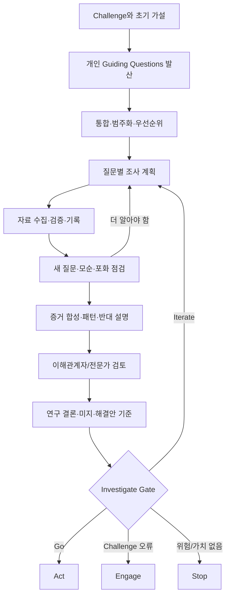

# Investigate 실전 가이드

> [!summary] 단계 한 줄 정의
> **Challenge를 책임 있게 다루기 위해 필요한 질문을 체계화하고, 적합한 방법으로 증거를 수집·평가·합성하여, 해결안의 토대가 되는 연구 결론과 기준을 만드는 단계다.**

[[02 Engage 실전 가이드|← Engage]] · [[04 Act 실전 가이드|Act →]] · [[07 CBL 실행 템플릿 모음#5. Guiding Questions 백로그|템플릿]]

## 1. Investigate의 목적

Investigate는 인터넷 검색이나 인터뷰 횟수를 채우는 단계가 아니다.

1. Challenge를 이해하는 데 필요한 학습 지도를 만든다.
2. 질문마다 가장 적합한 조사 방법을 고른다.
3. 사용자·현장·전문가·시스템·문헌의 서로 다른 증거를 수집한다.
4. 출처의 신뢰성, 맥락, 편향, 한계를 평가한다.
5. 모순과 반대 증거를 포함해 패턴을 찾는다.
6. 발견 목록을 연구 결론으로 합성한다.
7. 해결안이 만족해야 할 기준과 검증할 위험 가정을 도출한다.

> [!important] Investigate의 최종 산출물
> `무엇을 들었다`가 아니라 **Challenge에 대해 지금 무엇을 근거 있게 말할 수 있고, 무엇을 아직 모르며, 해결안은 무엇을 만족해야 하는가**다.

## 2. 시작 조건

- [ ] Big Idea, Essential Question, Challenge Statement가 있다.
- [ ] Challenge를 해결안 이름 없이 설명할 수 있다.
- [ ] 대상·맥락·범위가 최소한 임시로 정의돼 있다.
- [ ] 초기 사실·가설·미지·제약이 분리돼 있다.
- [ ] 팀 학습 목표와 개인 학습 목표가 있다.
- [ ] 사람·데이터·현장 접촉의 승인·안전 경계를 확인했다.
- [ ] 조사 기록, 원문, 합성 결과를 저장할 공간이 있다.

부족하면 [[02 Engage 실전 가이드#15. Engage Gate — Go / Iterate / Stop|Engage Gate]]로 돌아간다.

## 3. 전체 진행 순서

## 4. Step 1 — Guiding Questions 생성

### 4.1 먼저 개인별로 만든다

각자 15-20개를 만들고, 출처를 보지 않은 상태에서 작성한다. 기존 아이디어를 정당화하는 질문뿐 아니라 반증 질문을 포함한다.

### 4.2 질문 렌즈

| 범주 | 핵심 목적 | 질문 예시 |
|---|---|---|
| 정의 | 팀이 같은 현상을 말하는지 | `케어 공백은 무엇을 포함·제외하는가?` |
| 사람 | 영향을 받는 집단과 차이 | `누가 가장 크게 영향을 받으며 누구는 그렇지 않은가?` |
| 상황 | 발생 조건과 여정 | `언제·어디서·어떤 전환점에 어려움이 커지는가?` |
| 행동 | 실제로 하는 일 | `문제가 생겼을 때 누구에게 어떤 순서로 도움을 구하는가?` |
| 필요·목표 | 당사자가 원하는 진전 | `당사자는 어떤 상태를 성공으로 보는가?` |
| 감정·인지 | 불안, 확신, 이해, 동기 | `무엇을 모르거나 오해해 행동이 막히는가?` |
| 규모 | 빈도·심각도·분포 | `얼마나 자주, 얼마나 오래, 어떤 결과로 이어지는가?` |
| 원인 | 직접·근본·유지 요인 | `어떤 구조가 반복되게 만드는가?` |
| 기존 대안 | 현재 해결법과 경쟁 | `지금 무엇을 쓰며 왜 충분/불충분한가?` |
| 이해관계자 | 역할·인센티브·갈등 | `누가 이득·비용·위험·책임을 지는가?` |
| 시스템 | 흐름·병목·피드백 | `정보·사람·돈·권한이 어디서 끊기는가?` |
| 형평성 | 접근 차이와 배제 | `언어·나이·장애·지역·소득에 따라 무엇이 달라지는가?` |
| 제도·윤리 | 허용 범위와 권리 | `어떤 동의·승인·보호가 필요한가?` |
| 기술 | 가능성보다 조건 | `기술이 필요하다면 어떤 행동·정보 흐름을 지원해야 하는가?` |
| 영향 | 성공과 부작용 | `무엇이 변하면 개선이며 어떤 부작용을 피해야 하는가?` |
| 반증 | 팀 가정을 깨는 근거 | `이 문제가 중요하지 않다는 증거는 무엇일까?` |

### 4.3 질문 품질 테스트

각 질문 옆에 답한다.

1. 이 질문의 답이 어떤 결정을 바꾸는가?
2. 답이 달라질 수 있는가, 아니면 확인 질문인가?
3. 어떤 증거가 답으로 충분한가?
4. 누가 또는 무엇이 가장 적합한 출처인가?
5. 현재 범위에서 안전하고 현실적으로 답할 수 있는가?

`바꾸는 결정`이 없는 질문은 흥미롭더라도 후순위로 둔다.

### 4.4 좋은/나쁜 질문

| 질문 | 문제 | 개선 |
|---|---|---|
| `앱이 필요할까?` | 해결안 중심, 예/아니오 | `현재 어려움을 해결하기 위해 어떤 정보·행동·지원이 필요한가?` |
| `환자들은 불안할까?` | 유도·일반화 | `퇴원 후 어떤 순간에 어떤 감정이 생기며 행동에 어떻게 영향을 주는가?` |
| `병원은 왜 안 해줄까?` | 비난·원인 선결정 | `현재 지원 범위는 어떻게 결정되며 어떤 자원·권한·수가 제약이 있는가?` |
| `고령자는 앱을 못 쓰지 않나?` | 고정관념 | `연령·경험·능력·지원 환경에 따라 디지털 사용이 어떻게 달라지는가?` |

## 5. Step 2 — 질문 통합·범주화·우선순위

### 5.1 통합 원칙

- 같은 뜻은 대표 질문 하나로 합치고 원문은 보존한다.
- 한 질문에 두 개 이상 개념이 있으면 나눈다.
- 해결안 단어는 제거한다.
- `왜`가 비난이 되면 `어떤 조건·구조 때문에`로 바꾼다.
- 출처 하나가 답할 수 없는 질문은 관점별로 나눈다.

### 5.2 우선순위 3층

- **P0 — Gate Question:** 답에 따라 Challenge·안전·계속 여부가 바뀐다.
- **P1 — Decision Question:** 해결안 기준·대상·맥락·실험이 바뀐다.
- **P2 — Enrichment Question:** 이해를 깊게 하지만 현재 결정에는 덜 중요하다.

예:

- P0: `학생 팀이 환자 또는 건강정보에 접근할 수 있는가?`
- P0: `퇴원 후 공백이 실제로 존재하며 누구에게 중요한가?`
- P1: `가장 취약한 전환점은 언제인가?`
- P1: `현재 대안이 실패하는 조건은 무엇인가?`
- P2: `해외에서는 어떤 제품이 유명한가?`

### 5.3 Question Matrix 필드

| 필드 | 의미 |
|---|---|
| ID | GQ-01 같은 고유 번호 |
| 질문 | 한 문장 |
| 범주 | 사용자/맥락/원인/기존대안 등 |
| 우선순위 | P0/P1/P2 |
| 바꾸는 결정 | 이 답으로 무엇을 결정하는가 |
| 현재 가정 | 팀이 추측하는 답 |
| 필요한 증거 | 답으로 인정할 조건 |
| 방법·출처 | 문헌/인터뷰/관찰/데이터 등 |
| 담당자 | 최종 책임자 한 명 |
| 기한 | 합성 가능한 날짜 |
| 상태 | 미착수/진행/답변/미지/보류 |
| 결론 링크 | Evidence/Conclusion ID |

템플릿: [[07 CBL 실행 템플릿 모음#5. Guiding Questions 백로그|Guiding Questions 백로그]]

## 6. Step 3 — 조사 방법 선택

질문에 맞는 방법을 고른다. `인터뷰가 CBL답다`거나 `설문이 객관적이다` 같은 방법 중심 사고를 피한다.

### 방법 선택 표

| 알고 싶은 것 | 적합한 방법 | 부적합한 단독 방법 |
|---|---|---|
| 개념·정책·현황 | 공식 문서, 학술 문헌, 통계 | 지인 의견 |
| 경험·의미·동기 | 맥락 인터뷰, 일기, 참여 관찰 | 폐쇄형 설문만 |
| 실제 행동·워크플로 | 관찰, 프로세스 추적, 로그 | 회상 인터뷰만 |
| 빈도·분포 | 신뢰 가능한 기존 데이터, 설계된 설문 | 소수 인터뷰 일반화 |
| 원인 | 복수 방법, 비교 사례, 시스템 맵 | 단일 전문가 의견 |
| 기존 대안 | 사용자 경험, 서비스 여정, 제품/정책 분석 | 기능 목록만 |
| 기술 가능성 | 기술 스파이크, API/규격 문서, 전문가 검토 | 사용자 선호만 |
| 조직 실현 가능성 | 운영·결정권자 인터뷰, 프로세스·비용 분석 | 사용자 인터뷰만 |
| 사용성 | 과업 기반 관찰, think-aloud | `마음에 드나요?` 질문 |
| 영향 | 기준선·사후 측정, 비교, 정성 결과 | 만족도만 |

## 7. 방법별 실전 절차

### 7.1 Desk Research — 문헌·공개 자료 조사

#### 적합한 질문

- 개념 정의, 규모, 정책, 법, 임상·전문 지식
- 기존 연구·서비스·실패 사례
- 공개된 사용자·시장·운영 데이터

#### 절차

1. 질문을 검색 가능한 핵심어와 동의어로 분해한다.
2. 공식/1차 출처를 먼저 찾는다.
3. 최신성, 연구 설계, 표본, 맥락, 이해상충을 기록한다.
4. 주장과 근거를 한 줄 단위로 연결한다.
5. 같은 주장의 독립 출처를 찾는다.
6. 반대 결과와 적용되지 않는 맥락을 기록한다.
7. `우리 Challenge에 적용 가능한 부분/불가능한 부분`을 분리한다.

#### 출처 우선순위

1. 법령·정부·공공기관·표준·원 데이터
2. 체계적 문헌고찰·메타분석·동료평가 원 연구
3. 전문기관·대학·의료기관의 공식 안내
4. 업계 보고서·기업 자료
5. 언론·블로그·커뮤니티 경험담

낮은 순위가 무가치한 것은 아니다. 경험과 아이디어를 찾는 데 쓰되 사실 확정에는 더 강한 근거가 필요하다.

#### 기록할 필드

- 출처, 날짜, 링크
- 질문 ID
- 핵심 주장
- 직접 근거·표본·방법
- 적용 맥락
- 한계·이해상충
- 증거 강도
- 우리 해석

### 7.2 Expert Interview — 전문가 인터뷰

#### 적합한 질문

- 도메인 개념, 전문 판단, 알려진 위험, 기존 시도
- 접근 가능한 공개 자료와 추가 전문가
- 실제 제도·운영의 맥락

#### 전문가가 답할 수 없는 것

- 모든 사용자의 경험
- 조직 전체의 공식 입장(권한이 없다면)
- 제품 수요와 사용성
- 다른 전문 분야의 확정 판단

#### 준비

1. 인터뷰 목적과 답하려는 GQ를 3개 이하로 정한다.
2. 상대 역할·전문성·이해관계를 조사한다.
3. 팀 가정과 확인하고 싶은 반증을 적는다.
4. 동의 가능한 기록 방식과 정보 사용 범위를 확인한다.
5. 질문은 경험→사례→예외→구조→조언 순으로 설계한다.

#### 질문 예

- `최근 실제 사례를 개인정보 없이 과정 중심으로 설명해 주실 수 있나요?`
- `언제 이 문제가 가장 심각하고, 언제는 문제가 되지 않나요?`
- `현재 누가 어떤 방식으로 대응하며 어디서 막히나요?`
- `과거 시도 중 작동한 것과 실패한 것은 무엇이며 왜였나요?`
- `이 문제를 우리가 잘못 이해하고 있을 가능성은 무엇인가요?`
- `이 질문에 더 적합한 역할·자료는 무엇인가요?`

#### 피할 질문

- `저희 아이디어 좋죠?`
- `앱이 있으면 쓰실 건가요?`
- `병원이 데이터 주실 수 있나요?` — 상대 권한 확인 없이 묻지 않는다.
- 한 문장에 여러 가정이 든 질문

#### 분석

발언을 `전문 지식`, `개인 경험`, `조직 관점`, `추측`, `아이디어`, `제약`, `추가 출처`로 분류한다.

### 7.3 Contextual Interview — 경험·맥락 인터뷰

#### 적합한 질문

- 최근 실제 행동과 맥락
- 목표, 어려움, 우회 행동, 감정, 판단
- 현재 대안의 사용 경험

#### 절차

1. 모집 대상과 제외 기준을 정한다.
2. 동의·개인정보·민감정보·보상·기록·보관을 확인한다.
3. 일반 의견보다 `최근 구체적 사건`부터 묻는다.
4. 시간순으로 행동·도구·사람·정보·결정을 추적한다.
5. 해석을 말하지 말고 `그때 무엇을 했나요?`로 확인한다.
6. 이상적 미래보다 현재의 우회 행동을 본다.
7. 끝에 요약해 상대가 수정할 기회를 준다.

> [!danger] Challenge 6 주의
> 환자·보호자·건강상태를 대상으로 한 인터뷰는 단순 사용자 인터뷰라고 이름 붙여도 자동으로 허용되지 않는다. 교육 활동인지 인간대상연구인지, 건강 민감정보를 수집하는지, 병원·기관 승인과 IRB가 필요한지 **접촉 전에** 멘토·기관 담당자에게 확인한다. 확인 전에는 환자 모집·건강정보 질문·기록을 진행하지 않는다.

### 7.4 Observation — 관찰

#### 관찰 대상

- 실제 작업 흐름
- 정보·도구·사람 간 전환
- 기다림, 오류, 반복, 우회
- 말과 행동의 차이
- 공간·기기·환경 제약

#### 프로토콜

1. 관찰 질문과 범위를 정한다.
2. 접근·촬영·기록·개인정보 허용 범위를 확인한다.
3. 시간, 행동, 맥락, 직접 인용, 해석을 별도 열에 기록한다.
4. 예외와 정상 흐름을 모두 본다.
5. 관찰 후 당사자에게 이해를 확인한다.

`보았다`와 `의미한다고 생각한다`를 분리한다.

### 7.5 Survey — 설문

#### 적합한 경우

- 이미 정의가 명확한 항목의 분포·빈도·차이를 알아볼 때
- 질적 조사에서 발견한 패턴이 더 넓게 나타나는지 탐색할 때

#### 부적합한 경우

- 문제 정의 자체가 불명확할 때
- 모집 경로가 편향돼 전체 집단을 대표하지 못할 때
- 표본이 매우 작지만 백분율로 객관성을 연출할 때
- 민감정보·취약 대상·연구 승인 범위가 불명확할 때

#### 품질 체크

- 질문 하나에 개념 하나
- 중립적 표현
- 응답 범주가 겹치지 않고 빠짐 없음
- `모름/해당 없음/응답 원치 않음` 제공
- 시간 범위 명시
- 표본·모집·응답률·결측 공개
- 숫자를 모집 집단 밖으로 일반화하지 않음

### 7.6 Existing Solution / Analogue Analysis

기능 비교표만 만들지 않는다.

| 분석 영역 | 질문 |
|---|---|
| 대상·상황 | 누구의 어떤 순간을 다루는가? |
| 핵심 행동 | 사용자가 무엇을 하게 되는가? |
| 가치 | 어떤 진전·결과를 약속하는가? |
| 증거 | 실제 효과·사용·지속 근거가 있는가? |
| 제약 | 비용·교육·기기·조직·법적 전제는? |
| 실패 | 어디서 이탈·오류·불신이 생기는가? |
| 접근성 | 누가 사용하기 어렵거나 배제되는가? |
| 이전 가능성 | 우리 맥락과 같은/다른 조건은? |

### 7.7 Systems Mapping

복합 Challenge에서는 개별 사용자만 보면 구조적 원인을 제품 기능으로 떠넘길 수 있다.

그릴 것:

- 행위자와 역할
- 정보·돈·물품·책임·권한의 흐름
- 병목과 지연
- 인센티브와 충돌
- 공식 절차와 실제 우회 경로
- 피드백 루프
- 개입 지점과 부작용 가능성

### 7.8 Technical Spike

기술 가능성을 빠르게 확인하는 작은 실험이다.

- API·센서·권한·정확도·지연·배터리·보안 등 한 질문만 다룬다.
- 사용자 가치 검증과 기술 가능성 검증을 혼동하지 않는다.
- `구현 가능`은 `사용자가 원함`, `기관이 허용함`, `효과가 있음`을 뜻하지 않는다.

## 8. 윤리·안전·데이터 최소화

### 조사 전에 반드시 묻기

1. 사람과 직접 상호작용하는가?
2. 개인을 알아볼 수 있는 정보를 수집하는가?
3. 건강·질병·의료 이용 등 민감정보를 수집하는가?
4. 취약한 상황의 사람을 포함하는가?
5. 실제 행동·환경을 조작하는가?
6. 교육 과제 외 발표·연구·출판에 쓸 수 있는가?
7. 누가 승인하고, 누가 데이터를 소유하며, 언제 삭제하는가?

### 최소화 원칙

- 필요하지 않은 개인정보는 묻지 않는다.
- 이름 대신 ID를 사용한다.
- 원본과 분석본 접근을 제한한다.
- 녹음·사진은 명시적 동의와 허용 범위가 있을 때만 한다.
- 보관 기간과 삭제 계획을 먼저 정한다.
- 공유 자료에서는 재식별 가능성을 검토한다.
- 동의가 있어도 기관 정책·법·안전 의무가 사라지지 않는다.

한국의 개인정보 보호법은 건강 정보를 민감정보로 다루며, 인간대상연구는 목적과 방법에 따라 사전 IRB 심의가 요구될 수 있다. 팀이 법적 적용을 스스로 확정하지 말고 공식 담당자에게 확인한다. [[09 근거와 참고자료#6. 헬스케어 안전·윤리의 국내 공식 확인 경로|헬스케어 안전·윤리 근거]] 참조.

## 9. 증거 관리 시스템

### 9.1 반드시 구분할 여섯 층

| 층 | 정의 | 예 |
|---|---|---|
| Evidence | 관찰·원문·측정·출처가 있는 자료 | `실무자 3명 모두 퇴원 당일 전화 문의가 집중된다고 설명` |
| Interpretation | 한 증거의 의미에 대한 해석 | `초기 정보가 충분히 이해되지 않을 수 있다` |
| Pattern/Insight | 여러 증거에서 반복되며 행동·원인을 설명 | `정보량보다 환자가 행동해야 할 시점과 우선순위가 불명확할 때 부담이 커진다` |
| Conclusion | Challenge 질문에 대한 현재 답 | `공백의 한 형태는 정보 부재보다 퇴원 직후 행동 번역의 실패다` |
| Hypothesis | 아직 시험할 설명·예측 | `행동 우선순위를 상황별로 제공하면 문의와 불안이 줄 것이다` |
| Unknown | 답이 없거나 근거가 부족 | `어떤 환자군에서 가장 큰가` |

### 9.2 Evidence Card

각 증거에 다음을 붙인다.

- Evidence ID
- 관련 GQ
- 날짜·출처·역할·맥락
- 원문/관찰/수치
- 수집 방법
- 신뢰도와 한계
- 개인정보·공유 범위
- 초기 해석
- 지지/반박하는 가설
- 다음 질문

### 9.3 출처 신뢰성

다음 여섯 축으로 평가한다.

1. **권위:** 이 질문에 답할 지식·경험·권한이 있는가?
2. **직접성:** 원자료·직접 경험인가, 전언인가?
3. **방법:** 표본·측정·분석이 적절한가?
4. **최신성:** 현재 맥락에 유효한가?
5. **독립성:** 이해상충·홍보 목적이 있는가?
6. **전이성:** 우리 대상·상황과 얼마나 같은가?

신뢰도를 `상/중/하`로만 쓰지 말고 낮은 이유를 적는다.

### 9.4 삼각검증

하나의 결론을 가능한 한 다른 유형의 근거로 확인한다.

- 말한 경험 + 실제 행동 관찰
- 전문가 의견 + 공식 지침/연구
- 정성 패턴 + 공개 통계
- 사용자 관점 + 운영자 관점
- 국내 맥락 + 해외 유사 사례

세 출처가 모두 같은 네트워크나 같은 보고서를 복제했다면 독립 근거 세 개가 아니다.

### 9.5 모순 로그

모순은 제거할 잡음이 아니라 범위를 구체화하는 정보다.

| 충돌 주장 | 각각의 출처·맥락 | 가능한 설명 | 확인 질문 | 현재 처리 |
|---|---|---|---|---|
| A는 문제라 함 / B는 아님 | 역할·상황 기록 | 대상·시간·성과 정의 차이 | 언제 달라지는가 | 미결/분기 결론 |

### 9.6 부정 증거

반드시 찾는다.

- 문제가 발생하지 않는 사례
- 기존 대안이 잘 작동하는 조건
- 팀의 예상과 반대되는 행동
- 해결 의지가 낮은 이유
- 개입이 오히려 부담을 늘린 사례

## 10. 리서치 진행 관리

### 일일 체크

- 오늘 답하려는 GQ는?
- 이 활동이 바꾸는 결정은?
- 어떤 증거가 충분한가?
- 새로 생긴 질문은?
- 어떤 가정이 약해졌는가?
- 데이터·동의·공유 경계는 지켰는가?

### 주간 체크

| 상태 | 의미 | 행동 |
|---|---|---|
| Answered | 의사결정에 충분한 답 | 결론으로 합성 |
| Partial | 일부 맥락만 답 | 범위 표시 후 추가 조사 결정 |
| Contradicted | 근거가 충돌 | 분기 조건·추가 질문 정의 |
| Unknown | 접근·자료 없음 | 미지로 명시, 위험 판단 |
| Deferred | 현재 결정에 덜 중요 | 이유와 재검토 조건 기록 |
| Invalid | 질문 전제가 틀림 | 질문 폐기·Challenge 재검토 |

### 조사 중단 기준

`더 인터뷰할 사람이 없다`가 아니라 다음을 본다.

- 새 자료가 핵심 범주에 새로운 패턴을 거의 추가하지 않는다.
- 중요한 관점이 모두 최소 한 번 이상 포함됐다.
- 핵심 모순의 조건을 설명할 수 있다.
- 해결안 기준을 결정할 충분한 구체성이 있다.
- 추가 조사의 비용이 현재 의사결정 가치보다 크다.

이를 **실용적 포화**로 기록하되 전체 집단을 완전히 이해했다고 주장하지 않는다.

## 11. Step 4 — 증거 합성

### 11.1 준비

1. 모든 증거를 ID와 GQ에 연결한다.
2. 직접 인용·관찰·수치와 팀 해석을 분리한다.
3. 개인별로 먼저 의미를 메모한다.
4. 팀이 함께 묶고, 소수 해석도 보존한다.

### 11.2 Affinity Mapping

- `사람이 말한 주제`가 아니라 `행동·원인·조건` 중심으로 묶는다.
- 너무 큰 `정보`, `불편`, `소통` 묶음을 다시 나눈다.
- 각 묶음에 설명 문장을 붙인다.
- 같은 패턴이 발생하지 않는 반례를 붙인다.

나쁜 테마: `정보 부족`

좋은 테마: `정보는 제공되지만 퇴원 직후에는 행동 우선순위와 문의 기준으로 번역되지 않아 보호자가 다시 조정 역할을 맡는다.`

### 11.3 패턴에서 인사이트로

인사이트는 놀라운 문장이 아니라 **행동과 원인을 설명해 설계 판단을 바꾸는 문장**이다.

형식:

> `[상황]에서 [주체]는 [목표]를 위해 [행동/우회]하지만, [구조적·인지적·사회적 장벽] 때문에 [결과]가 발생한다. 이는 [설계/조사의 의미]를 뜻한다.`

### 11.4 대안 설명 비교

각 핵심 패턴에 최소 두 설명을 만든다.

| 관찰 | 설명 A | 설명 B | 구분할 추가 증거 |
|---|---|---|---|
| 문의가 반복됨 | 안내가 부족 | 안내는 많지만 행동 판단이 어려움 | 안내 내용·시점·질문 유형 분석 |

첫 설명에 만족하지 않는다.

### 11.5 시스템 수준 합성

개인 문제를 개인 책임으로 축소하지 않는다.

- 개인 행동
- 가족·팀 관계
- 조직 프로세스
- 기술·정보 인프라
- 비용·인센티브
- 정책·법·권한
- 문화·신뢰

각 수준이 서로 어떻게 강화·완화하는지 본다.

## 12. Step 5 — 연구 결론 작성

### 결론의 구성

좋은 결론에는 다섯 요소가 있다.

1. **주장:** 질문에 대한 현재 답
2. **조건:** 누구·언제·어디서 적용되는가
3. **근거:** 어떤 독립 증거들이 지지하는가
4. **한계/반례:** 어디까지 말할 수 없는가
5. **의미:** Challenge와 해결안 기준이 어떻게 바뀌는가

### 문장 템플릿

> `현재 확보한 [근거 유형/범위]에 따르면, [대상]은 [상황]에서 [핵심 현상]을 경험한다. 이는 주로 [원인/조건]과 연결되며, [반례/한계]에서는 다르게 나타난다. 따라서 해결안은 [기준]을 만족해야 하지만, [남은 미지]는 추가 검증이 필요하다.`

### 약한 결론

`환자들은 퇴원 후 불안하므로 앱이 필요하다.`

문제:

- 환자 범위·상황 없음
- 불안의 증거·원인 없음
- 앱으로 논리적 도약
- 기존 대안·반례·한계 없음

### 강한 결론의 형태

`현재 확인한 공개 자료와 의료 실무자 관점에서는 퇴원 직후의 어려움이 단순한 정보 부재보다, 여러 지침을 상황별 행동 우선순위로 해석하고 이상 징후 발생 시 적절한 도움 경로를 선택하는 과정에서 나타날 가능성이 있다. 다만 환자·보호자의 직접 근거와 발생 규모는 아직 확보하지 못했으므로 일반화할 수 없다. 다음 해결안 탐색은 정보량 추가보다 행동 판단·연결·책임의 명료성을 기준으로 삼되, 사용자 근거를 안전한 승인 범위에서 보강해야 한다.`

이 예도 실제 증거 ID가 붙어야 최종 결론이 된다.

## 13. Step 6 — 외부 검토

### 검토 목적

- 사실 오류
- 빠진 관점
- 잘못된 일반화
- 맥락·용어 오해
- 실행·윤리 제약
- 반대 사례

### 공유 형식

1. Challenge 한 문장
2. 조사 범위와 방법
3. 핵심 결론 3-5개
4. 각 결론의 근거와 한계
5. 모순·미지
6. 검토받고 싶은 질문

`맞나요?` 대신 묻는다.

- `어떤 결론이 과도하거나 맥락을 놓쳤나요?`
- `이 결론이 성립하지 않는 사례는 무엇인가요?`
- `이 문제를 더 잘 대표하는 역할은 누구인가요?`
- `실제 현장에서 이 기준이 충돌하는 지점은 어디인가요?`

외부 검토자의 피드백도 새 증거이며 자동 정답이 아니다.

## 14. 해결안 기준 도출

연구 결론에서 기준을 직접 뽑는다.

| 결론 ID | 사용자/시스템 의미 | 해결안 기준 | 검증 방법 |
|---|---|---|---|
| RC-01 | 행동 우선순위가 불명확 | 상황별 다음 행동을 이해 가능하게 해야 함 | 과업 수행·이해도 테스트 |
| RC-02 | 문의 경로가 분산 | 적절한 도움 경로 선택을 지원해야 함 | 시나리오 분류 정확도 |
| RC-03 | 고령층 내 능력 차이 큼 | 연령만으로 가정하지 않고 다양한 접근 방식 제공 | 다양한 능력의 대리 사용자 평가; 실제 대상은 승인 후 |

기준 유형:

- 가치/필요 충족
- 사용성과 접근성
- 안전과 윤리
- 정확성과 신뢰
- 조직·운영 실현 가능성
- 기술 실현 가능성
- 비용과 지속 가능성
- 측정 가능성과 학습 가치

기준에 특정 기능명이 들어가면 다시 추상화한다.

## 15. Investigate에서 도출해야 하는 결론

1. Challenge 핵심 용어의 운영 정의
2. 주요 사용자·이해관계자와 차이
3. 문제가 나타나는 여정·상황·전환점
4. 규모와 심각도에 대해 말할 수 있는 범위
5. 직접 원인·근본 원인·유지 구조
6. 현재 행동과 기존 대안
7. 기존 대안이 작동·실패하는 조건
8. 이해관계자의 목표·권한·인센티브·갈등
9. 접근성·형평성·윤리·법·안전 제약
10. 핵심 모순과 반대 증거
11. 아직 남은 미지와 위험
12. 해결안 기준
13. Act에서 가장 먼저 검증할 가정

## 16. 필수 산출물

- [ ] Guiding Question Matrix
- [ ] 조사 계획과 승인·안전 확인
- [ ] 출처·인터뷰·관찰 원문/기록
- [ ] Evidence Cards와 Evidence Index
- [ ] 이해관계자·시스템·여정 지도
- [ ] 기존 대안 분석
- [ ] 모순·반대 증거 로그
- [ ] 인사이트와 Research Conclusions
- [ ] 남은 미지·제한사항
- [ ] 해결안 기준과 검증 우선 가정
- [ ] 외부 검토 기록
- [ ] Investigate 성찰

## 17. Investigate Gate — Go / Iterate / Return / Stop

### Go: Act로 이동

- [ ] 모든 P0 질문이 답변·미지·보류 중 하나로 명시됐다.
- [ ] P1 질문이 해결안 기준을 만들 만큼 충분히 답됐다.
- [ ] 사용자·맥락·원인·기존 대안·시스템·제약을 다뤘다.
- [ ] 핵심 결론이 증거 ID에 추적된다.
- [ ] 가능하면 서로 다른 출처·방법으로 삼각검증했다.
- [ ] 모순과 반대 사례를 포함했다.
- [ ] 직접 근거가 없는 부분을 일반화하지 않았다.
- [ ] 외부 전문가·이해관계자 또는 동료 검토를 받았다.
- [ ] 해결안 기준이 특정 아이디어에 맞춰지지 않았다.
- [ ] Act의 가장 위험한 가정과 안전한 검증 범위가 보인다.

### Iterate: 조사 보완

- 인터뷰 요약은 많지만 결론이 없다.
- 팀이 좋아하는 아이디어를 지지하는 자료만 있다.
- 사용자·운영자·전문가 관점을 혼합했다.
- `모든`, `대부분`, `항상`을 뒷받침할 표본이 없다.
- 모순을 평균내거나 무시했다.
- 해결안 기준이 기능 목록이다.
- 핵심 미지가 Act의 위험을 감당할 수 없을 정도로 크다.

### Return: Engage로 복귀

- 실제 대상·상황이 Challenge Statement와 다르다.
- 문제의 가치·범위·실재성 가정이 약해졌다.
- 접근·권한·안전 제약 때문에 현 Challenge를 조사할 수 없다.
- 기존 대안이 충분해 다른 Challenge가 더 중요하다.

### Stop/보류

- 윤리·안전·법적 경계를 충족할 현실적 경로가 없다.
- 문제 중요성과 학습 가치를 뒷받침할 근거가 없다.
- 지속할 비용이 기대 학습·영향보다 크다.

## 18. 흔한 실패와 교정

| 실패 | 진단 신호 | 교정 행동 |
|---|---|---|
| 인터뷰 수집 중독 | 다음 인터뷰 목적이 같다 | 미지·모순·결정을 기준으로 추가 여부 판단 |
| 권위 편향 | 의사/멘토 한 명의 말을 결론으로 사용 | 역할 한계 기록, 독립 근거·다른 관점 확보 |
| 확인 편향 | 아이디어 지지 질문만 있음 | 반증 질문·부정 사례·대안 설명 의무화 |
| 증거와 해석 혼합 | 포스트잇에 팀 추론만 있음 | 원문/관찰/수치와 해석을 다른 색·필드로 분리 |
| 솔루션 인터뷰 | `쓰겠어요?` 중심 | 최근 행동·기존 대안·상황 질문으로 전환 |
| 기능 벤치마킹 | 경쟁 기능 표만 있음 | 대상·행동·가치·증거·제약·실패 분석 |
| 모순 제거 | 다수 의견만 채택 | 조건별 분기 결론과 모순 로그 작성 |
| 숫자 권위 | 작은 편의표본 백분율 | 표본·모집·한계 공개, 정성 의미와 분리 |
| 법·윤리 우회 | `교육용이라 괜찮다` 가정 | 기관 담당자에게 목적·방법·데이터를 보여 확인 |
| 합성 없는 발표 | 인용문 나열 | 주장-조건-근거-한계-의미 결론 작성 |

## 19. Challenge 6 우선 Guiding Questions

### P0 — 진행 여부와 안전

1. 팀이 말하는 `퇴원 후 케어 공백`의 운영 정의는 무엇인가?
2. 어떤 사람·상황에서 공백이 실제 문제라는 근거가 있는가?
3. 현재 Challenge에서 허용되는 사람·현장·데이터 접촉 범위는 무엇인가?
4. 병원·개별 의사·아카데미·팀 각각의 권한과 책임은 무엇인가?
5. 환자 직접 근거 없이 어디까지 결론을 낼 수 있는가?

### P1 — 문제와 해결 기준

6. 퇴원 전·당일·첫 72시간·첫 1-2주에 어떤 전환점이 있는가?
7. 환자·보호자·의료진·지역 돌봄 주체가 각각 무엇을 목표로 하는가?
8. 정보, 행동 판단, 연락, 물리적 지원, 비용, 심리적 안정 중 무엇이 공백인가?
9. 현재 안내·전화·외래·재활·지역 서비스는 어떻게 작동하며 어디서 실패하는가?
10. 재활이라는 병원 프레임과 더 넓은 회복 공백은 어디서 겹치고 갈리는가?
11. 연령·디지털 경험·돌봄 지원·질환·지역에 따라 무엇이 달라지는가?
12. 어떤 결과를 병원·환자·보호자가 개선으로 보는가?

### P2 — 가능성과 확장

13. 해외 유사 서비스의 전제와 국내 맥락 차이는 무엇인가?
14. 웨어러블·앱·전화·종이·사람 기반 개입은 각각 어떤 조건에서 적합한가?
15. Challenge 종료 후 유지·운영 주체가 될 수 있는가?

자세한 실행 순서는 [[08 Challenge 6 헬스케어 적용 가이드#13. 추천하는 2주 학습 스프린트|추천하는 2주 학습 스프린트]]에 있다.

## 20. 단계 말 성찰

### 개인

1. 내가 처음 믿었던 것 중 약해진 것은?
2. 반대 증거를 찾고 공정하게 다뤘는가?
3. 어떤 방법 역량을 새로 배웠는가?
4. 내가 직접 만든 증거와 팀에서 받은 증거는 무엇인가?
5. 여전히 모르는 것을 솔직히 말할 수 있는가?

### 팀

1. 어떤 결론이 가장 강하고 약한가?
2. 누락된 관점은 누구인가?
3. 모순을 조건으로 설명할 수 있는가?
4. 어떤 결론이 Challenge를 바꿨는가?
5. Act에서 가장 먼저 실패시켜 봐야 할 가정은 무엇인가?

---

[[02 Engage 실전 가이드|← 이전]] · [[04 Act 실전 가이드|다음: Act →]] · [[07 CBL 실행 템플릿 모음#5. Guiding Questions 백로그|Investigate 템플릿]]
