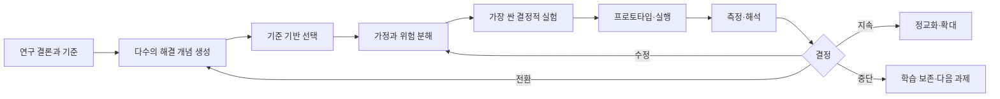

# Act 실전 가이드

> [!abstract] 이 단계의 목적
> Investigate에서 얻은 결론을 실제 행동으로 번역하고, 가장 위험한 가정을 작은 실험으로 검증한 뒤, 실행 결과를 근거로 **지속·수정·전환·중단**을 결정한다. Act의 산출물은 멋진 프로토타입이 아니라 **검증된 학습과 측정 가능한 변화**다.

관련 문서: [[00 CBL 러너 플레이북]] · [[03 Investigate 실전 가이드]] · [[05 기록·성찰·공유와 학습 증거]] · [[07 CBL 실행 템플릿 모음]] · [[08 Challenge 6 헬스케어 적용 가이드]]

## 1. Act를 시작해도 되는 조건

다음 질문에 팀이 근거를 들어 답할 수 있어야 한다.

- 누구의 어떤 상황을 개선하려는가?
- 지금 가장 중요한 문제 또는 기회는 무엇인가?
- 그 결론을 지지하는 자료·관찰·이해관계자 발언은 무엇인가?
- 해결안이 반드시 만족해야 할 기준은 무엇인가?
- 아직 불확실한 핵심 가정은 무엇인가?
- 개인정보·건강·취약한 참여자·기관 승인과 관련한 금지선은 무엇인가?

하나라도 답이 없으면 [[03 Investigate 실전 가이드#17. Investigate Gate — Go / Iterate / Return / Stop|Investigate Gate]]로 돌아간다. 아이디어가 떠올랐다는 사실만으로 Act를 시작하지 않는다.

## 2. Act의 전체 흐름

Act는 한 번의 제작 단계가 아니다. `가정 → 실험 → 증거 → 결정`을 여러 차례 반복하는 학습 루프다.

## 3. 해결안과 연구 결론을 연결한다

먼저 해결안별 **근거 추적표**를 만든다.

| 연구 결론 | 해결 기준 | 해결 개념의 대응 | 남은 불확실성 |
|---|---|---|---|
| 퇴원 직후 환자는 다음 행동의 우선순위를 혼동한다 | 첫 24시간 행동이 명확해야 한다 | 보호자와 함께 확인하는 3단계 안내 흐름 | 실제로 기억·실행되는가 |
| 의료진은 추가 업무를 감당하기 어렵다 | 기존 업무를 늘리지 않아야 한다 | 기존 설명 자료를 재구성 | 현장 워크플로에 들어갈 수 있는가 |

> [!warning] 해결안-근거 단절 신호
> “기술적으로 재미있다”, “앱이면 좋겠다”, “다른 서비스도 한다”만 있고 연구 결론과 연결되지 않으면 해결안이 아니라 선호다.

## 4. 먼저 넓히고, 나중에 좁힌다

### 4.1 해결 개념 발산

최소 세 범주의 아이디어를 만든다.

1. **정보·교육 변화**: 안내 내용, 시점, 표현, 피드백 방식
2. **행동·경험 변화**: 사용자의 다음 행동, 습관, 확인 루프
3. **서비스·시스템 변화**: 역할, 인계, 채널, 기존 절차 연결

디지털 제품만 상상하지 않는다. 인쇄물, 대화 스크립트, 체크인 절차, 서비스 블루프린트, 교육 세션, 기존 도구의 재배치가 더 적절할 수 있다.

발산 규칙:

- 개인 작성 후 공유해 첫 발언자의 영향력을 줄인다.
- 한 해결안에 여러 기능을 묶지 않는다.
- 아이디어마다 “어떤 결론 때문에 필요한가”를 한 줄로 쓴다.
- 금지선에 닿는 아이디어도 표시하되 승인 없이 실험하지 않는다.

### 4.2 기준 기반 수렴

평가 기준과 가중치는 아이디어를 보기 전에 합의한다.

| 기준 | 확인 질문 | 예시 가중치 |
|---|---|---:|
| 유용성 | 중요한 실제 문제를 줄이는가 | 25 |
| 사용성·접근성 | 대상자가 이해하고 사용할 수 있는가 | 15 |
| 실행 가능성 | 시간·기술·파트너 조건에서 가능한가 | 15 |
| 현장 적합성 | 기존 역할과 흐름에 들어갈 수 있는가 | 15 |
| 안전·윤리 | 위해와 정보 노출 위험을 통제할 수 있는가 | 20 |
| 학습 가치 | 핵심 가정을 빠르게 검증할 수 있는가 | 10 |

점수는 결정을 대신하지 않는다. 낮은 점수의 이유, 평가자의 전제, 치명적 금지 조건을 함께 기록한다.

## 5. 해결안을 가정으로 분해한다

해결안이 작동하려면 참이어야 하는 문장을 적는다.

| 가정 범주 | 질문 | 예시 |
|---|---|---|
| 바람직성 | 사람들이 이 문제를 중요하게 느끼는가 | 환자·보호자가 퇴원 직후 확인 지원을 원한다 |
| 사용성 | 설명 없이 핵심 행동을 수행할 수 있는가 | 3단계 흐름을 보고 다음 행동을 찾는다 |
| 기술 가능성 | 필요한 성능과 안정성을 구현할 수 있는가 | 알림이 적절한 시점에 전달된다 |
| 운영 가능성 | 현장 역할·시간·비용에 맞는가 | 의료진의 추가 입력 없이 운영된다 |
| 지속 가능성 | 유지 주체와 자원이 존재하는가 | 콘텐츠 갱신 책임자가 정해진다 |
| 안전·윤리 | 위해·오해·노출을 예방할 수 있는가 | 의학적 판단을 대신한다고 오인하지 않는다 |
| 도입 가능성 | 승인·조달·교육·신뢰 장벽을 넘을 수 있는가 | 병원 담당자가 시험 도입 경로를 설명할 수 있다 |

### 5.1 가정 우선순위

각 가정에 두 점수를 준다.

- **불확실성**: 현재 근거가 얼마나 약한가? 1–5
- **영향도**: 틀리면 해결안이 얼마나 무너지는가? 1–5

`위험 점수 = 불확실성 × 영향도`로 정렬한다. 단, 안전·법적 금지선은 점수와 무관하게 먼저 확인한다.

> [!tip] Act의 핵심 질문
> “우리가 만들 수 있는 것은 무엇인가?”보다 “틀렸을 때 전체 방향을 무너뜨리는 믿음은 무엇이며, 그것을 가장 싸고 안전하게 어떻게 확인할 것인가?”가 먼저다.

## 6. 프로토타입의 충실도를 질문에 맞춘다

| 검증 질문 | 적합한 형식 | 피해야 할 과잉 제작 |
|---|---|---|
| 가치 제안이 이해되는가 | 한 장 콘셉트, 스토리보드 | 완성 앱 |
| 흐름과 언어가 이해되는가 | 종이 화면, 클릭형 프로토타입 | 백엔드 구축 |
| 사람과 시스템의 역할이 맞는가 | 역할극, 서비스 블루프린트 | UI 세부 장식 |
| 자동화가 없어도 가치가 있는가 | 컨시어지, Wizard of Oz | 조기 자동화 |
| 기술적 병목이 풀리는가 | 기술 스파이크, 최소 데이터 모형 | 전체 제품 |
| 현장 운영이 가능한가 | 제한된 모의 실행, 비식별 시뮬레이션 | 승인 없는 실제 환자 적용 |

- **컨시어지**: 사람이 수동으로 서비스를 제공하며 가치와 흐름을 확인한다.
- **Wizard of Oz**: 사용자는 자동 시스템처럼 경험하지만 뒤에서는 사람이 작동시킨다.
- **기술 스파이크**: 제품을 만드는 것이 아니라 특정 기술 불확실성만 확인한다.

프로토타입의 완성도는 신뢰도가 아니다. 실제 행동과 가까운 증거가 더 중요하다.

## 7. 실험을 설계한다

모든 실험에는 다음 항목이 있어야 한다.

1. **가정**: 무엇이 참이라고 믿는가?
2. **반증 가능한 가설**: 관찰 가능한 형태로 어떻게 표현하는가?
3. **대상과 맥락**: 누구에게, 어떤 조건에서 시험하는가?
4. **절차**: 무엇을 보여주고 무엇을 요청하는가?
5. **측정값**: 행동·결과·발언 중 무엇을 기록하는가?
6. **판정 기준**: 어떤 결과면 지지·반박·불충분인가?
7. **중단 조건**: 불편·혼동·위해 신호가 나타나면 언제 멈추는가?
8. **편향 통제**: 유도 질문, 팀원의 설명, 표본 편향을 어떻게 줄이는가?
9. **권한과 동의**: 참여·촬영·녹음·데이터 보관에 필요한 동의는 무엇인가?

### 7.1 좋은 가설의 형태

> `[대상]이 [맥락]에서 [프로토타입]을 사용하면, [기준 시간/조건] 안에 [관찰 가능한 행동]을 하며, [성공 기준]을 충족할 것이다.`

예:

> 퇴원 경험이 있는 성인 대리 참여자가 모의 안내 카드를 보면, 추가 설명 없이 2분 안에 세 가지 다음 행동과 의료진에게 문의해야 할 상황을 구분하며, 5명 중 4명 이상이 핵심 문장을 자기 말로 정확히 설명할 것이다.

의료적 정확성을 검증하지 않은 콘텐츠로 실제 행동을 유도해서는 안 된다. 초기 실험은 비식별·가상 시나리오·대리 사용자로 제한할 수 있다.

### 7.2 지표를 층으로 나눈다

| 층 | 예시 | 해석 주의 |
|---|---|---|
| 활동 | 접속 수, 테스트 참여 수 | 가치나 변화 자체는 아님 |
| 행동 | 정확한 경로 선택, 과제 완료 | 실제 맥락 전이 여부 확인 필요 |
| 경험 | 이해도, 확신, 부담감 | 자기보고 편향 가능 |
| 결과 | 오류 감소, 연속성 향상 | 외부 요인과 시간 지연 고려 |
| 부작용 | 혼동, 불안, 업무 증가 | 평균 성과에 가려지지 않게 별도 기록 |

기준선이 가능한 경우 실행 전·후를 비교한다. 수치와 함께 이유를 설명하는 질적 자료도 수집한다.

## 8. 테스트를 진행하는 법

### 8.1 역할

- 진행자: 동일한 안내문을 사용하고 중립적으로 질문한다.
- 관찰자: 말보다 행동·막힘·우회·시간을 기록한다.
- 기록 담당: 익명 ID, 동의 범위, 원자료 위치를 관리한다.
- 안전 담당: 중단 조건, 개인정보 노출, 참여자 부담을 감시한다.

### 8.2 진행 원칙

- 먼저 행동하게 하고 나중에 이유를 묻는다.
- 기능을 설명하거나 사용자를 교육해서 성공시키지 않는다.
- “좋았나요?” 대신 “어디서 다음 행동을 결정했나요?”를 묻는다.
- 긍정 반응뿐 아니라 침묵·주저·오해·우회 행동을 기록한다.
- 한 회차가 끝날 때마다 프로토타입을 즉시 바꾸지 말고, 비교 가능한 묶음이 끝난 뒤 판단한다.

### 8.3 데이터 최소화

실험 목적에 꼭 필요한 정보만 수집한다. 개인 식별 정보, 건강 정보, 진료 기록, 화면 캡처, 음성은 각각 별도의 필요성과 권한을 확인한다. 저장 기간·접근자·삭제 시점을 사전에 정한다.

## 9. 결과를 해석한다

결과는 세 범주로 분류한다.

- **지지**: 미리 정한 성공 기준을 충족하고 중대한 부작용이 없다.
- **반박**: 핵심 행동 또는 안전 기준을 충족하지 못한다.
- **불충분**: 표본·절차·맥락·측정의 한계 때문에 판단할 수 없다.

### 9.1 해석 회의 순서

1. 각자가 독립적으로 관찰 사실을 쓴다.
2. 사실과 해석을 분리한다.
3. 예상과 어긋난 증거부터 본다.
4. 하위집단·맥락별 차이를 확인한다.
5. 대안 설명과 혼란 변수를 적는다.
6. 가정별 증거 강도를 갱신한다.
7. 다음 결정을 한 문장으로 확정한다.

### 9.2 네 가지 결정

| 결정 | 조건 | 다음 행동 |
|---|---|---|
| 지속 | 핵심 가정이 지지되고 위험이 관리됨 | 다음 위험 가정 또는 더 현실적인 맥락으로 이동 |
| 수정 | 가치 방향은 맞지만 흐름·표현·운영이 실패 | 원인에 해당하는 요소만 변경 후 재시험 |
| 전환 | 사용자·문제·전달 방식에 대한 핵심 가정이 반박 | 연구 결론으로 돌아가 새 개념 발산 |
| 중단 | 위해·권한·가치·실행 가능성의 치명적 장벽 | 실패 학습을 보존하고 다른 Challenge 또는 범위 선택 |

“더 만들어 보자”는 결정이 아니다. 무엇을 왜 다음에 검증할지 명시한다.

## 10. 실제 구현과 평가

CBL의 Act는 가능하면 현실 세계에서 행동하고 결과를 평가하는 데까지 간다. 그러나 “현실 적용”은 무단 배포를 의미하지 않는다.

구현 계획에 포함할 것:

- 적용 대상과 장소, 기간
- 책임자와 승인자
- 참여자 안내 및 동의
- 운영 절차와 교육
- 비용·장비·기술·유지 책임
- 오류·사고·민원·중단 대응
- 기준선, 성공 지표, 부작용 지표
- 수집 데이터의 보관·접근·삭제
- 종료 후 인계 또는 철수 방식

### 10.1 실제 적용이 불가능할 때

다음 중 가장 현실과 가까우면서 안전한 행동을 선택한다.

- 이해관계자 검토를 받은 실행 제안서
- 역할극 기반 서비스 리허설
- 비식별 합성 데이터로 수행한 기술 검증
- 대리 사용자와의 과제 기반 사용성 테스트
- 담당자가 평가한 업무 흐름·안전 시나리오
- 승인·자원·위험 조건이 명시된 다음 단계 로드맵

이 경우 “효과를 검증했다”고 쓰지 않는다. **어떤 가정을 어느 수준까지 검증했는지**만 주장한다.

## 11. Act 단계에서 반드시 내려야 할 결론

> [!success] 필수 결론
> 1. 선택한 해결 개념과 연구 결론의 연결은 무엇인가?
> 2. 해결안의 핵심 가정과 가장 큰 위험은 무엇인가?
> 3. 어떤 실험이 어떤 가정을 검증했는가?
> 4. 관찰 결과는 지지·반박·불충분 중 무엇인가?
> 5. 예상하지 못한 효과와 위해 신호는 무엇인가?
> 6. 다음 결정은 지속·수정·전환·중단 중 무엇이며 왜 그런가?
> 7. 실제 적용을 위해 필요한 승인·자원·파트너·추가 근거는 무엇인가?
> 8. 우리 팀과 각 러너는 무엇을 배웠는가?

## 12. Act 종료 게이트

- [ ] 해결안의 모든 핵심 요소가 연구 결론 또는 명시된 가정과 연결된다.
- [ ] 위험 가정이 우선순위화되어 있다.
- [ ] 실험 전 가설·지표·판정 기준·중단 조건을 정했다.
- [ ] 안전·윤리·개인정보·승인 경계를 지켰다.
- [ ] 행동 관찰과 참여자 피드백을 모두 기록했다.
- [ ] 반대 증거와 예상 밖 결과를 숨기지 않았다.
- [ ] 결과에 근거한 다음 결정이 한 문장으로 확정되었다.
- [ ] 실제 구현 수준과 검증하지 못한 범위를 명시했다.
- [ ] 학습 증거와 개인 성찰이 남아 있다.

## 13. 자주 실패하는 패턴과 복구법

| 실패 패턴 | 진단 | 복구 |
|---|---|---|
| 솔루션부터 제작 | 기준·가정 없이 기능 목록만 존재 | 근거 추적표와 가정 지도로 돌아간다 |
| 한 아이디어에 집착 | 비교 개념이 없고 비판을 방어함 | 최소 3개 범주의 개념을 독립 발산한다 |
| 완성도를 학습으로 착각 | UI는 정교하지만 위험 가정이 그대로 | 가장 위험한 한 가정용 저충실도 실험을 만든다 |
| 칭찬을 검증으로 착각 | “좋아요”만 기록 | 실제 과제·선택·시간·오류를 측정한다 |
| 기준을 결과 후 변경 | 실패한 뒤 성공 정의를 낮춤 | 실험 전 판정 기준을 타임스탬프로 고정한다 |
| 작은 표본을 일반화 | 몇 명 결과로 효과 주장 | 탐색적 신호로 표현하고 다음 표본·맥락을 설계한다 |
| 구현을 배포로 착각 | 승인 없이 실제 환경에 적용 | 모의 실행 또는 담당자 검토로 수준을 낮춘다 |
| 부정적 증거 삭제 | 발표 스토리에 맞는 결과만 보존 | 반증·이상 사례를 먼저 검토한다 |

## 14. Challenge 6에 바로 적용하기

Challenge 6의 현재 범위에서는 다음 순서가 안전하고 학습 가치가 높다.

1. 환자 접촉이나 실제 건강 데이터 없이 해결 기준을 합의한다.
2. 의료진·병원 담당자에게 문제 구조와 업무 흐름 가정을 검토받는다.
3. 퇴원 경험이 있는 일반 성인 또는 가상 페르소나를 활용해 언어·흐름을 시험한다.
4. 의료 콘텐츠는 임상 전문가의 정확성 검토 전 실제 지침처럼 제시하지 않는다.
5. 비식별 합성 시나리오로 서비스 역할극 또는 클릭형 프로토타입을 시험한다.
6. 병원 적용은 승인 경로·책임 주체·IRB 필요성·개인정보 처리 조건이 명확해진 이후의 별도 단계로 둔다.

초기 성공은 “환자 결과가 개선되었다”가 아니라 다음처럼 표현한다.

- 문제·대상·맥락 가정이 의료진 피드백으로 정교해졌다.
- 대리 사용자가 안내 흐름에서 특정 오해를 보였고 표현을 수정했다.
- 기존 업무를 늘리는 지점이 발견되어 운영 모형을 전환했다.
- 실제 적용 전에 필요한 승인과 증거의 목록이 명확해졌다.

구체적인 안전 경계와 다음 스프린트는 [[08 Challenge 6 헬스케어 적용 가이드]]를 따른다.
