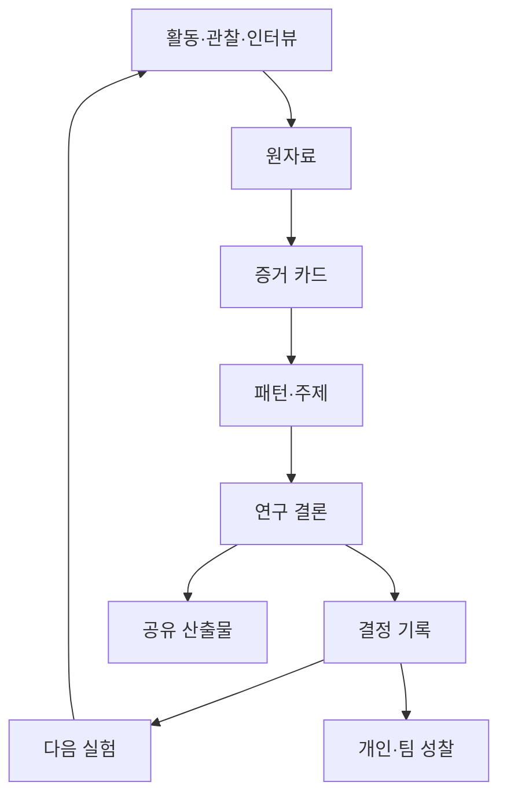

# 기록·성찰·공유와 학습 증거

> [!abstract] 핵심
> CBL에서 기록·성찰·공유는 마지막 발표용 부가 작업이 아니라 Engage·Investigate·Act 전체를 관통하는 학습 장치다. 좋은 기록은 “무엇을 했다”를 넘어 **무엇을 믿었고, 어떤 증거로 생각이 바뀌었으며, 다음 행동이 왜 달라졌는지**를 보여준다.

관련 문서: [[00 CBL 러너 플레이북]] · [[01 CBL 핵심 원리와 전체 프로세스]] · [[07 CBL 실행 템플릿 모음]]

## 1. 세 가지 기록을 분리한다

| 기록 | 목적 | 핵심 질문 |
|---|---|---|
| 프로젝트 기록 | 팀의 사실·결정·산출물을 재현 가능하게 보존 | 무엇을, 언제, 누구와, 어떤 근거로 결정했는가 |
| 연구 증거 | 주장과 원자료의 추적 가능성 확보 | 이 결론은 어떤 자료에서 나왔는가 |
| 개인 학습 기록 | 각 러너의 변화·기여·역량을 드러냄 | 나는 무엇을 몰랐고, 어떻게 배우고, 무엇이 달라졌는가 |

한 문서에 모두 섞으면 회의록은 길어지고 근거는 찾기 어려워진다. 공통 ID와 링크로 연결한다.

## 2. 최소 기록 체계

### 2.1 공통 식별자

- 자료: `SRC-001`, `INT-003`, `OBS-002`
- 통찰: `INS-007`
- 결정: `DEC-004`
- 가정: `ASM-006`
- 실험: `EXP-003`

결론 문장 옆에 관련 ID를 쓰면 주장→원자료→결정을 역추적할 수 있다.

### 2.2 파일명 원칙

`YYYY-MM-DD_활동종류_대상또는주제`

예: `2026-08-12_전문가인터뷰_퇴원교육흐름`

개인 이름·병명·연락처를 파일명에 넣지 않는다. 민감 자료는 팀 노트와 분리하고 접근·보관·삭제 정책을 적용한다.

## 3. 활동 전·중·후 기록

### 활동 전

- 학습 질문과 현재 가정
- 성공·실패 판정 기준
- 역할과 일정
- 동의·촬영·녹음·보관 범위
- 예상되는 편향과 위험

### 활동 중

- 시간, 맥락, 실제 행동과 직접 발언
- 계획과 달라진 점
- 관찰자의 해석이 아닌 구체적 사실
- 중단·불편·예상 밖 사건

### 활동 후 24시간 이내

- 요약과 원자료 정리
- 근거가 있는 통찰과 반대 사례
- 가정 신뢰도 변화
- 결정 및 다음 질문
- 개인 성찰

기억을 나중에 재구성하면 확증편향과 이야기 꾸미기가 커진다.

## 4. 사실·해석·결정을 구분한다

| 구분 | 예시 |
|---|---|
| 사실 | 참여자 5명 중 3명이 두 번째 단계에서 뒤로 돌아갔다 |
| 해석 | 단계 이름이 행동보다 조직 용어 중심이라 길 찾기가 어려울 수 있다 |
| 대안 해석 | 테스트 기기의 뒤로가기 위치가 낯설었을 수 있다 |
| 결정 | 단계명을 행동 동사로 바꾸고 동일 과제를 재시험한다 |

“사용자가 헷갈렸다”는 관찰처럼 보이지만 이미 해석이다. 무엇을 보고 그렇게 판단했는지 남긴다.

## 5. 결정 로그가 가장 중요한 이유

CBL 팀은 많은 아이디어와 피드백을 만난다. 결정 로그가 없으면 과거 논쟁을 반복하고, 목소리가 큰 사람의 기억이 팀의 역사로 바뀐다.

결정마다 기록할 것:

- 결정 문장
- 날짜와 결정자
- 사용한 근거와 반대 근거
- 고려한 대안
- 불확실성과 위험
- 재검토 조건 또는 만료 시점
- 결정으로 생긴 다음 행동과 책임자

> [!tip] 결정의 수명
> “영구 결정” 대신 “새로운 의료진 3명이 같은 장벽을 반박하면 재검토”처럼 갱신 조건을 쓴다.

## 6. 성찰은 회고문이 아니라 판단 훈련이다

### 6.1 개인 성찰 프롬프트

1. 오늘 내가 사실이라고 가정한 것은 무엇이었나?
2. 어떤 증거가 그 생각을 지지하거나 흔들었나?
3. 내가 회피하거나 과도하게 방어한 관점은 무엇인가?
4. 내 행동이 팀·이해관계자·결과에 어떤 영향을 주었나?
5. 다음에는 어떤 행동을 구체적으로 다르게 할 것인가?
6. 어떤 역량을 연습했고, 그 증거는 무엇인가?

### 6.2 팀 성찰 프롬프트

- 우리의 Challenge는 여전히 중요한가?
- 지금도 모르는 가장 중요한 것은 무엇인가?
- 누구의 관점이 과대표집·누락되었는가?
- 우리는 증거를 찾았나, 아이디어를 정당화할 자료를 찾았나?
- 어떤 결정이 지연되고 있으며 이유는 무엇인가?
- 협업 규칙 중 지켜진 것과 깨진 것은 무엇인가?
- 다음 주에 중단·시작·지속할 행동은 무엇인가?

### 6.3 성찰의 깊이

| 수준 | 형태 | 예시 |
|---|---|---|
| 서술 | 무슨 일이 있었나 | 전문가 인터뷰를 했다 |
| 분석 | 왜 그렇게 되었나 | 질문이 솔루션 중심이라 현장 맥락을 덜 들었다 |
| 전환 | 무엇을 바꿀 것인가 | 다음 인터뷰의 앞부분을 실제 업무 흐름 재구성에 쓴다 |
| 검증 | 변화가 효과가 있었나 | 수정 후 서술적 답변 비율이 늘었는지 비교한다 |

## 7. 학습 목표와 증거를 연결한다

Challenge 시작 시 개인·팀 학습 목표를 행동과 산출물로 정의한다.

| 학습 목표 | 관찰 가능한 행동 | 증거 | 평가자 |
|---|---|---|---|
| 편향을 줄인 인터뷰 | 중립 질문과 반대 사례 탐색 | 질문지 전후 버전, 녹취 코딩, 성찰 | 자기·동료·멘토 |
| 시스템 사고 | 행위자와 피드백 구조를 설명 | 시스템 지도, 수정 이력 | 동료·이해관계자 |
| 프로토타입 실험 | 사전 기준으로 가정을 판정 | 실험 계획, 원자료, 결정 로그 | 팀·멘토 |
| 협업 | 책임을 명확히 하고 갈등을 다룸 | 회의 기록, 동료 피드백 | 동료 |

완성품 하나로 모든 러너의 학습을 평가하지 않는다. 과정과 결과, 개인과 팀, 형성과 총괄 평가를 함께 본다.

## 8. 형성평가와 총괄평가

### 8.1 형성평가: 학습 중 방향을 바꾸기 위해

- 매 활동 종료 후 5분 회고
- 주간 가정·증거 리뷰
- 단계 게이트 점검
- 동료 피드백과 멘토 질문
- 프로토타입 실험 결과

핵심은 점수가 아니라 다음 행동 변화다.

### 8.2 총괄평가: 도달 수준을 설명하기 위해

- Challenge의 질과 범위
- 조사 설계와 증거의 질
- 결론의 추적 가능성
- 해결안과 연구의 정렬
- 구현·평가의 타당성
- 윤리·안전·포용성
- 개인 학습의 변화와 기여
- 공유의 명확성과 한계 공개

루브릭은 가능하면 러너가 멘토와 함께 초기에 합의한다. 평가 기준을 마지막에 발표 형식에 맞춰 만들지 않는다.

## 9. 포트폴리오에 남길 최소 증거

### Engage

- Big Idea에서 Challenge까지의 선택 과정
- 제외한 대안과 범위 기준
- 이해관계자 지도와 초기 윤리 경계
- 개인 학습 목표

### Investigate

- 우선순위 Guiding Questions
- 조사 계획과 원자료 목록
- 출처 평가, 삼각검증, 반대 사례
- 통찰·결론·해결 기준

### Act

- 해결 개념 비교
- 가정·위험 지도
- 프로토타입 버전과 실험 계획
- 원자료·결과·판정·의사결정
- 실제 적용 또는 적용 준비의 범위

### 전 과정

- 결정 로그
- 개인·팀 성찰
- 피드백을 반영한 변경 이력
- 실패·한계·열린 질문

## 10. 공유는 대상별로 설계한다

| 대상 | 알고 싶은 것 | 적합한 공유물 |
|---|---|---|
| 동료 러너 | 방법·실패·재사용 가능한 학습 | 학습 회고, 데모, 템플릿 |
| 멘토 | 판단 과정과 성장 | 근거 지도, 결정 로그, 성찰 |
| 이해관계자 | 문제 이해·부담·다음 참여 | 한 장 요약, 서비스 흐름, 질문 목록 |
| 의사결정자 | 가치·위험·자원·승인 | 실행 브리프, 근거 수준, 로드맵 |
| 일반 청중 | 왜 중요하고 무엇을 배웠는가 | 짧은 이야기, 시각 자료, 한계 포함 결과 |

### 10.1 공유 스토리의 기본 구조

1. Big Idea와 구체적인 Challenge
2. 출발 당시의 가정
3. 조사 방법과 만난 관점
4. 생각을 바꾼 핵심 증거
5. 해결안과 가장 위험한 가정
6. 실험·실행 결과
7. 지지된 것, 반박된 것, 모르는 것
8. 실제 영향과 한계
9. 개인·팀의 학습
10. 다음 행동과 필요한 협력

성과를 과장하지 않는다. 프로토타입 사용성 검증을 건강 결과 개선으로 표현하는 것은 증거 범위를 넘는다.

## 11. 공개 전 체크리스트

- [ ] 참여자의 공개 동의 범위와 일치한다.
- [ ] 개인 식별 정보와 민감 정보가 제거되었다.
- [ ] 인용문이 맥락을 왜곡하지 않는다.
- [ ] 사진·음성·기관명·로고 사용 권한이 있다.
- [ ] 검증 수준과 표본·방법의 한계를 밝혔다.
- [ ] 팀원과 외부 기여자의 공로를 표시했다.
- [ ] 공개하면 안 되는 원자료가 링크되지 않았다.
- [ ] 다음 독자가 재사용할 수 있는 학습을 포함했다.

## 12. 주간 운영 리듬

### 매일 또는 코어 타임 종료 전 10분

- 오늘 새로 얻은 증거 1개
- 바뀐 가정 1개
- 결정 또는 보류 1개
- 다음 책임자와 기한

### 매주 45분

1. 학습 목표와 Challenge 재확인
2. 증거 보드 업데이트
3. 반대 증거·누락 관점 검토
4. 결정 로그 점검
5. 팀 협업 회고
6. 다음 주의 핵심 학습 질문 1–3개 선정

### 단계 전환 시

- 해당 단계 게이트 검토
- 멘토 또는 외부 관점 피드백
- 개인 성찰 제출
- 공개 가능한 중간 학습 공유

## 13. 기록 품질 게이트

- [ ] 주장과 원자료가 링크로 연결된다.
- [ ] 사실·해석·결정이 구분되어 있다.
- [ ] 긍정·부정·불충분 증거가 모두 남아 있다.
- [ ] 결정의 이유와 재검토 조건이 있다.
- [ ] 개인 기여와 팀 산출물이 구분된다.
- [ ] 학습 목표별 증거가 최소 하나 이상 있다.
- [ ] 민감 자료의 접근·보관·삭제 기준이 있다.
- [ ] 외부 공유물이 실제 검증 수준을 넘어서 주장하지 않는다.
