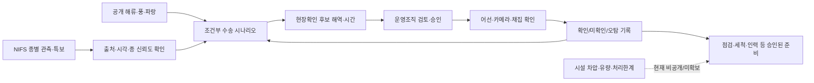

# 추가자료 Engage-Investigate 완료감사와 재수행

> [!danger] 완료감사 결론
> 이전 32·33번 문서는 **사실감사, 종 선정, 서비스 경계는 충분히 수행했지만 CBL Engage–Investigate의 전체 필수 산출물을 완료하지는 못했다.** 특히 팀 계약·개인/팀 학습목표·개인 질문 발산·Evidence ID 추적·현장 사용자 검토·성찰이 빠져 있었다. 따라서 이 문서는 추가자료 3건과 노무라입깃해파리 단일종 결정을 기준으로 desk research에서 할 수 있는 Engage–Investigate를 다시 수행한다. 사람에게서만 얻을 수 있는 근거는 빈칸을 꾸미지 않고 `미완료`로 남긴다.

> [!summary] 현재 판정
> - **Engage 내용:** 조건부 완료. Big Idea, Essential Question, Challenge, 이해관계자, 범위와 안전 경계는 성립한다.
> - **Engage 절차:** 부분 완료. 팀원별 개인적 연결·학습목표·성찰 원문과 운영 합의는 팀이 직접 작성해야 한다.
> - **Investigate desk research:** 완료. 문제, 사건, 기존 대응, 데이터, 반례, 안전 경계를 근거로 합성했다.
> - **Investigate 전체:** 미완료/Iterate. 직접 사용자·현행 업무·필요 선행시간·양성/음성 현장라벨·기존 방식 대비 증분가치를 확인하지 못했다.
> - **Act 진입:** 데이터 파이프라인과 가상 shadow workflow만 제한적으로 가능. 성능·운영효과 검증은 아직 금지한다.

## 0. 요구사항과 완료 기준

| 항목 | 고정 내용 |
| --- | --- |
| 사용자 목표 | 추가자료를 빠짐없이 반영해 Engage–Investigate를 제대로 수행하고, 단일 타깃을 중심으로 팀이 다음 결정을 내릴 근거를 만든다. |
| 선택된 조사 타깃 | 노무라입깃해파리 한 종. `가장 위험한 종`이 아니라 문제–데이터 적합성이 가장 높은 첫 검증종이다. |
| 하지 않을 일 | 제품 성능 날조, 울릉–독도 소용돌이 재도입, 살파와 해파리 혼합학습, 원전 정지·감발 권고, 보안민감 자료 탐색, 임의 경보 임계값 사용. |
| 완료 증거 | Engage/Investigate 필수 산출물별 상태, 추가자료 주장 추적표, Evidence Index, GQ Matrix, 모순 로그, 연구결론, 해결안 기준, Gate가 서로 연결된다. |
| 남길 미완료 | 팀원 자작 기록, 직접 사용자·현장관측자 근거, API 실호출과 현장라벨처럼 desk research로 대체할 수 없는 항목. |

---

## 1. 이전 산출물의 CBL 완결성 감사

### Engage 필수 산출물 10개

| 필수 산출물 | 이전 상태 | 이번 처리 | 최종 상태 |
| --- | --- | --- | --- |
| 팀 계약과 작업 리듬 | 팀 구성만 확인, 코어타임·결정·갈등규칙 없음 | 기존 [[04) CBL Engage 세션 01 - 협업 프로토콜과 초기 근거]]의 공백을 유지 | **미완료 — 팀 입력 필요** |
| Big Idea 선택 근거 | 32·33에 선택문은 있으나 후보 비교와 개인적 의미가 약함 | 아래 후보·선정 기준 재작성 | **내용 완료 / 개인 연결 미완료** |
| Essential Question 후보와 선택 기록 | 최종 질문 중심 | 아래 후보 4개와 선택 이유 복원 | **내용 완료 / 개인 발산 원문 없음** |
| Challenge와 설명 | 32·33에 있음 | 노무라 단일종 기준으로 재검증 | **완료** |
| 초기 이해관계자 지도 | 사용자 목록만 있음 | 역할·권한·근거·미지를 분리한 지도 작성 | **desk 수준 완료** |
| 사실·가설·미지·제약 | 25·30·32·33에 분산 | 본문과 Evidence Index로 통합 | **완료** |
| Scope Box·안전 스크린 | 안전 경계는 있으나 단일종 전환 후 통합본 없음 | 아래 Scope Box로 갱신 | **완료** |
| 팀·개인 학습목표 | 초기 문서부터 미충족 | 조사 목표만 제안하고 자작 영역 보존 | **미완료 — 팀 입력 필요** |
| Guiding Question 씨앗 | 26·30에 범용 생물 기준으로 존재 | 노무라 단일종 GQ Matrix로 갱신 | **완료** |
| Engage 성찰 | AI가 만든 판정만 있고 팀원 원문 없음 | 성찰 질문과 기록칸 제시 | **미완료 — 팀 입력 필요** |

### Investigate 필수 산출물 12개

| 필수 산출물 | 이전 상태 | 이번 처리 | 최종 상태 |
| --- | --- | --- | --- |
| Guiding Question Matrix | 26은 범용 생물 기준, 33은 미답 P0 목록만 있음 | 노무라 단일종 기준으로 재작성 | **완료** |
| 조사계획·안전 확인 | 공개자료 범위와 금지선은 있음 | 질문별 방법·증거·중단조건 연결 | **desk 수준 완료** |
| 출처·원문 기록 | 25·30·32·33에 충분 | Evidence ID로 색인 | **완료** |
| Evidence Cards·Index | 사실원장은 있으나 GQ/결론 추적이 약함 | 아래 E-01~E-15로 연결 | **Index 완료 / 개별 Card 부분** |
| 이해관계자·시스템·여정 지도 | 목록과 인과사슬만 있음 | 역할 흐름과 현재/가설 여정 작성 | **desk 수준 완료** |
| 기존 대안 분석 | 32에 요약 | 작동 조건·공백·전이 한계 보강 | **완료** |
| 모순·반대 증거 로그 | 여러 문서에 흩어짐 | 아래 한 표로 통합 | **완료** |
| 인사이트·Research Conclusions | 31에 RC가 있으나 범용 생물 기준 | 노무라 기준 RC와 Evidence ID 재작성 | **완료** |
| 남은 미지·제한 | 충분히 기록됨 | GQ 상태·작업티켓으로 연결 | **완료** |
| 해결안 기준·위험가정 | 31·32에 있음 | 단일종 검증 계약으로 갱신 | **완료** |
| 외부 검토 기록 | Claude·AI 에이전트 검토만 있음 | 동료검토와 현장검토를 구분 | **미완료 — 외부 관계자 없음** |
| Investigate 성찰 | 명시적 팀 성찰 없음 | 조사자가 답할 수 있는 성찰과 팀 질문 분리 | **부분 — 팀 입력 필요** |

> [!warning] 정정된 완료 판정
> 이전 결과를 `Engage–Investigate 완료`라고 부르는 것은 과했다. 정확한 표현은 **`Engage 내용 조건부 완료, Investigate desk research 완료, 사용자·현장 검증 미완료`**다.

---

## 2. Engage 재수행

### 2.1 Big Idea 후보와 선택

| 후보 | 열어 주는 관점 | 한계 | 판정 |
| --- | --- | --- | --- |
| 필수 흐름의 연속성 | 해수 취수와 전력공급을 공공가치로 연결 | 운영조직 관점으로 좁아질 수 있음 | **선택** |
| 불확실성 속의 선제성 | 완벽한 예측보다 비례적 준비를 강조 | 지역·시설 맥락이 약함 | 보조 원리 |
| 경계에서의 회복력 | 바다–기반시설 경계의 증폭을 설명 | 다소 추상적 | 보조 프레임 |
| 생태계와 기반시설의 공존 | 생물을 제거 대상으로만 보지 않음 | 3일 MVP의 직접 행동과 거리가 있음 | 장기 확장 |

> **선택 Big Idea — 필수 흐름의 연속성:** 변동하는 자연환경 속에서도 사회가 의존하는 물과 에너지의 흐름을 안정적으로 이어가는 능력.

선택 이유는 해파리·AI·지도라는 해결안을 제거해도 성립하고, 경북의 해안 원전 운영과 트랙의 공공가치를 연결하며, 결과를 `더 이른 검증과 준비`로 측정할 수 있기 때문이다.

### 2.2 Essential Question 후보와 선택

1. 변하는 바다 속에서 공공에 필요한 필수 흐름은 어떻게 이어질 수 있을까?
2. 불완전한 해양 신호를 누가 언제 검증해야 늦지도 과잉이지도 않은 대응이 가능한가?
3. 노무라입깃해파리의 대량 유입이 취수 운영부담으로 바뀌기 전에 무엇을 알아야 할까?
4. 경북 동해안의 시설·관측자·지역기관은 갑작스러운 자연변동에 어떻게 함께 준비할 수 있을까?

> **선택 Essential Question:** 변동하는 바다 속에서 노무라입깃해파리의 국지적 대량 유입이 필수 취수 흐름을 방해하기 전에 어떻게 준비할 수 있을까?

1번보다 대상·맥락이 구체적이고, 3번보다 특정 솔루션을 덜 전제하며, 사용자·기존대응·데이터·행동을 모두 조사할 하위 질문을 만든다.

### 2.3 Challenge

> **경북 원전 취수 운영조직이 노무라입깃해파리 대량 유입이 설비영향으로 번지기 전에 필요한 확인·준비시간을 확보할 수 있게 하자.**

이 Challenge는 `예측 앱`, `AI`, `자동경보`, `원전정지`를 요구하지 않는다. 지역 해양 관측 주체는 공동 사용자가 아니라 정보 제공·검증 파트너로 분리한다. 지금 중요한 이유는 2024년 신한울에서 노무라입깃해파리가 포함된 대규모 유입과 거름망 손상이 보도됐고, NIFS가 경북의 종별 출현·특보를 반복 제공하기 때문이다. 다만 공개자료에서 노무라로 특정된 국내 감발·정지는 확인되지 않았고 현행 운영조직에 실제 정보공백이 있는지도 아직 가설이다.

### 2.4 이해관계자 지도

| 주체 | 현재 역할로 확인된 것 | 이 Challenge에서 필요한 결정·정보 | 현재 근거 상태 |
| --- | --- | --- | --- |
| 취수·순환수 운전/정비 조직 | 설비계측, 점검·세척·운전절차 수행 가능 | 외부 신호를 보고 누가 무엇을 승인하는가 | **정확한 직책·권한 미확인** |
| 당직·상황관리 책임자 | 운영판단의 조정자일 가능성 | 강화감시·인력·장비 준비의 승인선 | **가설** |
| NIFS 해파리 모니터링 | 종별 주간보고·특보·조사 | 어떤 위치·시각 자료를 얼마나 빨리 제공 가능한가 | **공식 역할 확인 / 업무 연결 미확인** |
| 어촌계·수협·어선 관측자 | 한울과 정보공유 협약, 해상 시각관측·제거 가능 | 표준화된 양성·음성 확인과 회신 | **협력 존재 확인 / 현재 흐름 미확인** |
| 경북도·울진군·경주시 | 해양수산·재난·지역조정 | 시설–관측자 사이 상황 공유와 자원 조정 | **역할 가설** |
| 원안위·KINS | 안전규제·사건 확인 | 운영지원 도구의 안전·보안 경계 | **규제 역할 확인** |
| 현장 작업자 | 제거·세척·예찰 부담을 직접 짐 | 늦은 동원과 불필요 출동 감소 | **잠재 수혜, 직접근거 없음** |
| 경북 전력 이용자·지역사회 | 발전중단의 간접 영향 가능 | 가용성·전력공급 연속성 | **최종 수혜 가설, 방사선 안전효과 주장 금지** |

### 2.5 사실·가설·미지·제약

| 구분 | 내용 |
| --- | --- |
| 사실 | 대량 해양생물 유입은 국내외에서 순환수·취수 여과계통에 부담을 주어 감발·정지를 일으켰다. 2024 신한울 유입 보도의 약 70%는 노무라입깃해파리였다. NIFS는 종별 반복 관측과 특보를 제공한다. |
| 해석 | 문제의 공공가치는 원전사고 공포가 아니라 취수·발전 연속성과 급박한 현장대응 부담에 있다. |
| 가설 | 외부 관측과 공개 물리장을 결합하면 같은 확인자원으로 다음 확인 위치·시점을 더 잘 고를 수 있다. |
| 미지 | 직접 사용자, 기존 신호·SOP, 필요한 선행시간, 현장 양성/음성 라벨, 공개신호의 증분가치, 오경보 비용. |
| 제약 | 주·도 단위 출현률, 시설 근접 생물량 부재, ROMS 실호출·입도 미검증, 보안민감 시설자료, 3일 개발기간. |

### 2.6 Scope Box

| 포함 | 인접하지만 제외 | 승인 전 금지 | 이후 확장 |
| --- | --- | --- | --- |
| 노무라입깃해파리, 공식 공개 관측·특보, 공개 해류·기상, 근거·불확실성, 현장확인 workflow | 살파·해조류·새우·어군 예측, 장기 기후인과, 원전 전체 안전성 평가 | 상세 취수구·보안·CCTV·내부망·보호계통 임계, 자동 감발·정지 권고, 실제 운영 적용 | 살파 전용 데이터·시설라벨 확보 후 별도 모듈 |

### 2.7 학습 목표와 성찰

조사 수준의 학습 목표는 다음과 같다.

- 도메인: 노무라입깃해파리의 `관측된 존재 → 조건부 수송 → 현장확인 → 준비행동`을 단계별 증거로 분리한다.
- 방법: 공공데이터가 사용자의 판단을 실제로 바꾸는지 기준선과 반증을 포함해 검증한다.
- 윤리·안전: 운영지원과 원전 제어, 공개정보와 보안민감정보의 경계를 지킨다.

> [!question] 팀이 직접 채울 항목
> 각 팀원은 `왜 이 문제를 중요하게 보는가`, `어떤 해결안을 선호해 질문을 좁혔는가`, `이번에 배우고 싶은 것`, `어떤 증거가 나오면 방향을 바꿀 것인가`를 자기 언어로 남겨야 한다. 이 기록 전에는 Engage의 소유감·학습목표·성찰을 완료로 처리하지 않는다.

---

## 3. 추가자료 주장 추적표

| 추가자료 주장 | 최종 처리 | 이유 |
| --- | --- | --- |
| 해파리 존재보다 시설 대응능력을 넘는 대량 유입이 문제 | **채택 — 문제정의** | 사건 결과에 더 가깝다. 단, 공개자료로 처리능력 초과를 직접 계산할 수는 없다. |
| 발생→군집화→이동→취수구 유입→설비영향 | **수정 채택** | `관측된 존재→조건부 수송→국지 집적 가능성→취수 노출→시설영향`으로 단계별 증거를 분리한다. |
| Bloom/Retention/Release/Arrival 4개 확률모델 | **폐기/재설계** | 학습·교정 라벨이 없고 일부 단계는 검증된 지역모델이 아니다. |
| 울릉–독도 소용돌이가 집적·방출을 설명 | **폐기** | 직접 인과근거가 없고 사용자가 제외했다. |
| NIFS 출현률·특보를 사용 | **조건부 채택** | 종별 광역 관측 seed와 현행 baseline으로만 사용한다. biomass·시설 임계가 아니다. |
| 2024년 노무라 주의단계 `1개체/100㎡` 또는 발견률 20%+피해우려 | **역사 baseline 설명으로만 채택** | 당시 NIFS의 어업피해 특보 발령기준이다. 원전 취수 임계값이나 2026년 현행 기준으로 자동 전용하지 않는다. 비교에서는 팀이 기준을 재적용하기보다 실제 공식 특보 발표시각을 사용한다. |
| XGBoost/LightGBM 대량발생확률 | **폐기** | 노무라 대량발생 정답과 정상 음성라벨이 부족하다. |
| 입자 10,000개 통과비율을 도착확률로 표현 | **수정** | `ensemble 시나리오 교차비율`로만 표시하고 실제 확률로 부르지 않는다. |
| 6시간·82%·ETA 21±5h·30/60/80 경보 | **폐기** | 성능·운영요구에서 도출되지 않은 예시값이다. |
| Expected Intake Load·kg/h | **2단계 데이터 계약으로 보존** | 농도, 취수유량, 포획률, 차압·처리곡선이 있어야 한다. MVP 출력에서 제외한다. |
| 한울·월성 운전/설비 담당자가 사용자 | **사용자 가설로 보존** | 역할은 타당하지만 실제 수신자·승인권자·과업은 인터뷰 전 확정할 수 없다. |
| 사용자 3계층: 운전·설비 / 모니터링 / 의사결정자 | **수정 채택** | 운전·설비 조직을 직접 사용자 후보, 관측자는 검증 파트너, 승인자는 운영조직 안의 별도 역할로 분리한다. |
| KHNP AIMD가 이미 운영됨 | **추가검증** | 일반 설비 예측진단의 조직적 선례일 수 있지만 해양생물 유입을 다룬다는 근거는 없다. 직접 경쟁 baseline으로 자동 간주하지 않는다. |
| 동해해경청·NIFS 항공예찰 전례 | **추가검증** | 실제 공식 근거와 현재 요청·승인·비용·관측표준을 확인한 뒤 현장확인 대안에 포함한다. |
| 예비력 8.2GW와 APR1400 2기 2.8GW 비교 | **폐기 — 실제 영향 수치로 사용 금지** | 기사 시점의 예비력과 설비 정격용량을 대비한 산술 시나리오이며 해파리 사건의 실제 공급력 손실이 아니다. |
| EDF는 원거리 관측·샘플링·제거를 강화 | **채택** | 기존대응 기준선이다. 공개자료로 피해감소 효과는 평가할 수 없다. |
| KCI 연구가 해파리 탐지를 검증 | **반증** | 현장에 해파리·살파가 없었으며 원격 음향·영상 수집 가능성만 보였다. |
| 원전상태 API를 결과 라벨로 사용 | **폐기** | 정지원인·취수부하·경미개입·정상 음성을 제공하지 않는다. |
| 해파리부터 시작해 여러 생물로 확장 | **수정** | 전면은 노무라 단일종. 살파 등은 데이터·모델·검증을 별도로 통과해야 한다. |
| 원전 안전을 지킨다 | **수정** | 취수·발전 연속성과 준비시간으로 표현한다. 개별 사건의 안전영향이 없었다는 근거를 보존한다. |

---

## 4. Investigate 재수행

### 4.1 핵심 용어의 운영 정의

- **노무라 관측:** 종이 확인되거나 종별 공식 보고에 포함된 시각·공간 기록. 일반 해파리 신고는 종 신뢰도를 별도 표시한다.
- **조건부 접근 시나리오:** 명시된 출발 관측과 물리장·가정 아래 모델 경로가 특정 연안구역을 통과하는 결과. 실제 도달확률이 아니다.
- **현장확인 우선순위:** 제한된 관측자·선박·센서로 다음에 확인할 구역과 시간대를 근거·결측과 함께 정렬한 것.
- **운전영향성 유입:** 취수 영향권으로 들어오는 생물량이 여과·세척·제거능력을 넘어 설비신호 또는 운전조치를 바꿀 수 있는 사건. 공개자료로 직접 계산하지 않는다.
- **성공:** 원전 정지 방지가 아니라, 고정된 확인예산에서 기존 기준선보다 확인 효율이나 실제 준비 가능한 선행시간을 개선하는 것.

### 4.2 문제 시스템과 정보 흐름

현재 공개데이터가 가장 강한 구간은 `광역 관측→조건부 수송`이고, 가장 큰 공백은 `시설 주변 확인→운영행동`이다. 공공데이터가 있다고 공백이 자동으로 해결되는 것은 아니다.

### 4.3 사용자 여정 가설

| 단계 | 현재 방식으로 확인된 것 | 남는 질문 | 서비스가 시험할 변화 |
| --- | --- | --- | --- |
| 광역 인지 | NIFS 보고·특보, 어민 관찰 | 시설별로 누가 언제 확인하는가 | 출처·종·갱신시각을 한 근거묶음으로 제공 |
| 시설 주변 확인 | 카메라·순찰·어촌계 정보공유가 존재할 수 있음 | 어디를 언제 확인하며 음성도 기록하는가 | 같은 확인예산에서 후보 해역·시간 선별 |
| 판단·승인 | 운영·정비 절차와 시설계측 존재 | 외부 신호로 시작할 수 있는 저위험 행동은 무엇인가 | 자동권고가 아닌 검토 요청·근거카드 |
| 준비·대응 | 점검·세척·인력·제거·감발 등 다층 수단 | 행동별 필요시간·비용·권한은 무엇인가 | 확인 결과와 승인된 준비행동 연결 |
| 사후학습 | 중대사건 공지는 남지만 경미개입·정상시간은 비공개 | 오경보·놓침을 어떻게 기록하는가 | 양성·음성·무응답 라벨을 같은 형식으로 축적 |

### 4.4 Guiding Question Matrix — 노무라 단일종

| ID | 우선순위 | 질문 | 바꾸는 결정 | 현재 가정 | 필요한 증거·방법 | 담당·기한 | 상태 | 결론 링크 |
| --- | --- | --- | --- | --- | --- | --- | --- | --- |
| N-P0-01 | P0 | 실제 수신자·검토자·승인자는 누구인가? | 직접 사용자·화면·권한 | 운전·정비·당직 역할이 분리될 것 | 조직문서+승인된 인터뷰 | 기획 담당 지정 필요 / Act 전 | **미지** | RC-05·08 |
| N-P0-02 | P0 | 현행 NIFS·어민제보·카메라·시설계측 흐름의 병목은 어디인가? | Challenge 유지·전환 | 탐지보다 신호 선별·권한 연결일 수 있음 | 최근 사건 시간순 워크플로 | 기획 담당 지정 필요 / Act 전 | **미지** | RC-04·05 |
| N-P0-03 | P0 | 확인·점검·인력준비에 필요한 최소 선행시간은 얼마인가? | 가치·조회창·지표 | 행동마다 다를 것 | 행동별 준비시간·실제 로그 | 기획 담당 지정 필요 / 성능문구 전 | **미지; 6/12/24h 금지** | RC-05·07 |
| N-P0-04 | P0 | NIFS 노무라 자료에 조건부 수송을 시작할 충분한 위치·시각이 있는가? | 경로형 MVP/상황인지형 축소 | 공개 경북 점 seed가 부족할 가능성 | API·PDF 파싱, 좌표·종 신뢰도·지연 | 개발 담당 / 구현 시작 4시간 이내 | **부분; 주·도 단위 중심** | RC-02·03·07 |
| N-P0-05 | P0 | KHOA ROMS가 경북 해역에서 실제 호출되고 입도가 충분한가? | 수송 기술 가능성 | API 메타는 있으나 근안 입도 부족 가능성 | 승인키 실호출·응답·격자·기간 보존 | 개발 담당 / 구현 시작 4시간 이내 | **미완료** | RC-03·07 |
| N-P0-06 | P0 | 시간표시된 양성·음성 현장라벨을 확보할 수 있는가? | 예측·증분가치 주장 | 공개자료만으로는 불가 | 독립 채집/카메라/표준 순찰 | 대외협력 담당 지정 필요 / 성능평가 전 | **현재 불가** | RC-05·07 |
| N-P0-07 | P0 | 결합신호가 NIFS 특보·계절규칙보다 같은 확인예산에서 나은가? | 신규성·공공가치 | 아직 모름 | 사전등록 shadow 비교 | 개발+기획 / 라벨 확보 후 | **미검증** | RC-05 |
| N-P0-08 | P0 | 비공개 시설자료·자동운전 없이 완결되는 안전한 과업이 있는가? | MVP 허용범위 | 현장확인 후보 선별은 가능할 수 있음 | 보안기준·사용자 과업 검토 | 기획+개발 / Act 범위 고정 전 | **조건부** | RC-08 |
| N-P0-09 | P0 | 야간·휴일에는 누가 신호를 받고 확인·준비를 승인하는가? | 실제 사용자·24h workflow | 주간과 다른 승인경로가 있을 것 | 당직 RACI·최근 사례 인터뷰 | 기획 담당 지정 필요 / 사용자 범위 확정 전 | **미지** | RC-05·08 |
| N-P0-10 | P0 | 월성을 한울과 같은 사용자·데이터 흐름으로 묶어도 되는가? | 경북 전체/한울 단일부지 범위 | 부지별 제보·설비·사건 근거가 다를 것 | 월성 별도 사건·제보·승인경로 | 기획 담당 지정 필요 / 발표범위 확정 전 | **미지** | RC-01·05 |
| N-P1-01 | P1 | 초기분포·풍·해류·수직행동 중 무엇이 접근 결과를 바꾸는가? | 입력·불확실성 | 초기분포·풍 영향이 클 것 | 종별 수송연구·민감도 실험 | 조사 담당 / 모델 설계 전 | **부분** | RC-03 |
| N-P1-02 | P1 | 개체수·출현률·biomass·flux 중 무엇을 관측할 수 있는가? | 출력 의미 | 출현률만 안정적으로 가능 | NIFS 정의·현장 데이터 계약 | 데이터 담당 / 스키마 확정 전 | **부분** | RC-02·07 |
| N-P1-03 | P1 | 기존 대응이 잘 작동하는 조건과 실패 조건은 무엇인가? | 실제 공백 | 다층대응은 존재하나 경북 성능은 모름 | Torness·EDF·KHNP+현장검토 | 기획 담당 / 사용자 검토 전 | **부분** | RC-04·05 |
| N-P1-04 | P1 | 어떤 불확실성 표현이 과신 없이 행동을 돕는가? | UX·경보표현 | 출처·시각·결측·상대순위가 필요할 것 | 역할별 시나리오 과업 테스트 | 디자인+기획 / 데모 전 | **미지; 확률·ETA 금지** | RC-03·08 |
| N-P1-05 | P1 | miss·false alarm·no-data 비용은 누가 부담하는가? | 임계·평가지표 | 역할별 비용이 다를 것 | 운영자·관측자·작업자 인터뷰 | 기획 담당 / 임계 설계 전 | **미지** | RC-05 |
| N-P1-06 | P1 | 데이터 제거 시 다음 확인구역이 실제로 달라지는가? | 트랙의 실제 데이터 사용 | 바뀌어야 핵심 사용으로 인정 가능 | ablation 비교 | 개발 담당 / 데모 전 | **Act에서 검증 가능** | RC-03·05 |
| N-P2-01 | P2 | 살파 모듈로 확장할 최소 데이터 계약은 무엇인가? | 확장 여부 | 종별 양·음성·수심·시설라벨이 필요 | 데이터 소유자 협의 | 보류 / 노무라 Gate 후 | **조건 정의, 자료 없음** | RC-06 |

### 4.5 실제 파일·API 데이터 감사

| 자료 | 직접 확인한 실체 | 노무라 단일종에서 허용되는 역할 | 최종 판정 |
| --- | --- | --- | --- |
| 해파리 출현보고 파일 36,826행 | 실제 기간 2013-07-25~2019-07-11, 날짜·지역·좌표·크기·밀집여부는 있으나 **종 필드가 없음** | 전체 해파리 파이프라인·좌표·중복 QC fixture | **노무라 seed·label로 사용 금지** |
| 해파리 트롤조사 375행 | 2011-06-14~2023-07-13 누적 snapshot. 노무라 표기 153행, 좌표완전 136행이나 **경북 노무라 행은 없음** | 서·남해의 종 정규화·presence/absence fixture | **경북 공간검증 라벨로 사용 금지** |
| NIFS `jellyDetail2` | `nom_ratio_10` 경북 노무라 출현률, 전주비·분포·전망 명세 확인 | `경북-주` 단위의 coarse 상태·baseline | 키 실호출 전 metadata verified. 점 좌표 seed·biomass 아님 |
| 2024 NIFS 특보 기준 | 주의단계: 1개체 이상/100㎡ 또는 발견률 20% 초과와 어업피해 우려 | 역사적 기준 설명. B2는 실제 공식 특보 발표시각으로 재현 | 원전 취수 경보기준·2026 현행 기준으로 전용 금지 |
| KHOA ROMS | 표층 유향·유속·수온 명세 확인 | 종+좌표+시각 seed가 있을 때 조건부 2D 수송 | **경북 bbox 실호출·격자·기간 P0** |

이 감사로 기존의 `3일 공간예측 검증 가능성 높음` 판정은 철회한다. 현재 3일에 확실히 증명 가능한 것은 **실데이터 계약·출처 추적·종 정규화·기준선 재현·조건부 수송 코드의 생존성**이다. 경북 공간 hit@K·거리오차는 독립된 노무라 좌표 seed/후속 label과 동기간 물리장을 확보할 때만 가능하다.

재현 메모(조회일 2026-08-22): 원본은 [해파리 출현보고 파일](https://www.data.go.kr/data/15147963/fileData.do)과 [해파리 트롤조사 파일](https://www.data.go.kr/data/15147957/fileData.do)에서 내려받았다. 행 수는 헤더를 제외했다. 트롤의 노무라 153행은 종명 문자열을 공백 정리한 뒤 `노무라` 또는 `노무라입깃해파리`와 정확히 일치하는 행을 합산했고, 좌표완전은 위·경도가 모두 숫자인 행으로 정의했다. 해당 노무라 좌표의 최대 경도는 약 128.983°로 경북 동해 연안 검증자료가 아니며, `경북 노무라 없음`은 행정경계 판정이 아니라 이 공간범위 감사 결과다. 원본 파일이 갱신되면 동일 조건으로 다시 집계한다.

### 4.6 Evidence Index

| ID | 근거 | 직접 확인된 주장 | 강도·한계 | 연결 결론 |
| --- | --- | --- | --- | --- |
| E-01 | [KIOST 1992–2003 집계](https://sciwatch.kiost.ac.kr/handle/2020.kiost/31420) | 해양생물 영향 16회 중 해파리 5회 | B; 정지·감발 혼합, 종별 원표 없음 | RC-01, RC-06 |
| E-02 | [1996 울진2 보도](https://www.imaeil.com/page/view/1996091414594602285) | 해파리로 약 6시간52분 발전중단 | C; 노무라 종 미확인 | RC-01 |
| E-03 | [2003 살파 논문](https://pubmed.ncbi.nlm.nih.gov/19195402/) | 살파 약 295t, 발전능력 38% 감소 | B; 해파리 아님 | RC-06 |
| E-04 | [2021 한울 공지](https://www.khnp.co.kr/hanul/selectBbsNttView.do?bbsNo=120&integrDeptCode=&key=1761&nttNo=29483&pageIndex=42&searchCnd=all&searchCtgry=&searchKrwd=) | 살파 유입과 순환수펌프·정지 영향 | A; 노무라 라벨 아님 | RC-06, RC-08 |
| E-05 | [2024 신한울 보도](https://www.yna.co.kr/view/AKR20240830117300003) | 나흘 428t, 약 70% 노무라, 거름망 손상 | C; 비공개 한수원 자료 인용, 감발·정지 없음 | RC-01, RC-02 |
| E-06 | [NIFS 해파리 API](https://www.nifs.go.kr/openApi/actionOpenapiInfoList.do) | 종·지역별 출현률·분포·전망 제공 | A; 출현률은 biomass 아님 | RC-02, RC-03 |
| E-06A | [2024 NIFS 노무라 주의단계 기준](https://www.nifs.go.kr/news/actionNewsView.do?MENU_ID=M0000307&NEWS_SEQ=4509) | 1개체 이상/100㎡ 또는 발견률 20% 초과와 어업피해 우려 | A; 2024 어업피해 기준이며 원전 임계·2026 현행기준 확인자료가 아님 | RC-02, RC-04 |
| E-07 | [2025 울산·경북 예비주의보](https://www.nifs.go.kr/news/actionNewsView.do?MENU_ID=M0000307&NEWS_SEQ=4726) | 경북 연안 노무라 출현 공식 확인 | A; 시설 유입 라벨 아님 | RC-02 |
| E-08 | [노무라 수송 연구](https://doi.org/10.1016/j.jmarsys.2009.10.015) | 해류·바람이 광역 분포에 영향 | B; 취수구 도착 검증 아님 | RC-03 |
| E-09 | [KHOA ROMS](https://www.data.go.kr/data/15142227/openapi.do) | 표층 유향·유속·수온 예측 API 존재 | A 메타데이터; 승인키 실응답 미보존 | RC-03, RC-07 |
| E-10 | [KCI 2024](https://www.kci.go.kr/kciportal/landing/article.kci?arti_id=ART003115688) | 원전 인근 원격 음향·영상 수집의 기술 가능성 | B; 현장 해파리·살파 없음, 탐지성능 미검증 | RC-04 |
| E-11 | [EDF 2025 후속조치](https://www.edf.fr/apres-l-episode-des-meduses-en-aout-2025-retour-d-experience-et-actions-renforcees-a-gravelines) | 카메라·어민관찰·24h 내 표본·필요시 포획 | A 운영자; 피해저감 효과 수치 없음 | RC-04, RC-05 |
| E-12 | [ASNR 2025 사건](https://reglementation-controle.asnr.fr/controle/actualites-du-controle/installations-nucleaires/avis-d-incident-des-installations-nucleaires/arrets-automatiques-des-reacteurs-2-3-4-et-6-de-la-centrale-nucleaire-de-gravelines) | 4기 자동정지, INES 0, 안전계통 가용 | A 규제기관 | RC-01, RC-08 |
| E-12A | [EDF 2026 재발](https://www.edf.fr/actualites-des-unites-de-production) | 3·4호기 자동정지, 2호기 예방정지, 1호기 예방감발 | A 운영자; 강화대응의 효과·실패 인과는 미확인 | RC-01, RC-04, RC-05 |
| E-13 | [Torness OSART](https://www.gov.uk/government/publications/operational-safety-review-torness-nuclear-power-station-2018-independent-report-and-government-response/osart-report-on-torness-nuclear-power-plant-2018) | 풍·파랑 지표+절차+계측+물리처리 결합 | A; 경북 전이 미검증 | RC-04, RC-05 |
| E-14 | [[30) P0 질문 조사 답변과 미해결 항목]] | 사용자·선행시간·증분가치 공개확인 불가 | 내부 합성; 원근거 링크 추적 필요 | RC-05, RC-07 |
| E-15 | [원안위 비공개 기준](https://www.nssc.go.kr/ko/cms/FR_CON/index.do?MENU_ID=250) | 시설·경비·방재 관련 상세정보의 공개 제한 | A | RC-08 |

모든 E-항목은 공개자료이며 개인정보를 수집하지 않았다. 수집일은 2026-08-22, 공유범위는 출처 링크와 비민감 요약이다. 각 근거의 다음 질문은 연결된 RC와 N-P 질문을 따른다. 인터뷰·관찰이 생기면 동의·기록·보관·삭제 범위를 포함한 별도 Evidence Card를 만든다.

### 4.7 모순·반대 증거 로그

| 충돌·반례 | 양쪽 근거 | 현재 설명 | 처리 |
| --- | --- | --- | --- |
| 최근 국내 정지는 살파인데 노무라를 선택 | E-03·04 vs E-05·06·07 | 위험 절대순위가 아니라 첫 MVP의 문제–데이터 적합성 선택 | 살파를 강한 반례·재선정 조건으로 보존 |
| 과거 울진 해파리 사건을 노무라 근거로 쓸 수 있는가 | E-01·02는 종 미확인 | 해파리군 문제 실재에는 사용, 노무라 학습라벨에는 사용 금지 | 분리 |
| 2024 신한울 428t이 큰데 정지했는가 | E-05에 손상은 있으나 감발·정지 없음 | 대량유입이 곧 운전중단은 아님 | 처리능력·대응의 음성/완화 사례 가능성 보존 |
| 해파리는 원전 안전사고인가 | E-12는 정지와 INES 0·안전계통 가용을 함께 기록 | 외부 위해 가능성과 개별 사건 결과를 분리 | 가용성·운영복원력 중심 표현 |
| 아무도 미리 보지 않는가 | E-11·13 및 한울 정보공유는 다층 감시가 이미 있음을 보임 | 신규성은 예측앱 존재가 아니라 고정 예산의 다음 확인 선택 개선 여부 | baseline 필수 |
| 강화 감시가 있으면 정지를 막는가 | E-11의 2025 후속조치 뒤 E-12A의 2026 재발 | 기존 조치의 실패나 피해저감 어느 쪽도 반사실 없이 단정 불가 | 성능·선행시간·대응효과를 별도 검증 |
| 첨부의 2026 호기 설명과 EDF 공식 세부가 다른가 | 첨부는 `2·3·4 정지, 1호기 50%`로 결과를 요약; EDF 2026-08-18 갱신은 3·4 자동정지, 2 예방정지, 1 예방감발로 동작방식을 구분 | 결과 호기 목록은 겹치지만 정지 방식의 세부도가 다름 | 2026-08-22 확인한 EDF 공식 갱신을 우선하고 첨부를 정밀화한 것으로 기록 |
| 센서로 탐지 가능성이 입증됐는가 | E-10은 현장에 타깃이 없었음 | 통신·일반 음향자료 수집만 확인 | 정확도·분류·경보 성능 주장 금지 |
| NIFS 값이 대량 유입량인가 | E-06의 출현률은 응답자 기반 | 광역 상태·seed이지 biomass/flux 아님 | 출력 계약에 고정 |
| 공개 물리장으로 도착확률을 만들 수 있는가 | E-08·09는 수송조건을 지지하지만 도착 라벨 없음 | 조건부 시나리오만 가능 | probability·ETA 금지 |
| 2024 NIFS 최대밀도 수치가 출처마다 다름 | 공식 페이지·재인용 간 표기 충돌 | 원자료 대조 전 숫자 사용은 불필요 | 특보 확대 사실만 사용 |

### 4.8 Research Conclusions

| ID | 현재 결론 | 조건·한계 | 근거 | 설계 의미 |
| --- | --- | --- | --- | --- |
| RC-01 | 해파리 대량유입은 취수·순환수 설비에 실제 운영부담을 줄 수 있다. | 사건별 종·결과가 다르며 중대사고로 일반화하지 않는다. | E-01·02·05·12·12A | 문제는 실재하되 가용성·준비시간으로 표현 |
| RC-02 | 노무라는 경북 최근 사건과 종별 공공 관측을 서사·광역 기준선 수준에서 연결할 수 있는 첫 종이다. | `가장 위험한 종`이라는 뜻이 아니며 경북의 종+좌표+시각 라벨은 아직 확보하지 못했다. | E-05·06·07 | MVP 단일종 선정, 공간검증은 조건부 |
| RC-03 | 관측 seed와 물리장을 결합한 조건부 광역 수송은 과학적으로 탐색 가능하다. | 초기분포·바람·수직행동·국지류 때문에 시설도착 확률은 아님. | E-06·08·09 | 출력은 확인 후보구역과 불확실성 |
| RC-04 | 현장 센서·카메라·관찰·물리 차단·절차가 이미 존재한다. | 경북 현행 성능과 타깃 탐지성능은 공개되지 않았다. | E-10·11·13 | 기존대응을 대체하지 않고 확인 배치를 지원 |
| RC-05 | 가장 유망한 공백은 외부신호를 다음 현장확인과 준비행동으로 연결하는 구간이다. | 직접 사용자와 현재 병목을 확인하기 전에는 가설이다. | E-11·13·14 | 사용자 검토가 다음 Gate |
| RC-06 | 살파는 노무라 선택을 견제하는 핵심 반례다. | 전용 반복관측·음성라벨 확보 시 우선순위가 바뀔 수 있다. | E-03·04 | 생물별 모델 분리·재선정 조건 |
| RC-07 | 공개자료만으로 취수구 유입량·부하·정지확률을 검증할 수 없다. | 시설·현장 라벨을 확보하면 2단계 연구 가능 | E-06·09·14 | 성능·임계값·kg/h 금지 |
| RC-08 | 도구는 자동운전이나 안전판단이 아니라 저위험 확인·준비의 근거 지원에 머물러야 한다. | 상세 시설정보·실제 운영 적용은 별도 승인·보안 검토 필요 | E-04·12·15 | 인간 승인, 공개정보 최소화 |

### 4.9 기존 대안 분석

| 대안 | 이미 해결하는 것 | 작동 조건 | 남는 검증 질문 |
| --- | --- | --- | --- |
| NIFS 특보·주간보고 | 종별 광역 출현과 공식 대응정보. 2024 발표의 주의단계는 `1개체 이상/100㎡` 또는 `발견률 20% 초과+어업피해 우려` | 보고망과 주간 갱신 | 당시 어업피해 기준을 시설임계·현행기준으로 전용하지 않고, 실제 특보 발표가 시설 주변 확인을 시작하기에 얼마나 빠르고 좁은가 |
| 어민·어촌계 관찰 | 현장 육안 신호와 지역 협업 | 선박·인력·기상·연락망 | 음성 관측과 시간기록이 있는가 |
| 카메라·음향 센서 | 시설 가까운 국지 관측 가능성 | 타깃 검출·분류 교정 | 노무라 민감도·오경보·야간 교란은 어떤가 |
| 그물·스크린·세척·raking | 실제 유입 차단·제거 | 처리용량과 유지·인력 | 언제 처리능력이 잠식되는가 |
| 풍·파랑 위험지표와 SOP | 환경신호를 절차로 연결 | 지역에 맞춘 검증·계측 | 해류+실제 종 관측이 추가가치를 주는가 |
| 현장 제거·표적 어획 | 확인된 군집 감소 가능 | 선박·안전·시간·생태 영향 | 어떤 선행시간과 농도에서 실행 가능한가 |

### 4.10 공공가치 증거사슬

| 단계 | 현재 내용 | 근거 상태 |
| --- | --- | --- |
| 직접 사용자 | 취수·순환수 감시·정비·상황관리 중 실제 승인권자 | 가설 — 인터뷰 필요 |
| 최종 수혜 | 현장 작업자, 발전운영 조직, 간접적으로 전력 이용자 | 잠재 수혜 |
| 공공 수요 | 대량 노무라 유입이 설비손상·운영부담으로 이어질 수 있음 | E-01·02·05·12 |
| 공공데이터 | NIFS 종별 관측·특보 + 공개 해류·기상 | E-06·07·09 |
| 개입 | 제한된 현장확인 자원을 다음 구역·시간에 우선 배치 | 미검증 가설 |
| 즉시 결과 | 출처·시각·종 신뢰도·조건부 경로·결측이 붙은 확인요청 | 프로토타입으로 검증 가능 |
| 지역 영향 | 확인과 준비가 가능한 선행시간 증가, 불필요 출동 감소 잠재력 | 현장라벨 전에는 주장 불가 |
| 측정 | baseline 대비 확인 yield, lead time, miss, false dispatch, 근거추적률 | shadow 비교 설계 |

### 4.11 해결안 기준

| 기준 | 반드시 만족할 조건 | 검증 방법 |
| --- | --- | --- |
| 종별성 | 노무라 확인과 일반 해파리·종 미확정을 구분 | 입력 스키마·샘플 검사 |
| 근거 추적 | 모든 출력에 출처·관측/예측시각·좌표·가정·갱신시각 표시 | 출력 감사 |
| 불확실성 | 모델 통과비율을 실제 확률로 표현하지 않음 | 금지 필드·문구 검사 |
| 행동 연결 | 출력이 `다음 확인 구역·시간·이유`로 끝남 | 과업 시연 |
| 인간 승인 | 현장요청·점검은 담당자 검토 뒤 진행 | 상태전이 테스트 |
| 기준선 비교 | 계절·직전 주·NIFS 특보와 같은 조건에서 비교 | replay/shadow harness |
| 음성 기록 | 확인/미확인/오탐/no-data를 모두 보존 | verification schema 검사 |
| 안전·보안 | 상세 시설도면·임계값·CCTV·제어 인터페이스 없음 | 데이터 인벤토리 감사 |
| 축소 가능 | 좌표·ROMS가 불충분하면 상황인지형으로 즉시 축소 | kill-switch 시연 |
| 데이터 실사용 | NIFS/해류 입력을 제거하면 확인 후보가 달라져야 함 | ablation 테스트 |

### 4.12 Act에서 가장 먼저 실패시킬 가정

> **실제 노무라 관측 seed와 공개 물리장을 추가하면, NIFS 특보·계절규칙만 사용할 때보다 같은 확인예산으로 다음 양성 확인을 더 일찍 또는 더 자주 찾을 수 있다.**

안전한 검증은 원전 운전과 연결하지 않는 shadow mode다.

1. A=`계절+직전 주+NIFS 특보`, B=`A+실제 위치 seed+공개 해류 ensemble`을 같은 시각에 실행한다.
2. 양쪽이 다음 확인구역·시간을 사전 기록한다.
3. 독립 관찰자가 호출구역과 미호출 음성구역을 표준 방식으로 확인한다.
4. 동일 확인예산에서 `양성 확인/출동`, 최초 확인 선행시간, 놓침, 오출동, 상위 K 적중을 비교한다.
5. 파트너·음성라벨이 없거나 B가 반복 개선하지 못하면 예측형 서비스를 중단한다.

---

## 5. Gate와 남은 작업

### Engage Gate

| Gate 조건 | 판정 |
| --- | --- |
| 해결안 단어 없이 Challenge 성립 | 충족 |
| 대상·맥락 조사 가능 | 조건부 충족 |
| 팀원 각자의 중요성 설명 | **미확인** |
| 여러 해결 경로 열림 | 충족 |
| 초기 현실근거와 가설 분리 | 충족 |
| 중요한 미지가 GQ로 전환 | 충족 |
| 시간·접근·권한·윤리 경계 | 충족 |
| 안전하지 않은 활동 금지 | 충족 |

**판정: 내용상 Go, 팀 소유감·학습목표 기록 전까지 절차상 조건부 Go.**

### Investigate Gate

| Gate 조건 | 판정 |
| --- | --- |
| 모든 P0가 답변·미지·보류로 표시 | 충족 |
| P1이 해결안 기준을 만들 만큼 답변 | 부분 충족 |
| 사용자·맥락·원인·기존대안·시스템·제약 | desk 수준 충족, 사용자 직접근거 없음 |
| 결론이 Evidence ID에 추적 | 충족 |
| 서로 다른 출처·방법 삼각검증 | 문헌·공식자료 간 부분 충족, 현장방법 없음 |
| 모순·반례 포함 | 충족 |
| 근거 없는 일반화 방지 | 충족 |
| 외부 전문가·이해관계자 검토 | **미충족** |
| 해결안 기준이 기능에 종속되지 않음 | 충족 |
| Act 위험가정·안전범위 명시 | 충족 |

**판정: Iterate. 데이터·근거 파이프라인의 제한적 Act는 가능하지만, 사용자 가치·조기성·증분가치를 입증했다고 말할 수 없다.**

### 외부 접촉 사전 Gate

직접 사용자·어촌계·지자체·연구기관에 연락하는 것은 이 문서 작성만으로 승인되지 않는다. 접촉 전 다음을 한 장으로 고정하고 사용자의 외부 연락 승인을 받아야 한다.

1. 접촉할 역할과 질문할 GQ는 최대 3개로 제한한다.
2. 프로젝트·교육 목적, 답변 사용범위와 공개 가능성을 먼저 설명한다.
3. 녹음·촬영은 별도 명시적 동의가 없으면 하지 않고 메모 여부도 알린다.
4. 이름·연락처·직책을 불필요하게 수집하지 않으며, 분석본은 역할 ID로 기록한다.
5. 원전 운영·보안·시설 상세·비공개 SOP·내부 임계값은 질문하거나 기록하지 않는다.
6. 원본 메모의 소유자·접근자·보관기간·삭제시점을 정한다.
7. 기관 승인이나 공식 답변권한이 필요한 질문은 개인 의견과 분리하고 담당 창구로 돌린다.

> [!warning] 실행 경계
> 위 Gate와 사용자 승인이 완료되기 전에는 인터뷰 요청, 현장출동, 시설·직원 접촉을 실행하지 않는다. 현재 문서는 질문 설계까지만 허용한다.

### 반드시 남은 작업 티켓

#### 팀이 직접 해야 하는 것

- [ ] 팀원별 개인적 연결·선호 해결안·학습목표·중단 증거 기록
- [ ] 코어타임·결정방식·기록책임·갈등복구 규칙 합의
- [ ] Challenge를 각자 자기 말로 다시 쓴 뒤 차이를 보존
- [ ] Engage·Investigate 성찰 작성

#### 관계자에게서만 얻을 수 있는 것

- [ ] 직접 사용자·수신자·승인권자와 현재 업무 흐름
- [ ] 외부 관측으로 시작할 수 있는 저위험 준비행동
- [ ] 행동별 최소 필요 선행시간
- [ ] 기존 특보·어민제보·카메라·시설계측의 실제 병목
- [ ] 양성·음성 현장관측과 오경보·미탐 비용

#### 기술로 확인할 것

- [ ] NIFS 공식 API/문서의 종·좌표·시각·지연·결측 실측
- [ ] KHOA ROMS 승인키 경북 bbox 실호출과 격자·예측기간 보존
- [ ] 입력 스키마에 `species_confidence`, `source`, `retrieved_at`, `is_synthetic` 포함
- [ ] 출력 스키마에서 `arrival_probability`, `ETA`, `kg/h`, `stop_probability` 금지
- [ ] B0/B1/B2 기준선과 ablation·shadow replay 구현

---

## 6. 서비스 문장과 현재 가설

### 6.1 현장정보 수신 역할을 명시한 서비스 정의

> **국립수산과학원의 노무라입깃해파리 관측·특보와 경북 연안의 공개 해류·기상자료에, 어민·현장 담당자가 제보하거나 연계 API로 전달한 현장 관측정보를 수신·반영해, 대량 유입을 우선 확인할 해역과 시간대를 근거·불확실성과 함께 선별하고 취수 운영조직의 현장확인과 단계별 준비를 앞당기는 의사결정 지원 서비스.**

서비스는 직접 현장관측을 수행하지 않는다. 어민·현장 담당자 등 권한 있는 정보 제공자가 전달한 관측정보를 수신·반영하고, 실제 현장확인과 준비행동은 취수 운영조직과 승인된 주체가 수행한다.

### 6.2 개선된 짧은 서비스 문장

> **국립수산과학원의 노무라입깃해파리 관측·특보와 경북 연안의 공개 해류·기상자료를 결합해, 다음에 확인할 해역과 시간대를 제시하고 현장 확인 결과를 축적하여 취수 운영조직의 조기대응 의사결정을 지원하는 서비스.**

### 6.3 구체화한 서비스 가설 — 한 문장

> **경북 한울·월성 원전의 취수 연속성을 위해, 대량발생 생물군 가운데 최근 신한울의 시설부하 사례와 종별 공공관측을 함께 검증할 수 있는 노무라입깃해파리를 첫 검증종으로 삼아, 국립수산과학원의 관측·특보와 경북 연안의 공개 해류·기상자료 및 어민·현장 담당자의 제보나 연계 API로 수신한 관측정보를 결합하고, 조건부 수송 시나리오상 공개·승인된 원전 취수구 주변 위험권에서 우선 확인할 후보 해역과 시간대를 출처·불확실성과 함께 제시하며, 권한 있는 주체의 현장 확인 결과를 양성·음성 기록으로 축적해 취수 운영조직의 승인된 단계별 준비와 조기대응 의사결정을 앞당길 수 있는지 검증하는 원전 취수 상황인지·의사결정 지원 서비스.**

여기서 `취수구 주변 위험권`은 상세 시설구조나 운전 임계값이 아니라, 공개 또는 사용자 승인 범위에서 현장확인을 우선 검토할 공간적 후보 구역을 뜻한다. 이 문장은 `무엇을 이미 만들었다`가 아니라 **Investigate 이후 시험할 서비스 가설**이다.

## 7. 성찰 기록

### 조사자가 확인한 변화

- 처음에는 대량생물 유입 전체를 다루는 것이 확장성처럼 보였지만, 종별 발생·수송·센서·시설거동이 달라 단일종으로 좁혔다.
- 추가자료의 핵심 문제의식인 `대량`, `선행시간`, `처리능력`은 유지했지만, 데이터가 없는 확률·ETA·부하 숫자는 제거했다.
- 데이터셋을 많이 연결하는 것이 창의성이 아니라, NIFS 관측과 해류자료가 **다음 현장확인 선택을 실제로 바꾸는가**가 창의성과 공공가치의 검증점이 됐다.
- 가장 큰 미지는 기술이 아니라 직접 사용자·현재 업무·필요시간·검증라벨이다.

### 팀 성찰 — 직접 작성 필요

1. 우리는 같은 Challenge를 말하고 있는가, 아니면 각자 예측·센서·원전안전·데이터 시각화를 다르게 상상하는가?
2. 노무라를 고른 이유를 위험성, 데이터 가용성, 구현 편의 중 무엇으로 이해하는가?
3. 사용자 인터뷰에서 현행 대응이 충분하다고 나오면 무엇을 포기할 것인가?
4. 이번 해커톤에서 각자가 증명하고 싶은 학습은 무엇인가?

## 8. 협업·검토 기록

- Codex: 원본 CBL 가이드와 추가자료·현재 산출물의 요구사항 대조, Evidence Index·GQ·결론·Gate 통합, 문서 편집.
- Claude: 원본 가이드와 추가자료를 먼저 읽는 I2 독립 완료감사. 파일 수정 권한 없음.
- 하위 에이전트: CBL/사용자, 사건/사실, 데이터/검증을 분리 감사.
- AI 간 동의는 근거로 사용하지 않고, 공식자료·학술자료·문서상 완료 기준을 우선했다.
- Claude와 Codex의 결론 일치는 협업 기록일 뿐 Gate 통과나 종 선정의 증거로 사용하지 않았다.
- 외부 도메인 전문가·직접 이해관계자 검토는 아직 없으며 Investigate Gate의 미충족으로 보존한다.
- Claude 독립 완료감사 세션: `0a8aaa23-4d02-4d23-8c0d-226a65cf0d9b`.
- Claude 1차 원본 감사 비용 표시는 `$2.854513`, 변경분 재검토 `$2.5857095`, 최종 차단이슈 확인 `$0.7061205`로 합계 `$6.146343`였다. Max 구독 환경의 API 단가 환산 표시이며 별도 청구액과 다를 수 있다.
- 1차 감사에서 허용하지 않은 `Bash` 호출 1건이 거부됐고 파일 변경은 없었다. 2차 변경분 검토에는 권한 거부가 없었다.
