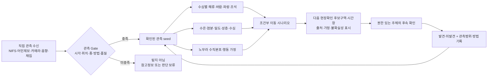

# 해파리 군집 위치 탐지 방법과 정보 결합 Investigate

> [!summary] 조사 결론
> **해파리 군집의 위치는 한 가지 데이터로 탐지할 수 없다.** 특정 시각·위치에서 생물을 직접 본 `관측`, 수층 전체를 훑는 `음향`, 종을 확인하는 `영상·채집`을 상호검증해야 한다. 해류·바람·수온 같은 환경자료는 해파리의 현재 위치를 탐지하지 않으며, 시각·좌표·종이 확인된 관측을 시작점으로 이후의 `조건부 이동 가능 구역`을 추정하는 입력이다.

> [!warning] 현재 Gate
> 방법의 과학적 가능성과 후보 데이터는 확인했다. 그러나 경북 원전 주변에서의 탐지율·오경보율·필요 공간해상도·선행시간·최적 조합은 현장 원자료와 직접 사용자 요구가 없어 **미검증**이다. 현재 판정은 `Investigate — Iterate`다.

> [!warning] 제출 12시간 전 Timebox Override
> 아래의 현장 실험 A·C와 직접 사용자 조사는 제출 후 검증부채다. 제출 전에는 공개 데이터로 가능한 hindcast·fixture 검사, AI 문헌·수치 교차감사, 팀 블라인드 과업, 트랙 제공자의 문제·데이터 적합성 검토만 수행한다. 이를 현장 탐지성능이나 실사용자 가치 검증으로 부르지 않는다.

## 1. 두 조사 문장의 검증

### 문장 1

> 해파리 군집의 위치를 탐지할 수 있는 방법은 무엇일까?

**검증 가능하고 유효한 질문이다.** 다만 `탐지`를 다음처럼 정의해야 한다.

> 특정 시각과 공간범위에서 사람·카메라·음향·채집 등으로 노무라입깃해파리의 존재 또는 군집을 관측하고, 관측방법과 품질을 함께 기록한 것.

위치점 하나만 있거나 종이 확인되지 않은 일반 음향신호는 `노무라 군집 탐지`로 충분하지 않다.

### 문장 2

> 어떤 정보를 종합하면 해파리의 위치를 탐지하는 정보가 될까?

**의도는 유효하지만 `탐지`와 `추정`이 섞여 있다.** 환경자료를 여러 개 합쳐도 해파리의 존재를 직접 확인한 것은 아니다. 다음처럼 바꾸는 편이 검증 가능하다.

> **확인된 해파리 관측을 시작점으로, 어떤 해양·기상·생태 정보를 결합해야 다음 현장확인 후보구역을 추정할 수 있을까?**

따라서 본 조사에서는 `직접탐지 → 조건부 위치추정 → 후속 직접확인`을 서로 다른 단계로 다룬다.

## 2. 탐지·추정·운영영향의 경계

| 단계 | 질문 | 인정할 증거 | 인정하지 않을 것 |
| --- | --- | --- | --- |
| 직접탐지 | 지금 어디에서 실제로 관측됐는가? | 시각·좌표·수심/범위·종·관측법·품질이 붙은 사람/센서/채집 기록 | 수온·해류 이상, 도 단위 출현률만으로 존재 단정 |
| 군집 확인 | 실제로 여러 개체가 모였는가? | 탐지면적·관측노력과 함께 기록된 개체수·밀도·음향/영상 범위 | 신고 건수, 사진 한 장, NIFS 발견률을 생물량으로 전환 |
| 위치 추정 | 관측 뒤 어디로 이동할 수 있는가? | 확인된 관측 seed + 동기간 물리장 + 종별 행동가정의 조건부 시나리오 | 환경자료만으로 현재 군집을 생성, 입자 비율을 도착확률로 명명 |
| 취수구 노출 | 취수 영향권을 실제로 통과하는가? | 시설 근접 농도·유속·수심·취수조건과 독립 현장확인 | 광역 연안 접근을 취수구 도착으로 번역 |
| 설비영향 | 스크린·펌프에 어떤 부담을 주는가? | 유입량·차압·유량·수거량·개입 로그 | 위치만으로 폐색·감발·정지확률 계산 |

### `탐지됨`의 증거 수준

| 수준 | 의미 | 허용 표현 |
| --- | --- | --- |
| D0 간접조건 | 수온·염분·해류·위성·모델로 적합환경이나 수송을 추정 | `환경조건`, `조건부 이동 시나리오` |
| D1 비표준 신고 | 시각·위치가 있는 제보이나 사진·표본·관측노력이 불충분 | `신고됨` |
| D2 직접 존재확인 | 시간·좌표가 붙은 사진·영상·육안·표본·종 특이 eDNA 양성 | `해당 관측점에서 존재 신호 확인` |
| D3 종 확증 | 전문가가 판독한 사진·표본 또는 검증된 노무라 특이 분자검사 | `노무라로 확인` |
| D4 군집 정량 | 표준 면적·체적·음향빔에서 밀도와 탐지불확실성을 동시 기록 | `군집 위치·범위 관측` |
| D5 시설 관련 검증 | 취수 전방 관측과 실제 유입·부하의 선행시간·탐지율을 반복검증 | `시설 대응에 유효` |

현재 공개근거로 경북 원전 주변 D5는 확인되지 않았다. `군집 위치를 탐지했다`는 표현은 원칙적으로 D4 이상의 증거가 있을 때 사용한다.

## 3. 위치를 직접 탐지하거나 검증·교정하는 방법

| 방법 | 직접 알 수 있는 것 | 장점 | 핵심 한계 | 노무라·경북 원전 적용 판정 |
| --- | --- | --- | --- | --- |
| 어민·선박·현장 담당자 제보 | 관측 시각·GPS·표층 존재·사진·대략적 개체수 | 넓은 해역에서 빠르게 첫 신호를 얻을 수 있음 | 관측노력·미관측 구역이 불균일하고 종 오인·중복신고 가능 | **첫 seed 후보.** API로 수신하되 사진·시각·좌표·방법·신뢰도를 필수화 |
| 선박 목시 transect | 표층의 종·개체수·분포선 | 사람이 종과 상태를 확인 | 야간·파랑·안개·눈부심, 중·저층 군집을 놓침 | **단독 사용 불가.** 음향·채집과 동시 사용 |
| 그물·트롤 채집 | 종·크기·중량·수층의 직접 표본 | 종 확인과 음향·영상 보정의 기준자료 | 공간적으로 희소하고 느리며 망 회피·파손·선택편향 | **ground truth 후보.** 상시 탐지보다 표적 검증용 |
| 과학어군탐지기 | 항로 아래 수층별 반사신호·분포·상대밀도 | 어둡거나 탁한 물에서도 수층을 연속 조사 | 음향만으로 종 확정이 어렵고 TS 교정·잡음제거·채집 검증 필요; 표층 사각 가능 | **광역 수층 탐지의 강한 후보.** 노무라 다주파 연구 선례 있음 |
| DIDSON/ARIS 등 음향카메라·이미징소나 | 수십 m 안의 개체 형상·방향·크기·통과 흐름 | 탁도와 야간 영향이 광학카메라보다 적음 | 좁은 관측범위·설치비·생물/부유물 분류오류·부착생물 | **취수구 주변 고정감시에 유력한 후보.** 시설 협력과 현장 교정 필요 |
| 수중 광학카메라 | 가까운 거리의 형태·종 확인 영상 | 음향 표적의 시각적 확인 | 탁도·조명·야간·biofouling·좁은 시야; 조명이 생물행동을 바꿀 수 있음 | **종 확인 보조.** 2024 국내 원전 인근 실증은 통신만 확인, 해파리 탐지성능 미검증 |
| 드론·항공영상 | 맑고 얕은 해역의 표층 군집 경계·면적 | 비교적 넓은 표층을 빠르게 확인 | 투명도·수심·햇빛 반사·파랑·구름·비행제약; 중·저층은 탐지 불가 | **표층 군집에 조건부.** 다른 종·해역의 성능을 노무라에 전용 금지 |
| 위성영상 | 매우 큰 표층 색·형태 이상과 주변 해양환경 | 광역 반복관측 | 구름·재방문·픽셀크기·대기/수면 영향; 수중의 투명한 노무라 군집 직접탐지는 입증 부족 | **환경 맥락·탐색 가설용.** 현재 핵심 직접탐지 수단 아님 |
| 노무라 특이 eDNA 수질시료 | 채수지점 주변에 노무라 DNA가 존재했는지 | 육안·그물에서 놓친 종 존재신호를 분자적으로 확인 가능 | 채수·실험 지연, DNA의 이동·잔존, 교차반응·보존 실패; 현재 군집 경계·개체수·방향을 바로 주지 않음 | **종 존재 보조검증 후보.** 2025 현장연구 선례는 있으나 실시간 위치·개체수 성능은 미검증 |
| 개체 태그·표류부이 | 태그한 개체의 3차원 이동 또는 물 흐름 | 능동유영과 수동수송을 분리하는 연구 가능 | 먼저 개체를 포획해야 하며 한 개체가 군집 전체를 대표하지 않음 | **행동모델 교정 연구용.** 직접 군집 발견 수단은 아님 |

### 직접탐지 방법의 핵심 근거

- NIFS가 참여한 2020–2022 조사에서는 **음향·목시·트롤·환경조사**를 병행했다. 표층 목시 결과는 음향으로 확인한 중·저층 분포보다 크게 적어, 표층 육안만으로 수층 전체 위치를 대표하기 어렵다. [Oh et al., 2024](https://www.mdpi.com/2073-4441/16/16/2265)
- 2020–2024 동중국해 조사에서는 다주파 음향과 해파리 전용 트롤을 결합했고, 노무라가 주로 **40–60m 중·저층 및 강한 성층 구간**에 나타났다고 보고했다. 수온과의 유의한 관계는 없었고 염분·해수밀도와 양의 관계가 확인됐다. [Oh et al., 2026](https://pubmed.ncbi.nlm.nih.gov/41972573/)
- 과학어군탐지기는 넓은 수층을 볼 수 있지만 음향표적은 그물·영상으로 확인하고 종별 target strength를 교정해야 한다. 노무라의 38/120kHz target strength 연구가 있지만 실험개체 기반 값의 현장 일반화에는 검증이 필요하다. [Cho et al., 2014](https://academic.oup.com/icesjms/article/71/3/597/639548), [Graham et al., 2010](https://academic.oup.com/icesjms/article/67/8/1739/608506)
- 음향카메라 DIDSON은 노무라를 포함한 대형 해파리의 개체·산란·유영방향을 관측한 선례가 있지만, 노무라의 유효 관측범위는 연구 설정에서 약 20m였다. [Honda et al., 2016](https://www.jstage.jst.go.jp/article/fisheng/53/2/53_87/_article/-char/en)
- 국내 원전 주변 2024 연구는 음향·카메라 부이와 1.8km 통신을 확인했지만 현장에 해파리·살파가 출현하지 않아 실제 표적의 탐지율·종분류·경보성능을 검증하지 못했다. 조명에 치어가 모이는 관측자 효과도 있었다. [강태종 외, 2024](https://www.kci.go.kr/kciportal/landing/article.kci?arti_id=ART003115688)
- 드론은 얕은 연안에서 직접탐지가 가능하지만 한 연구에서 현장 조종자 탐지는 전체 기회의 12%, 사후 영상판독은 31.6%였고 장소·개체크기·반사조건에 따라 차이가 컸다. 이는 다른 종의 결과이므로 노무라 정확도로 사용할 수 없다. [Rowley et al., 2020](https://journals.plos.org/plosone/article?id=10.1371/journal.pone.0241410)
- 제주 상추자도에서 노무라를 드론으로 직접 계수한 단일 현장 연구는 표층의 큰 개체를 GPS 영상으로 지도화할 가능성을 보였지만, 20분·1회 조사이고 고도 100m 이상에서 해상도 저하와 햇빛 반사·부유입자 오인이 보고됐다. 경북·중저층·야간 성능으로 일반화할 수 없다. [Kim et al., 2021](https://d-nb.info/1233084933/34)
- UAV 영상 CNN 연구의 높은 테스트 정확도는 제한된 두 지역·두 클래스 영상분류 결과이며, 경북 노무라의 실시간 공간탐지 정확도나 운영 선행시간으로 전용할 수 없다. 논문도 위성은 해상도·재방문·접근지연 때문에 수시간 조기경보에 부적합하다고 설명한다. [Mcilwaine & Rivas Casado, 2021](https://www.sciencedirect.com/science/article/pii/S0303243420309223)
- 2025년 노무라 특이 eDNA qPCR 연구는 2021–2023년 일본해·동중국해 시료를 육안·그물·영상과 비교해 종 검출 가능성을 보였다. 그러나 PCR 효율 98.9%는 현장 탐지정확도가 아니며, 저자도 추가 교차반응 검증을 요구한다. 채수점의 DNA 양성은 실시간 군집 좌표나 개체수·톤수가 아니다. [Minamoto et al., 2025](https://www.jstage.jst.go.jp/article/pbr/20/3/20_P200301/_pdf/-char/en)

## 4. 어떤 정보를 결합해야 하는가

### 4.1 반드시 필요한 관측 seed

위치추정을 시작하려면 최소한 아래 항목이 있는 **직접 관측**이 필요하다.

| 필드 | 의미 |
| --- | --- |
| `observed_at` | 실제 관측 시각과 시간대 |
| `lat`, `lon`, `depth_range` | 좌표와 관측 수층 |
| `taxon`, `species_confidence` | 노무라 종 판정과 확신 수준 |
| `observation_method` | 목시·사진·음향·카메라·채집·eDNA 등 |
| `count_or_density`, `unit` | 개체수·밀도·면적 등 실제 측정 정의 |
| `detection_footprint`, `effort` | 관측한 면적·시간·항로; 미발견 기록을 해석하는 데 필수 |
| `media_or_sample` | 사진·영상·음향 원자료·표본 여부 |
| `source`, `qc_status` | 제공자·원문·검토 상태 |

NIFS 주간보고 API는 조사일, 종별 경북 출현률, 출현해역 설명과 분포도를 제공하지만 기본적으로 광역·주간 자료다. `nom_ratio_10`은 경북 응답자 기반 출현률이지 군집 좌표·밀도·생물량이 아니다. [NIFS 공식 OpenAPI 명세](https://www.nifs.go.kr/openApi/actionOpenapiInfoList.do)

NIFS 공식 모니터링망에는 2026년 기준 전국 294명, 경북 45명의 어민·지자체·공무원 등이 참여하므로 현장 신호의 제도적 출발점은 존재한다. 그러나 공개 주간집계와 팀이 수신하려는 `즉시 좌표 제보 API`는 같은 것이 아니다. [NIFS 해파리 모니터링체제](https://nifs.go.kr/portal/pcon0000062/systA/actionConts.do)

공개 원자료의 공백도 확인됐다. 36,826행 출현보고 파일은 좌표가 있지만 종 필드가 없고, 375행 트롤 누적자료에는 노무라 기록이 있으나 경북 노무라 좌표가 없다. 따라서 현재 공개파일만으로 `최신 경북 노무라 seed → 독립 후속 위치` 검증쌍을 만들 수 없다. [해파리 출현보고](https://www.data.go.kr/data/15147963/fileData.do), [해파리 트롤조사](https://www.data.go.kr/data/15147957/fileData.do)

### 4.2 관측 뒤 이동을 추정하는 정보

| 정보 | 위치추정에서의 역할 | 현재 주의점 |
| --- | --- | --- |
| 수심별 해류 `u/v`와 가능하면 `w` | 관측 seed의 이동·확산·수렴 계산 | 공개 KHOA ROMS 표층류만으로 40–60m 노무라 분포를 대표할 수 없음 |
| 바람 | 해수 유동의 forcing과 표층 이동 민감도 | ROMS가 이미 대기 forcing을 포함했다면 바람을 다시 더할 때 이중계산 위험; 임의 windage 금지 |
| 파랑·Stokes drift·조석 | 근해 표층 이동과 왕복·수렴의 보조 | 파고만으로 Stokes drift를 계산할 수 없고, 광역 파고·지점 조류가 취수구 앞 국지흐름을 대신하지 않음 |
| 수온·염분·해수밀도·성층 | 노무라가 존재할 수층과 환경조건의 보조 | 최신 조사에서는 염분·밀도 관계는 있었지만 수온은 유의하지 않았음; 존재 증거가 아님 |
| 수심·해안선·항만/구조물 경계 | 입자 육상통과 방지와 연안 체류 후보 계산 | 상세 취수시설 구조는 공개·승인 범위 밖에서 사용 금지 |
| 노무라 수직분포·능동유영 | 어떤 수심의 해류에 노출되는지와 수동입자 오차 보정 | 시간·성장단계·지역별 행동자료가 부족함 |
| 후속 직접관측 | 모델 envelope를 실제 위치와 비교하고 갱신 | 같은 관측을 seed와 정답으로 중복 사용하면 안 됨 |

Moon et al.은 ROMS 입자추적에서 바람 포함 여부에 따라 한반도 주변 노무라 분포가 크게 달라짐을 보였지만, 사망·수직이동 같은 생물과정을 제외했다. 따라서 연구는 물리적 수송의 타당성은 지지하지만 경북 취수구 도착확률은 지지하지 않는다. [Moon et al., 2010](https://www.sciencedirect.com/science/article/pii/S0924796309003030)

한국 주변의 후속 연구에서도 일부 연도에는 입자가 관측보다 일찍 도착하거나 합리적으로 재현되지 않았고 관측과 입자 위치 차이가 약 0.5°까지 나타났다. 광역 이동경로의 유사성이 근안 위치·ETA를 보장하지 않는다. [Kim et al., 2018](https://www.sciencedirect.com/science/article/pii/S2352485517302980)

### 4.3 환경정보만으로는 탐지가 아닌 것

- 수온이 적절하다 → 노무라가 있다는 뜻이 아니다.
- 염분·밀도·성층이 과거 분포와 닮았다 → 현재 군집 좌표가 아니다.
- 해류가 취수구 방향이다 → 그 해류 위에 실제 군집이 있다는 뜻이 아니다.
- 위성에서 해색 이상이 보인다 → 노무라 종과 수층 군집을 확인한 것이 아니다.
- NIFS 경북 출현률이 높다 → 특정 원전 앞 생물량이 높다는 뜻이 아니다.
- 음향반사가 강하다 → 영상·채집 보정 없이는 노무라 종으로 확정하기 어렵다.

## 5. 검증 가능한 정보 결합 구조

### 공간 규모별 관측 조합 가설

| 규모 | 목적 | 우선 조합 | 아직 필요한 검증 |
| --- | --- | --- | --- |
| 광역 연안 | 첫 출현 신호와 조사구역 축소 | NIFS 특보·어민 GPS 제보·선박 목시 | 지연·중복·종 판정·관측공백 |
| 수 km 후보해역 | 표층과 수층의 군집 경계 확인 | 표층 드론/항공 + 선박 다주파 음향 + 선택적 채집 | 경북 노무라 동시비교 탐지율·비용 |
| 취수구 주변 공개·승인 범위 | 통과 개체·방향·상대부하 확인 | 고정 음향카메라/소나 + 수중카메라 + 현장표본 | 시설 허가·biofouling·종분류·차압/유량 연결 |
| 관측 사이 시간 | 다음 확인구역 제안 | 확인된 seed + 수심별 수송 ensemble + 후속관측 | 3차원 물리장·행동모델·독립 라벨 |

## 6. 현재 가장 타당한 최소 구성

해커톤에서 새 센서를 설치하지 않는다는 조건이면, 직접탐지 시스템을 만들었다고 주장할 수 없다. 구현 가능한 최소 구성은 다음이다.

1. **현장 관측정보 수신 API:** 어민·조사자·승인된 센서가 시각·좌표·종·사진·관측범위·방법을 전달한다.
2. **Evidence Gate:** `확인됨`, `종 미확정`, `위치 불충분`, `오래된 관측`, `가상 seed`를 분리한다.
3. **조건부 위치추정:** Gate를 통과한 seed에만 수송자료를 적용해 다음 확인 후보구역을 제시한다.
4. **다음 관측 배치:** 드론·선박·음향센서를 직접 운영하지 않고 어느 구역을 어떤 방법으로 확인할지 요청 후보를 만든다.
5. **결과 수신:** 발견·미발견뿐 아니라 실제로 살핀 범위·시간·방법을 함께 축적한다.

지도와 API에서도 `● 직접관측점`, `반투명 조건부 이동범위`, `별도 환경 레이어`를 구분한다. 세 층을 하나의 `탐지확률`이나 동일한 위험색으로 합치지 않는다. 현재 공개 NIFS 자료만으로는 최신 노무라 점좌표 seed가 생기지 않으므로, 실제 현장 입력이 없으면 `가상 seed` 또는 `광역 보고`로 표시한다. 공개 ROMS가 표층만 제공하는 동안 모든 이동범위에는 `표층조건부·미검증`을 붙인다.

> [!important] 문구 경계
> `해파리 군집 위치 탐지 서비스`보다 **`해파리 관측정보 수신과 다음 확인구역 추정 서비스`**가 현재 팀의 실제 역할과 근거에 맞다.

## 7. 검증 실험

### 제출 전 실험 D — 근거·표현·실패경로 검증

- 과거·가상 seed, HB 점관측, ROMS/cached/synthetic 면장의 상태를 명시해 동일 입력의 재현성을 검사한다.
- 비구현 팀원과 트랙 제공자가 직접관측점·조건부 이동범위·데이터없음을 구분하는지 블라인드 과업으로 본다.
- 서로 다른 AI 모델이 출처·수치·인과·반례·금지주장을 독립 감사하고, 불일치는 원문으로 판정한다.
- 결측·오래된 자료·방향 미확인·격자밖 입력에서 `계산 보류`가 유지되는지 확인한다.
- 이 실험의 지표는 출처 추적률, 상태구분 성공률, 허위 숫자 수, 실패경로 통과율이다. 탐지율·오경보율·선행시간은 측정하지 않는다.

### 제출 후 현장실험 경계

> [!danger] 수행·승인 경계
> 실험 A·C의 관측·채집·출동 수행 주체는 팀이 아니라 승인된 조사기관·현장 파트너다. 제출 전에는 실행하지 않는다. 팀의 역할은 제출 후 실험 사전등록, 입력·결과 수신, 기록과 비교에 한정한다. 착수는 [[34) 추가자료 Engage-Investigate 완료감사와 재수행#제출 후 외부 접촉 사전 Gate]]와 사용자의 외부 연락 승인 완료 이후에만 가능하다.

### 실험 A — 직접탐지 방법 비교

- 승인된 파트너가 같은 시각·해역에서 수행할 목시·드론·음향·카메라와 채집 기준자료의 비교 설계를 사전등록하고 결과를 수신한다.
- 파트너가 양성구역뿐 아니라 사전 지정한 음성구역도 같은 관측노력으로 확인하도록 설계한다.
- 팀은 수신한 결과에서 종 식별률, 관측범위당 탐지, 위치오차, 지연, 오탐·미탐, 날씨·수심별 성능을 비교한다.
- 기존 논문 성능을 경북 성능으로 복사하지 않는다.

### 실험 B — 조건부 위치추정 hindcast

- 시각·좌표·종이 확인된 T0 관측을 seed로 고정한다.
- 이후 관측을 보지 않은 상태에서 `무수송`, `표층류`, `수심별 해류`, `수심별 해류+바람/파랑`, `행동가정 추가`를 각각 실행한다.
- 독립된 T1 관측과 top-K 후보구역 적중, 최소거리, coverage, 판단보류 비율을 비교한다.
- 입력 제거 실험으로 어떤 정보가 실제 결과를 바꾸는지 확인한다.

### 실험 C — 사용자 가치 shadow 비교

- A: 현행 NIFS 특보·어민제보·순찰
- B: A + 조건부 다음 확인구역
- 승인된 운영·관측 파트너가 수행한 동일 확인예산의 결과를 수신해 최초 확인까지 확보한 시간, 확인 1회당 발견, 불필요 확인·놓침을 비교한다.
- 원전 운영과 연결하지 않는 shadow mode로만 시행한다.

## 8. P0 미해결 질문과 중단조건

| P0 질문 | 현재 상태 | 중단·전환 조건 |
| --- | --- | --- |
| 취수 운영조직이 어떤 행동을 위해 어느 정도 위치해상도·선행시간을 필요로 하는가? | 제출 전 확인 불가·직접 사용자 조사 필요 | 제출에서는 가설로 표시. 제출 후 위치정보가 실제 행동을 바꾸지 않으면 위치 서비스 중단 |
| 시각·좌표·종·관측범위가 붙은 경북 노무라 양성·음성 자료를 얻을 수 있는가? | 미확인 | 독립 seed/label 쌍이 없으면 공간성능 주장 삭제 |
| NIFS·어민제보를 실시간 또는 준실시간 API로 수신할 권한과 구조가 있는가? | NIFS 주간 API만 공식 확인 | 실제 제보 API가 없으면 `가상 입력`으로 표시 |
| 경북에서 수심별 3차원 해류를 필요한 해상도로 확보할 수 있는가? | 공개 표층 ROMS 후보만 확인 | 표층자료만이면 중·저층 노무라 위치추정 주장 축소 |
| 고정 음향·카메라가 실제 노무라를 구분하는가? | 국내 원전 실증의 표적 0건 | 현장 양·음성 동시검증 없으면 탐지기능 주장 금지 |
| 결합모델이 단순 지속성·현행 특보보다 나은가? | 검증자료 없음 | held-out 사건에서 개선이 없으면 정보융합 방향 중단 |
| 시설 차압·수위·펌프 등 기존 근접계측보다 외부 위치정보가 더 이른가? | 시설 로그·업무흐름 미공개 | 기존 계측이 충분히 빠르고 외부 신호가 행동을 앞당기지 못하면 서비스 가치 주장 중단 |
| 위치를 더 일찍 알아도 실제로 실행할 승인된 대응수단이 있는가? | 사용자 조사 필요 | 제거·예찰·인력·설비준비를 실행할 수 없다면 위치정밀화 방향 중단 |
| 유용하려면 보안민감 취수구 세부가 필수인가? | 미확인 | 비공개 구조·임계값이 필수면 원전 특화 범위 중단 |

## 9. Research Conclusions

### RC-01 — 군집 위치 직접탐지는 다중 관측의 문제다

동중국해 조사에서 노무라는 표층뿐 아니라 중·저층에도 분포했으므로 목시·드론만으로 군집 전체를 찾기 어렵다. 광역 수층은 다주파 음향, 종 확인은 영상·채집, 표층 경계는 목시·드론, 시설 근접은 음향카메라·카메라를 결합하는 구조가 가장 근거에 맞다. 그러나 이 수직분포와 조합의 성능을 경북 원전의 더 얕거나 다른 연안환경에 적용할 수 있는지는 아직 검증되지 않았다.

### RC-02 — 해양환경자료는 위치를 탐지하지 않는다

해류·바람·파랑·수온·염분은 확인된 관측 이후 이동·수층·수렴 가능성을 계산하는 조건이다. 관측 seed가 없으면 출력은 해파리 위치가 아니라 환경상 유리한 조건 또는 가상 시나리오다.

### RC-03 — 표층자료만으로는 노무라 위치추정이 불충분하다

동중국해에서 확인된 노무라의 중·저층 분포와 별도 태그연구의 수직이동은 수심별 해류와 밀도성층 정보가 중요할 수 있음을 보여준다. 다만 경북 연안의 실제 분포수심은 미확인이다. 공개 ROMS 표층류만 사용한 결과는 `표층조건부 시나리오`로 제한하고, 이를 취수구 주변 전 수층 군집으로 일반화하지 않는다.

### RC-04 — 서비스가 만들 수 있는 첫 데이터 자산은 관측의 표준화다

팀이 직접 관측하지 않더라도, 어민·조사자·센서가 제공한 `시각·좌표·수심·종·방법·관측범위·발견/미발견`을 같은 계약으로 수신하면 이후 탐지기술과 수송모델을 비교할 학습·검증자료를 만들 수 있다. 미발견은 `없음`이 아니라 해당 범위와 방법에서 찾지 못했다는 기록이어야 한다.

### RC-05 — 현재 서비스 표현은 ‘탐지’보다 ‘수신·추정·확인’이 정확하다

팀은 센서를 직접 운영하지 않으므로 현장 탐지의 주체가 아니다. 현재 제품 가설의 기능은 관측정보 수신, 근거품질 판정, 조건부 다음 확인구역 제시, 후속 확인 결과 축적이다.

### RC-06 — 결합은 하나의 위험점수가 아니라 증거층 분리여야 한다

직접관측, 조건부 이동범위, 환경 prior는 서로 다른 종류의 정보다. 바람·수온 등으로 직접관측을 덮어쓰거나 세 층을 하나의 확률로 합치면 `관측됨`과 `그럴듯함`이 섞인다. 새 직접관측이 들어올 때만 위치추정을 갱신하고, 관측이 오래될수록 불확실성이 넓어지는 구조가 필요하다.

## 10. 이번 Investigate의 답

### 질문 1에 대한 답

해파리 군집 위치는 `사람/선박 제보`, `표층 목시·드론`, `수층 다주파 음향`, `근거리 음향카메라·광학카메라`, `선택적 그물·트롤`을 공간 규모에 맞게 조합해 직접 확인할 수 있다. 노무라처럼 중·저층에 분포하는 종은 음향과 종 확인용 영상·채집의 결합이 핵심이며, 한 방법만으로 군집 전체와 종·생물량을 동시에 확정하기 어렵다.

### 질문 2에 대한 답

해파리 위치정보가 되려면 먼저 `시각·좌표·수심·종·관측방법·관측범위`가 있는 직접 관측이 필요하다. 그 뒤 수심별 해류, 바람·파랑·조석, 수온·염분·밀도성층, 수심·해안선, 노무라의 수직분포·능동유영 가정을 결합해 **다음 확인 후보구역**을 추정할 수 있다. 환경정보만 종합한 결과는 탐지가 아니며, 독립 후속관측으로 확인되기 전에는 위치확률·ETA·취수구 도착으로 표현하지 않는다.
