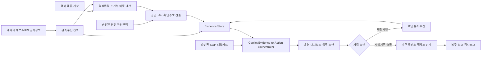

# 원전 취수구 해파리 위험 대시보드 서비스 계획서

> [!summary] 서비스 정의
> **공식 해파리 정보와 현장에서 수신한 관측, 경북 연안 유동장을 결합하고, 유속 격자와 승인된 원전 확인구역이 함께 확보된 해역에 한해 다음 확인 후보를 계산한다. Microsoft Copilot은 근거·데이터 공백·승인된 대응카드를 조율해 취수 운영조직의 현장확인과 기존 절차 인계를 앞당긴다.**

> [!warning] 제품 경계
> 이 서비스는 `해파리 도착확률`, `정확 ETA`, `예상 유입량`, `원전 정지확률`을 산출하지 않는다. 원전 출력조정·감발·정지·설비제어를 권고하거나 실행하지 않으며, 시설 상태가 승인 기준에 닿으면 운영자가 기존 발전소 절차로 인계한다.

## 0. 계획서 결론

현재 가장 강한 제품가설은 `더 정확한 위험점수`가 아니라 다음 업무를 하나의 감사 가능한 흐름으로 연결하는 것이다.

`외부 해파리 신호 수신 → 증거 검증 → 조건부 이동범위 계산 → 원전 확인구역과 교차 → 다음 현장확인 과제 → 승인된 매뉴얼 카드 → 기존 운전절차 인계 → 복구·회고`

공개 근거는 이 방향을 지지한다.

- IAEA는 취수구의 비정상 생물 축적을 제때 발견하도록 지속 감시하고, 지역 환경·기상·수로기관과 통신 프로토콜을 두라고 권고한다.
- Torness는 기상지표만이 아니라 절차·흐름도, 중앙제어실 정보, 스크린·순환수 계측, 세척·레이크를 한 묶음으로 운영했다.
- Gravelines는 카메라, 어민 일일관측, 중복 확인, 24시간 이내 표본조사, 팀 훈련을 강화했다. 그러나 2026년 유입이 재발했으므로 감시체계의 예방효과는 검증해야 한다.
- ASNR는 2025년 Gravelines 사건 뒤 해파리 감시 시기와 선제조치 순서가 현상 진행속도에 맞지 않는다고 지적했다. 이는 해외 시설에서 `정보 수신`보다 `검증·승인·업무 인계 속도`가 병목일 수 있다는 근거이며, 한울·월성에 같은 병목이 있는지는 인터뷰 전 가설이다.

따라서 Act의 핵심 검증대상은 다음 두 가지다.

1. 같은 확인 자원으로 다음 확인구역을 더 잘 선택할 수 있는가?
2. Copilot이 여러 화면과 문서 사이의 탐색·인계·기록 시간을 줄이되, 근거 없는 운전판단을 만들지 않는가?

---

## 1. 사용자와 해결할 업무

### 1.1 직접 사용자 가설

실제 직제·권한은 인터뷰 전 확정하지 않는다.

| 역할 가설 | 현재 해결할 질문 | 시스템 권한 |
| --- | --- | --- |
| 당직·상황조정 책임자 | 현재 근거와 미완료 확인·승인·인계는 무엇인가? | 상태 승인, 작업 승인, 기존 절차 인계 |
| 취수·순환수 운전 담당 | 외부 신호가 시설 확인구역과 어떤 관계이며 어떤 설비 확인이 필요한가? | 시설상태 입력·확인, 내부 절차 실행은 별도 체계 |
| 취수설비 정비·현장 담당 | 어디를 무엇으로 확인하고 어떤 준비·복구 증거를 남겨야 하는가? | 작업 수행·완료증거 등록 |
| 해양관측·어민 연락 담당 | 어떤 제보가 유효하며 어디를 다시 확인해야 하는가? | 제보 검토, 확인작업 조정 |
| 데이터·모델 관리자 | 어떤 데이터·가정·실패가 현재 범위를 만들었는가? | 데이터·모델 품질관리, 운전결정권 없음 |
| 감사·사건검토 담당 | 누가 어떤 근거로 무엇을 승인하고 완료했는가? | 전체 계보·변경·회고 조회 |

### 1.2 핵심 Job-to-be-Done

> 해파리 신호가 들어왔을 때 여러 지도·API·제보·문서를 따로 찾지 않고, 지금 확인된 사실과 추정·데이터 공백을 구분한 뒤, 다음 현장확인과 승인된 준비업무를 담당자에게 빠르게 연결하고 싶다.

### 1.3 사용자에게 주는 두 종류의 가치

| 가치 | 현재 문제 | 서비스가 바꾸려는 것 |
| --- | --- | --- |
| 근본 문제 해결 | 광역 정보와 국지 확인 사이 공백, 분산된 제보, 느린 검증·인계 | 제한된 확인 자원을 다음 확인후보에 배치하고 사건 단위 근거·과제·결과를 연결 |
| 편의 개선 | 여러 화면·문서·교대기록 탐색, 반복 입력, 근거 역추적 | 자연어 조회, 역할별 작업함, 승인된 SOP 바로가기, 자동 인수인계 초안 |

### 1.4 대상 생물 경계

- MVP는 팀 결정에 따라 노무라·보름달물해파리 등 **해파리 종명을 하나의 `jellyfish` 입력군으로 받는다.**
- 그러나 입력군 통합이 동일한 이동행동을 뜻하지 않는다. 종이 확인되면 원자료에는 보존하고, 단일 표층 계수로 모든 종을 정확히 설명한다고 주장하지 않는다.
- **살파는 해파리가 아니라 피낭동물이며 현재 모델 입력에서 제외한다.** 2021년 한울 정지사례는 문제의 국내 중요성을 보여주는 반례로만 보존하고 해파리 성능라벨로 쓰지 않는다.

---

## 2. 현재 파이프라인 감사와 사용 계약

### 2.1 보존할 자산

| 자산 | 현재 역할 | 서비스에서의 사용 |
| --- | --- | --- |
| [[35) 해파리 군집 위치 탐지 방법과 정보 결합 Investigate]] | 직접관측·조건부 이동·환경맥락 경계 | 화면 레이어와 데이터계약의 기준 |
| [[36) 기존 해파리 직접관측 수신 데이터 감사]] | 과거 경북 관측·NIFS 수신체계·QC 한계 | 관측수신 API와 데모·QC fixture |
| [[해류 데이터 활용 및 실시간 수집 파이프라인]] | 경북 해류 수집·정규화·이동 계산 초안 | 유동장 수집과 조건부 입자수송 모듈 |
| `경북해류수집.py` | 실시간 관측 API 수집 실험 | 데이터 생존성 검증용 수집기 |
| 기존 루트 대시보드 제안서 | 지도·실시간·업무대시보드 아이디어 | 구조만 참고하고 확률·ETA·ML 위험등급은 폐기 |

### 2.2 파이프라인별 현재 판정

| 파이프라인 | 확인 상태 | P0 미지 | 운영화 전 조건 |
| --- | --- | --- | --- |
| 해파리 위치파악 | 35번 문서에 조사·정보결합 구조 존재 | 최신 경북 점좌표와 독립 후속관측 부족 | `관측점 → 조건부 이동범위 → 후속확인`을 분리 |
| 해류 실시간 조회 | 수집문서·스크립트·CSV 존재 | API 유향의 toward/from 정의, 지점·HF radar 커버리지, 결측·과거자료, 격자 입도 | 실제 응답·시간대·단위·방향을 테스트하고 실패 시 판단보류 |
| 원전 영향권 설정 | 현재 `final data`에서 독립 파일을 확인하지 못함 | 폴리곤 출처, 공개/내부 경계, 버전·승인자, 산정규칙 | 임의 반경을 실제 위험권으로 부르지 않고 승인된 확인구역만 사용 |

> [!danger] P0 — 현재 유속 격자가 원전 근해를 덮지 않음
> 저장된 CSV를 재계산한 결과, 면 형태의 `HF_0071` 자료는 98개 격자로 위도 약 `36.0193–36.0887`, 경도 약 `129.4287–129.5064`의 포항항 주변만 덮는다. 한울·신한울과 월성·신월성은 모두 이 격자 밖이며, 점 관측을 수십 km 이상 최근접값으로 확장해 원전 이동범위를 만들 물리적 근거는 없다. **현재 데이터만으로 원전 영향권 교차를 실행할 수 없다.**

| 전환안 | 얻는 것 | 잃는 것 |
| --- | --- | --- |
| A. 포항 검증으로 전환 | 실격자로 수송코드·데이터 건강을 검증 | 포항에 원전이 없어 원전 적용은 미래형 |
| B. 원전 서사 유지·수송 비활성 | 사용자·업무·근거 대시보드 검증 | 핵심 지도 계산을 시연하지 못함 |
| C. 원전 근해 격자 확보 시도 | 성공 시 원전 조건부 이동 데모 가능 | `HF_0073`·ROMS 커버리지/키/격자 미확인, 일정위험 큼 |
| D. 이원화 | 포항에서 물리 검증, 원전 화면은 적용설계로 분리 | 현재 가능과 미래 적용을 심사자가 혼동할 수 있음 |

Day 0에 C를 제한시간 안에 확인하고 실패 시 A·B·D 중 하나로 전환한다. 전환 전에는 원전 실시간 위험지도라는 표현을 쓰지 않는다.

> [!danger] 즉시 보안조치
> 현재 공개 저장소의 해류 수집 스크립트에는 API 인증키가 소스에 포함되어 있다. 기존 키를 폐기·재발급하고 환경변수 또는 비밀 저장소로 분리한 뒤, 저장소 이력 노출까지 점검해야 한다. 키 값은 계획서·UI·로그에 기록하지 않는다.

> [!warning] 현재 수송모델의 생물학적 한계
> 현 파이프라인은 해파리를 `표층 수동입자`로 근사하고 단일 windage·Stokes 계수를 검토한다. 이 계수는 경북 해파리로 교정되지 않았고 수직분포·능동유영을 포함하지 않는다. 종을 묶어 받더라도 이 근사를 `해파리 이동의 정답`으로 표현하지 않고, 가정별 조건부 범위와 불일치를 함께 표시한다.

### 2.3 세 증거층

| 층 | 표시 | 의미 | 금지 해석 |
| --- | --- | --- | --- |
| 직접관측 | `● 관측점` | 특정 시각·좌표에서 사진·목시·센서·채집 등으로 수신된 해파리 신호 | 주변 전 해역에 존재, 종·생물량 확정 |
| 조건부 이동범위 | 반투명 envelope | 특정 관측 seed와 유동장·가정에서 계산된 다음 확인 후보범위 | 도착확률, ETA, 취수구 유입 확정 |
| 환경맥락 | 해류·풍·파랑·수온 레이어 | 이동 해석·데이터 상태·현장작업 조건 | 해파리 직접탐지 |

### 2.4 영향권의 안전한 정의

`원전 영향권`을 하나의 공개 고정반경으로 만들지 않는다.

| 구역 | 소유자 | 공개 수준 | 용도 |
| --- | --- | --- | --- |
| 공개 확인후보구역 | 팀 또는 공공기관 자료 | 공개·거친 해안 세그먼트 | 해커톤 지도와 현장확인 시뮬레이션 |
| 운영자 승인 확인구역 | 운영조직 | 역할 기반 제한 | 조건부 이동범위와 교차, 확인업무 발행 |
| 내부 운전구역·설비기준 | 운영조직 | 비공개 | 기존 발전소 시스템·SOP에서만 사용 |

필수 필드는 `zone_id, geometry, purpose, source, approver, version, effective_from, access_class`다. 교차결과는 `20개 조건부 시나리오 중 7개가 확인구역과 겹침`처럼 계산 의미를 그대로 쓰고 `35% 도착확률`로 바꾸지 않는다.

---

## 3. 전체 서비스 구조



### 3.1 결정론적 서비스가 맡는 것

- 좌표·시간대·단위·중복·결측 검증
- 해류 벡터 변환과 보간
- 입자수송·ensemble 계산
- 육상·수심 마스크
- 승인된 확인구역과 공간 교차
- 시간창별 데이터 최신성·coverage
- 규칙 기반 상태전이 조건 검사

### 3.2 Copilot이 맡는 것

- 비정형 제보를 관측 필드 후보로 구조화하고 누락정보 질문
- 중복·모순·데이터 공백을 찾아 검토 초안 생성
- 사용자 의도에 맞는 조회·계산·문서검색 도구 선택
- 다음 확인구역의 근거와 반대 신호 설명
- 현재 역할·상태에 맞는 승인된 대응카드 검색
- 작업·승인요청·교대 인수인계 초안
- 사건 종료 뒤 관측→판단→과제→승인→결과 묶음 생성

### 3.3 Copilot이 맡지 않는 것

- 해류·입자경로·공간교차의 직접 계산
- 해파리 종·생물량 자동 확정
- 새로운 임계값·원전 운전절차 생성
- 감발·정지·출력·설비조작 판단 또는 실행
- 낮은 품질 신호를 직접관측 사실로 승격
- 정보가 없을 때 `안전` 또는 `위험 낮음` 판정

---

## 4. Microsoft Copilot 활용 전략

### 4.1 제품 내 역할

Copilot은 `위험 브리핑 생성기`가 아니라 **Evidence-to-Action Orchestrator**다. Copilot Studio의 generative orchestration은 지식·도구·에이전트·이벤트를 선택하고 필요한 입력을 질문할 수 있으므로, 실시간 데이터 API와 승인된 문서를 연결하는 대화형 조정자에 적합하다. 다만 Microsoft 문서는 현재 generative orchestration의 영어 지원 제한을 명시하므로 한국어 성능은 실제 테넌트에서 별도 회귀시험해야 한다.

### 4.2 도구 API

#### 읽기 전용

```text
get_evidence_snapshot(site_id, as_of)
query_observations(bbox, time_range, evidence_levels)
get_data_health(dataset_ids)
explain_scenario(scenario_id)
retrieve_approved_playbook(site_id, workflow_state, role)
get_open_tasks(event_id, role)
```

#### 결정론 계산 실행 — 승인된 파라미터만

```text
run_conditional_transport(seed_ids, horizon_hours, approved_scenario_id)
intersect_approved_zone(scenario_id, role_scoped_zone_id)
rank_next_checks(candidate_ids, approved_budget_policy_id)
```

Copilot은 가정값·계수·zone을 자유롭게 만들거나 선택하지 않는다. `approved_scenario_id`, `role_scoped_zone_id`, `approved_budget_policy_id`는 서버 화이트리스트와 사용자 권한으로 검증하고, 결과에는 사용한 버전을 기록한다.

#### 초안·사람 승인 필요

```text
propose_verification_task(candidate_zone, reason, source_refs)
submit_verification_task(task_draft_id, approver_id)
record_field_observation(observation_payload)
create_shift_handover(event_id)
acknowledge_workflow_state(event_id, user_id)
```

원전 제어·출력·정지·설비조작 도구는 만들지 않는다.

### 4.3 AI 응답 계약

```json
{
  "statement": "...",
  "evidence_type": "direct_observation | conditional_scenario | context",
  "source_refs": [],
  "observed_or_generated_at": "...",
  "assumption_version": "...",
  "limitations": [],
  "contradicting_evidence": [],
  "allowed_next_tasks": [],
  "requires_human_approval": true
}
```

### 4.4 지식·권한 구조

| 지식층 | 내용 | 사용 규칙 |
| --- | --- | --- |
| 공개 근거 | IAEA·규제기관·운영자·NIFS 자료 | 문제 배경·해외사례·근거 설명 |
| 내부 승인 문서 | 운영조직 SOP, 직무·연락체계, 문서 ID·버전 | Entra 역할기반 접근, 해당 절만 검색 |
| 사건 기록 | 관측·계산·사람승인·작업결과 | 사건·역할별 접근, 변경불가 감사이력 |
| 일반 모델 지식 | 자유 생성 지식 | 운영 답변에는 사용하지 않거나 명시적 비활성화 |

Copilot Studio 지식소스는 SharePoint·Dataverse·Azure AI Search 또는 허용된 자체 검색 API로 제한한다. 모든 변경성 작업은 사람 승인 단계를 거친다. Power Automate 승인은 승인자·응답·의견을 기록하고 Teams·Outlook·Action Center에서 처리할 수 있지만, 이는 운전절차의 법적·조직적 승인체계를 자동 대체하지 않는다.

### 4.5 전 과정 AI/LLM 적용표

| 단계 | Copilot/LLM 기여 | 유형 | 결정론·사람 경계 |
| --- | --- | --- | --- |
| 평시 준비 | 승인 문서 색인, 만료·버전불일치·필수 데이터 결손 알림 | 편의 개선 | 문서 유효성은 문서관리시스템과 소유자가 확정 |
| 신호 수신 | 제보 문장을 관측 필드로 구조화, 사진·좌표·시각 누락 질문, 중복 후보 묶기 | 근본 문제 해결 | 관측 사실·종·개체량은 사람/QC가 확정 |
| 데이터 결합 | 필요한 관측·해류·영향권 도구를 선택하고 실패·상충자료를 모음 | 편의 개선 | 해류·수송·공간교차 계산은 백엔드 수행 |
| 다음 확인 | 확인예산과 데이터공백을 넣어 최적화 API를 호출하고 선정 이유·반대근거 설명 | 근본 문제 해결 | 최적화 규칙과 구역 승인, 현장 파견은 사람 권한 |
| 준비업무 | 상태·역할에 맞는 승인 대응카드 검색, 과제·승인요청 초안 | 편의 개선 | 새 절차·임계값 생성 금지, 실행 전 사람 승인 |
| 사건 인계 | 설비상태 확인 요청과 내부 절차 바로가기, 인계 체크리스트 | 편의 개선 | 감발·정지·설비조작은 기존 절차·운영자만 판단 |
| 교대 | 변경된 사실·미완료 과제·마지막 승인·보류사유 초안 | 편의 개선 | 책임자가 검토·서명 |
| 복구·회고 | 사건 계보 구조화, 확인됨·확인되지 않음·미관측 분리, 조치효과 질문 생성 | 근본 문제 해결 | 원인·효과 판정과 절차개정은 공식 검토체계 |
| 품질관리 | 금지질문·도구선택·문서버전·근거인용 회귀시험 생성·실행 | 편의 개선 | 배포 Gate와 안전성 검토는 사람이 승인 |

### 4.6 근본 문제해결 기능

#### A. 증거 정규화·모순 탐지

현장 제보에서 `관측시각, 수신시각, 위치, 관측법, 증거, 개체규모, 관측범위` 후보를 추출하고 필수필드가 없으면 질문한다. 비슷한 시간·장소의 제보를 같은 사건 후보로 묶되 사람이 확정한다.

#### B. 다음 확인의 가치 계산

Copilot은 직접 순위를 계산하지 않는다. `관측비용, 접근가능성, 데이터공백, ensemble disagreement, 영향권 겹침`을 입력받는 규칙·최적화 API를 호출하고, 왜 해당 구역이 정보가치가 큰지 설명한다. 핵심 문제해결 가설은 최적화 API의 후보선정이며, Copilot의 기여는 제약을 수집하고 선택근거·반대근거를 사람이 검증할 수 있게 만드는 것이다.

#### C. 증거에서 승인된 업무로 연결

현재 상태·역할·시설에 맞는 대응카드를 검색해 `왜 관련 있는지, 무엇이 부족한지, 누가 승인해야 하는지`를 보여준다. 자유문장 절차가 아니라 승인 문서의 ID·버전·원문 링크를 반환한다.

#### D. 교대·사후학습

미완료 확인, 보류 이유, 마지막 승인, 다음 담당자를 교대 초안으로 만들고, 사건 종료 뒤 확인됨·확인되지 않음·미관측과 작업시간을 구조화한다. `미관측`을 `없음`으로 바꾸지 않는다.

### 4.7 편의 개선 기능

운영자 질의 예시:

- `지금 한울 확인구역과 겹치는 조건부 시나리오와 반대 근거를 보여줘.`
- `직접관측만 시간순으로 보여줘.`
- `지난 교대 이후 달라진 사실과 미완료 작업만 정리해줘.`
- `현재 상태에서 내 역할에 해당하는 승인 문서와 작업을 열어줘.`
- `왜 A 구역을 다음 확인 후보로 골랐고 어떤 데이터가 부족한가?`

### 4.8 AI 성능 검증

| 영역 | 지표 |
| --- | --- |
| 제보 구조화 | 필수필드 추출 정확도, 누락 질문 재현율 |
| 중복정리 | 사건 병합 precision·recall |
| 도구선택 | 올바른 도구·입력·순서 선택률 |
| 근거답변 | 주장별 출처·시각·가정 포함률 100% |
| 매뉴얼 검색 | 역할·상태·문서버전 정확도 |
| 편의성 | 근거패킷 생성시간, 화면·문서 전환 수, 수동 재입력 수 |
| 인계 | 미완료 업무 누락률, 승인·담당자 기록률 |
| 안전성 | 무근거 임계값·ETA·운전권고·무승인 실행 0건 |

Copilot Studio의 반복 테스트와 activity map을 활용하되 플랫폼 평가는 안전·윤리 검토를 대체하지 않는다.

### 4.9 AI Kill Conditions

- 직접관측과 조건부 추정을 한 종류의 사실로 혼동한다.
- 승인 문서에 없는 임계값·행동·문서절을 한 번이라도 생성한다.
- 역할 밖 데이터에 접근하거나 승인 없이 쓰기 도구를 실행한다.
- 한국어 질의에서 도구선택·필수필드 추출이 배포 기준을 통과하지 못한다.
- 다음 확인후보가 단순 규칙보다 shadow test에서 개선되지 않는다.
- 작업시간·화면전환·누락률 중 어느 것도 의미 있게 줄이지 못한다.
- 데이터 부족 상황에서 답변을 보류하지 않는다.

이 경우 Copilot을 근거검색·읽기 전용 UI로 축소한다.

---

## 5. 대시보드 정보구조

### 5.1 상단 공통바

- 대상 부지 또는 승인된 확인구역
- 현재 `업무 상태`와 마지막 사람 승인
- 최신 직접관측 시각과 수신 지연
- 해류자료 최신시각·수집 성공여부
- 데이터 건강: 정상 / 지연 / 결측 / 정의 미검증
- seed 유형: 실제 관측 / 광역 공식보고 / 가상 데모

### 5.2 중앙 지도

- 직접관측점: `관측됨 / 확인되지 않음 / 미관측`을 서로 다른 기호로 표시
- 조건부 이동범위: 시간창별 외곽선
- 환경맥락: 해류 벡터, 풍·파랑·수온
- 커버리지·결측: 격자 밖, API 지연, 결측, 방향 정의 미검증 구역을 별도 해칭으로 표시
- 승인된 확인후보구역과 선정 이유
- 현장확인 작업의 담당·상태·기한
- 공개 데모에서는 정확한 취수시설 구조·내부 계측·민감 임계값을 숨김

직접관측점과 시·군 또는 해안구간 수준의 광역보고는 같은 점 기호로 그리지 않는다. 원전이 현재 유속 격자 밖이라면 빈 지도를 보간하지 않고 `커버리지 밖 — 이동계산 보류`를 전경에 표시한다.

> [!info] 지도 상시 문구
> 조건부 이동범위는 특정 관측과 해양자료·가정에 따른 다음 확인 후보이며 실제 도착확률이나 취수구 유입을 의미하지 않습니다.

### 5.3 우측 Evidence-to-Action 패널

1. 현재 업무 상태와 마지막 승인
2. 상태를 만든 직접관측·조건부 시나리오·환경정보
3. 상충 신호와 빠진 정보
4. 다음 허용 작업 후보
5. 담당 역할·승인자·완료증거
6. 내부 매뉴얼 문서 ID·버전·시행일·원문 링크
7. Copilot 질의·설명·작업초안

### 5.4 하단 사건 타임라인

- 관측 수신·QC 승인/반려
- 조건부 시나리오 실행·실패
- 확인후보 생성
- 과제 할당·승인·완료
- 후속 관측 결과
- 기존 발전소 절차로 인계한 시점
- 복구·종료·회고

### 5.5 역할별 기본 화면

| 역할 | 기본 탭 |
| --- | --- |
| 상황조정 | 상태·미완료 과제·승인대기·인수인계 |
| 취수운전 | 근거층·시설 확인구역·내부절차 인계 |
| 정비·현장 | 확인구역·작업방법·완료증거 |
| 관측조정 | 제보 QC·중복·다음 확인후보 |
| 감사·데이터 | 데이터계보·모델버전·사람판단·수정이력 |

---

## 6. 업무 상태와 대응 매뉴얼 연결

### 6.1 업무 상태머신

위험등급 하나로 관측 신뢰도·사건상태·업무상태를 섞지 않고 세 축으로 분리한다.

| 축 | 정상 흐름 | 실패·종료 흐름 | 전이 필수기록 |
| --- | --- | --- | --- |
| 관측 Observation | 수신 → 구조화 → QC → 승인 | 반려 / 정보부족 보류 | actor, role, at, reason, evidence_ref |
| 사건 Case | 후보 → 이동계산 가능 → 검증요청 → 확인 | 미확인 / 오탐 / TTL 만료 / 데이터부족 종료 | seed·field·zone·가정 버전, 사람 판정 |
| 과제 Task | 초안 → 승인대기 → 승인 → 수행 → 완료증거 → 종료 | 반려 / 취소 / 기한초과 | 담당·승인자·기한·완료증거 |

`기존 발전소 절차 인계`는 AI가 정하는 위험단계가 아니라, 운영자가 내부 기준을 확인한 뒤 사건과 과제에 기록하는 별도 handoff 이벤트다. 인계 뒤 대시보드는 문서 링크·담당·완료증거만 추적한다.

규칙:

- 영향권 교차와 데이터공백은 현장검증 과제를 정하기 전에 계산·표시한다.
- Copilot과 이동모델은 기존 절차 인계를 자동 결정하지 않는다.
- `미확인`, `미관측`, `오탐`, `데이터 없음`을 서로 구분한다.
- `데이터 없음`은 `안전` 또는 `위험 낮음`이 아니다.
- 감발·정지·설비제어 판단은 기존 시스템과 운영자 권한이다.

### 6.2 공개 근거에서 확인된 병목

| 병목 | 근거 | 서비스 연결 | 확실성 |
| --- | --- | --- | --- |
| 감시 시기·대상 불일치 | ASNR는 Gravelines의 해파리 감시가 기회적이고 증식 피크와 맞지 않았다고 지적 | 계절·공식신호·제보 수신상태와 관측공백 표시 | **해외 사례 확인 / 국내 전이 미확인** |
| 현상속도와 선제조치 순서 불일치 | ASNR는 조치 순서가 사건의 빠른 진행과 맞지 않았다고 지적 | 신호→확인→승인→인계 시간을 사건 타임라인으로 측정 | **해외 사례 확인 / 국내 전이 미확인** |
| 여러 관측채널의 조정 | EDF는 카메라·어민 일일관측·SNSM 중복관측·24h 이내 표본조사를 함께 운영 | 채널별 근거·담당·기한을 한 사건에 결합 | **해외 사례 확인 / 국내 전이 미확인** |
| 외부예보만으로 부족 | Torness는 기상지표와 절차·계측·세척·raking을 묶음 | 지도보다 Evidence-to-Action 패널 중심 | **해외 사례 확인 / 국내 전이 미확인** |
| 사후 설비상태·조치효과 추적 | ASNR는 사건 후 필터·펌프·열교환기 강화감시와 상태평가를 요구 | 회복 단계의 완료증거·조치효과·미완료 작업 | **해외 사례 확인 / 국내 전이 미확인** |
| 제보·모델·설비 신호가 흩어져 상황판 생성이 늦음 | 위 다중채널에서 도출한 설계 추론 | 단일 사건패킷·교대요약 | **추론 — 인터뷰 필요** |
| 담당·승인·기한이 불명확해 확인이 지연 | 공개문서에는 한국 현행 흐름 미공개 | 역할별 작업함·승인 흐름 | **가설 — 인터뷰 필요** |

### 6.3 공개 근거로 구성한 고수준 대응 흐름

| 고수준 흐름 | 관측축 | 사건축 | 과제축 |
| --- | --- | --- | --- |
| 1. 평시 준비상태 확인 | 해당 없음 | 후보 없음 | 정기 점검과제 또는 해당 없음 |
| 2. 신호 수신·검증 | 수신 → 구조화 → QC → 승인/보류/반려 | 후보 생성 | 필요 시 보완요청 초안 |
| 3. 확인계획 | 승인 관측을 seed로 연결 | 이동계산 가능 → 검증요청 | 현장확인 초안 → 승인대기 |
| 4. 근접 확인 | 후속관측 수신·QC | 확인 / 미확인 / 오탐 / 만료 | 확인과제 수행·완료증거 |
| 5. 승인된 준비 | 관련 관측을 근거로 유지 | 확인 사건 유지 | 준비카드 승인·수행·완료 |
| 6. 기존 절차 인계 | 새 시설관측을 별도 근거로 기록 | handoff 이벤트 기록 | 내부 절차 담당자에게 인계 |
| 7. 회복 | 회복·재확인 관측 기록 | 종료대기 | 상태확인·복구승인·미완료 추적 |
| 8. 회고 | 관측품질·결손 검토 | 종료 / 재평가 | 조치효과·절차개선 과제 |

이 순서는 새로운 발전소 매뉴얼이 아니라 공개 근거를 바탕으로 한 `서비스 업무 흐름 가설`이다. 실제 행동·순서·임계값은 운영사의 승인된 문서가 기준이다.

### 6.4 대응카드 계약

```yaml
card_id:
workflow_state:
purpose:
basis_evidence_ids:
knowns:
unknowns:
contradicting_signals:
required_role:
allowed_task_category:
preconditions:
required_approver:
due_policy:
completion_evidence:
procedure_doc_id:
procedure_version:
procedure_section_link:
effective_date:
owner:
access_level:
status: draft|approved|in_progress|done|rejected
```

공개 단계에서 다룰 카드 범주:

- 신호 출처·시각·좌표·방법 검증
- 독립 현장확인 요청
- 기존 감시·점검절차 확인 요청
- 승인된 인력·장비 준비절차 링크
- 시설계측 이상 시 기존 비정상운전절차로 인계
- 회복 뒤 제거·설비점검·사건기록·회고

### 6.5 매뉴얼 연결 원칙

이번 공개조사에서는 한울·월성의 해파리 취수구 대응에 적용할 **현행 발전소별 운전 매뉴얼 원문**을 확인하지 못했다. 따라서 아래 구조는 공개 해외사례를 한국 절차로 복사한 매뉴얼이 아니라, 향후 운영사가 제공하는 승인 문서를 안전하게 연결하기 위한 `manual adapter` 설계다.

- 공개 IAEA·규제기관·운영자 자료는 `왜 이 단계가 필요한가`를 설명한다.
- 실제 작업은 운영조직의 현행 승인 SOP를 원문 링크로 연다.
- Copilot은 관련 원문 절을 검색·발췌하고 조직이 허용한 경우에만 참고요약을 붙인다. 실행기준은 항상 승인된 대응카드와 원문이며, 문서 ID·버전·시행일·인용 위치를 표시한다.
- 관련 문서가 없거나 권한이 없으면 `문서 확인 필요`로 보류한다.
- 실제 SOP가 없는 해커톤 데모는 `가상 SOP ID` 워터마크를 붙인다.
- 정확한 차압·유량·보호계통 논리·감발/정지 기준은 생성·공개하지 않는다.

---

## 7. 데이터·감사 계약

### 7.1 핵심 엔터티

| 엔터티 | 필수 내용 |
| --- | --- |
| Observation | observed_at, received_at, lat/lon, method, evidence, presence, footprint, effort, QC |
| PhysicalField | provider, run_time, valid_time, u/v, depth, grid, direction convention, QC |
| Scenario | seed IDs, field IDs, assumptions, horizon, envelope, coverage, validation state |
| FacilityZone | geometry, purpose, source, approver, version, access class |
| EvidenceCard | 사실/추정/맥락, 출처, 시각, 반대근거, 결손 |
| Task | 담당, 승인자, 상태, 기한정책, 완료증거 |
| ProcedureCard | 문서 ID·버전·절·권한·유효기간 |
| Event | 모든 관측·계산·판단·승인·작업·결과의 묶음 |

### 7.2 감사로그

- API 원자료 hash와 수집시각
- 좌표·단위·방향 변환 이력
- seed·field·모델·가정 버전
- Copilot이 사용한 지식·도구·응답
- 사람의 승인·반려·수정시각과 이유
- 작업완료 증거·인수인계
- 데이터 접근·다운로드·외부전송 기록

### 7.3 보안·권한

- Microsoft Entra 인증과 역할기반 권한
- 공개 해양정보와 내부 시설/SOP 저장소 분리
- Copilot Studio 데이터 정책으로 허용 connector·HTTP endpoint·지식소스·배포채널 제한
- 제보의 개인정보는 관측 payload와 분리하고 외부지도에는 좌표를 coarse cell로 표시
- 프롬프트 인젝션이 가능한 제보·웹문서는 `데이터`로만 처리하고 지시로 실행하지 않음
- 플랫폼 로그와 별개로 도메인 사건로그 유지

---

## 8. Act MVP

### 8.1 3일 MVP 범위

1. 해파리 관측 수신 폼/API와 QC
2. 직접관측·조건부 이동범위·환경맥락을 분리한 지도
3. 유속 격자 커버리지·결측 레이어와 `계산 가능/보류` 판정
4. 커버리지가 확보된 해역에서 공개 또는 명시적 가상 확인구역과의 교차
5. 다음 확인후보와 근거·반대신호 카드
6. 역할별 과제·사람승인·가상 SOP 링크
7. Copilot 자연어 조회·누락질문·작업/인계 초안
8. 전체 사건 타임라인과 데이터 건강상태

영향권 교차 이후 기능은 원전 근해 격자가 확보될 때 원전 데모로 승격한다. 확보하지 못하면 포항 실격자 검증과 원전 적용설계를 분리하거나, 원전 화면에서 수송을 비활성화한다.

### 8.2 데모 시나리오

`실제 과거 경북 해파리 관측 또는 명시적 가상 seed 수신 → QC → 해류 커버리지 확인 → 계산 가능할 때만 조건부 3/6/12시간 범위 → 가상 확인구역과 교차 → Copilot에게 이유·반대근거 질문 → 확인작업 초안 → 사람승인 → 후속 결과 입력 → 가상 SOP 인계 → 회고`

3/6/12시간은 사용자 지정 시나리오 창이며 검증된 경보 선행시간이 아니다.

### 8.3 MVP가 증명할 것

- 관측과 추정을 혼동하지 않고 출처까지 추적할 수 있는가?
- 한 화면에서 최신 근거·데이터공백·다음 작업을 찾는 시간이 줄어드는가?
- Copilot이 승인된 도구·문서만 사용하고 누락정보를 질문하는가?
- 모든 작업과 상태전이에 사람승인·완료증거가 남는가?
- 격자 밖을 억지로 보간하지 않고 판단보류하는가?
- 조건부 수송을 넣었을 때 단순 반경 기준보다 다음 확인후보가 달라지는가? 단, 이것은 유용성 확인이 아니라 파이프라인 ablation이다.

### 8.4 MVP가 증명하지 못할 것

- 실제 취수구 도착·폐색·감발·정지확률
- 정확한 ETA·유입톤수·처리여유
- 원전 안전 향상 또는 발전손실 감소
- 현행 KHNP 절차 대비 운영효과
- 현장 사용자의 실제 필요 선행시간
- Copilot의 생산 운영 적합성
- 현재 저장된 유속격자로 한울·월성의 이동범위를 계산할 수 있다는 주장
- MVP 대응카드는 가상 SOP ID를 사용하며 실제 운영 문서의 연결·버전·권한은 검증하지 못한다.

---

## 9. 검증계획

### 9.1 비교 실험

| 실험 | A 기준선 | B 개입 | 측정 |
| --- | --- | --- | --- |
| 상황파악 | 원자료·문서 개별 탐색 | 통합 대시보드 | 최신 근거·다음 작업 찾는 시간, 오류율 |
| AI 편의 | 고정 필터·수동 작업카드 | Copilot 조회·초안 | 화면전환, 수동입력, 누락률, 작업할당 시간 |
| 확인후보 | 고정 반경 또는 최근 관측 유지 | 해류 조건부 범위 | 독립 후속관측이 있을 때 hit@K·거리·coverage |
| 매뉴얼 검색 | 문서목록 수동 검색 | 상태·역할 기반 카드검색 | 정확한 문서버전·절 찾기 성공률·시간 |
| 안전성 | 금지 질문 세트 | Copilot | 임계값·ETA·운전권고·권한우회 생성 0건 |

### 9.2 핵심 KPI

- 최초 신호 → 증거패킷 생성시간
- 최초 신호 → 확인과제 승인시간
- 직접관측·추정·맥락 구분 정답률
- 출처·관측시각·가정 표시율 100%
- 작업카드 필수항목 완성률
- 교대 시 미완료 업무 누락률
- API 성공률·결측률·자료신선도
- 상태변경의 사람승인·근거 추적률 100%
- 기존 확인예산 대비 후속 확인 효율 — 독립 후속관측을 확보한 뒤에만 측정
- 금지출력·무승인 실행·역할외 접근 0건

위 시간·편의 지표는 실제 운영효과가 아니라 **팀원 또는 대리사용자 과업시험**으로만 보고한다. 실제 취수 운영자의 효과는 사용자 접근 뒤 재검증한다.

### 9.2.1 3일 안에 측정 가능한 것과 불가능한 것

| 측정 가능 | 현재 측정 불가 |
| --- | --- |
| 제보 구조화 필드 정확도 | 실제 원전 대응 선행시간 |
| 출력의 출처·시각·가정 추적률 | 해파리 도착 적중률·오경보율 |
| 동일 입력의 결정론적 재현성 | 설비부하·발전손실 감소 |
| 격자 밖·결측 표시 정확도 | 현행 KHNP 절차 대비 대응시간 단축 |
| API 수신→화면 반영 p95 지연 | 실제 운영자의 업무누락 감소 |
| 금지표현·무승인 실행 건수 | 원전 안전 개선 |
| 팀원 과업테스트의 문서탐색·입력시간 | 독립 후속관측 없는 hit@K·거리오차 |

### 9.3 P0 Gate

| 질문 | 통과 기준 | 실패 시 처리 |
| --- | --- | --- |
| 해류 방향·시간·단위가 확인됐는가? | 공급자 정의와 테스트 벡터 일치 | 이동범위 비활성화 |
| 원전 근해 면 유속격자가 있는가? | 한울 또는 월성 확인구역을 실제 bbox가 덮음 | 포항 검증 또는 원전 수송 비활성 |
| 영향권 파일·출처·승인자가 있는가? | 버전된 zone 계약 | 가상 공개구역만 사용 |
| 점관측 seed가 있는가? | 시각·좌표·방법·증거 | 광역정보 화면만 표시 |
| 독립 후속관측이 있는가? | T0와 다른 T1 관측 | 정확도·확률 주장 삭제 |
| 승인 SOP가 있는가? | 문서 ID·버전·권한·절 | 가상 카드 워터마크 |
| Copilot 한국어 도구선택이 안정적인가? | 사전등록 테스트 통과 | 읽기전용 또는 규칙 UI로 축소 |
| 기존 방식보다 시간이 줄었는가? | 사용자 과업 테스트에서 개선 | AI/화면 구조 재설계 |

### 9.4 전체 Kill Conditions

- 실제 사용자가 조기 신호로 바꿀 승인된 저위험 업무가 없다.
- 현행 시스템에 같은 정보·업무 연결이 이미 있고 증분가치가 없다.
- 해류 데이터 정의·커버리지가 확인구역 판단에 부적합하다.
- 시설에 유용하려면 비공개 취약점·제어·운전임계값을 서비스에 넣어야 한다.
- 조건부 수송이 단순 기준선보다 독립 후속관측에서 나아지지 않는다.
- Copilot이 근거층·권한·문서버전을 안정적으로 지키지 못한다.
- 오경보·불필요 확인업무가 예상 이익보다 커진다.

---

## 10. 구현 우선순위

### Day 0 — 선행 정리

- 공개 저장소 API 키 폐기·재발급·비밀관리
- 해류 API 유향·단위·timezone·coverage 테스트
- `HF_0073` 또는 ROMS의 원전 근해 bbox를 제한시간 안에 실호출
- 실패 시 포항 검증 / 원전 수송 비활성 / 이원화 중 전환안 선택
- 영향권 파일 위치와 버전·출처 확인
- 공개/가상 seed와 SOP 카드 표시정책 확정

### Day 1 — 데이터와 지도

- 관측수신 스키마·QC
- 해류 수집·정규화·데이터 건강
- 조건부 이동범위·영향권 교차
- 세 증거층 지도

### Day 2 — 업무와 Copilot

- 상태머신·작업·승인·대응카드
- Copilot 읽기 도구와 승인된 쓰기 초안
- 근거·결손·반대신호 응답 계약
- 역할별 화면·인수인계

### Day 3 — 평가와 발표

- 사용자 과업테스트
- 금지 질문·권한·문서버전 회귀시험
- 조건부 수송 기준선 비교 가능한 범위만 실행
- 성과·실패·미검증을 구분한 발표

---

## 11. 기존 대시보드 제안서에서 보존·폐기

| 기존 요소 | 판정 | 새 계획 |
| --- | --- | --- |
| 원전 취수 연속성 문제 | 보존 | 안전 공포보다 운영 연속성과 준비시간 중심 |
| NIFS·관측·해류 결합 | 수정 보존 | 직접관측·조건부 이동·환경맥락 분리 |
| 물리기반 입자이동 | 수정 보존 | 조건부 확인범위, 확률·ETA 아님 |
| 지도·실시간·이력 | 보존 | 근거층·데이터 건강·업무상태 강화 |
| LLM 브리핑 | 대폭 수정 | 증거정리·누락탐지·도구조정·매뉴얼·과제 연결 |
| 위험 게이지 | 폐기 | 업무상태와 데이터상태 분리 |
| 24/48/72시간 도달확률 | 폐기 | 사용자 지정 시간창별 조건부 범위 |
| LightGBM/LSTM 위험등급 | 폐기 | 시설 양·음성 라벨과 정상구간 부족 |
| `68%`, `ETA 21±5h` | 폐기 | 검증되지 않은 성능숫자 |
| 차단막·인력·출력조정 자동제안 | 폐기 | 승인 대응카드 검색·작업초안만 |
| 공개데이터만으로 72시간 경보 | 폐기 | 점관측·후속관측·시설라벨 없이는 검증 불가 |
| 과거사례 RAG | 조건부 보존 | 결과예측이 아닌 근거비교·출처검색 |

### 11.1 반드시 보존할 반례

| 반례 | 설계에 주는 제약 |
| --- | --- |
| 2021년 한울의 최근 반복 정지원인은 해파리가 아니라 살파 | 살파 사건을 해파리 모델의 양성라벨로 쓰지 않음 |
| 2024년 신한울은 보도상 나흘 428t·약 70% 노무라와 스크린 손상이 있었으나 감발·정지는 확인되지 않음 | 대량 유입량을 정지위험으로 단순 변환하지 않음 |
| Gravelines는 2025년 대응강화 뒤 2026년에도 재발 | 조기감시가 정지를 예방한다고 보장하지 않음 |
| 제거수단·선박·인력 제약이 크면 일찍 알아도 실행하지 못할 수 있음 | 정보 선행시간과 실제 실행가능성을 별도 검증 |
| 기존 취수구 근접계측이 외부 신호보다 충분히 빠를 수 있음 | 현행 계측·순찰 baseline 대비 증분가치 검증 |
| NIFS·어촌계·카메라·스크린·운영절차 등 다층감시가 이미 존재 | `아무도 보고 있지 않다`는 신규성 서사 금지 |

---

## 12. 발표 가능 문장과 금지 문장

### 발표 가능

> 해파리 신호를 더 그럴듯한 확률로 바꾸는 대신, 직접관측·조건부 이동·데이터 공백을 분리하고 다음 현장확인과 승인된 준비업무를 한 사건 흐름으로 연결합니다.

> Copilot은 해류를 계산하거나 원전 운전을 판단하지 않습니다. 검증된 계산 API와 승인 문서를 조율해 운영자가 근거와 다음 업무를 빠르게 찾고 사람 승인으로 인계하도록 돕습니다.

> 실제 병목이 예측 정확도인지, 검증·승인·업무 인계속도인지는 현장 인터뷰와 shadow test로 확인합니다.

### 금지

- `해파리가 6시간 뒤 82% 확률로 취수구에 도착한다.`
- `AI가 원전 위험등급과 정지시점을 예측한다.`
- `NIFS 출현률로 취수구 유입톤수를 계산한다.`
- `풍향·파고·수온만으로 해파리를 탐지한다.`
- `공개자료만으로 실제 취수구 영향권과 설비임계값을 안다.`
- `Copilot이 대응 매뉴얼을 생성하고 출력조정을 권고한다.`
- `Gravelines 감시체계가 효과를 입증했다.`
- `대시보드가 원전 안전을 보장한다.`
- `72시간 조기경보`, `kg/h`, `정지확률`, 검증되지 않은 정확도 수치를 성능처럼 제시한다.

---

## 13. 공식 근거

### 해양생물 취수 위험·운영 흐름

- [IAEA SSG-77 — Protection Against Internal and External Hazards in the Operation of Nuclear Power Plants](https://www-pub.iaea.org/MTCD/publications/PDF/PUB1991_web.pdf): II.88–II.95의 해파리 등 수중 생물위험, 취수구 지속 감시, 외부기관 통신, 정기 세척·순회.
- [IAEA SSG-79 — Design of Nuclear Installations Against External Events Excluding Earthquakes](https://www-pub.iaea.org/MTCD/Publications/PDF/PUB1968_web.pdf): 5.208–5.209의 생물현상 조기경보 감시와 전용 운영·정비절차.
- [UK GOV 공개 IAEA Torness OSART](https://www.gov.uk/government/publications/operational-safety-review-torness-nuclear-power-station-2018-independent-report-and-government-response/osart-report-on-torness-nuclear-power-plant-2018): 3.4(a)의 기상지표·절차·제어실 정보·계측·세척·raking 통합 사례.
- [ASNR Gravelines 2025 사건](https://reglementation-controle.asnr.fr/controle/actualites-du-controle/installations-nucleaires/avis-d-incident-des-installations-nucleaires/arrets-automatiques-des-reacteurs-2-3-4-et-6-de-la-centrale-nucleaire-de-gravelines): CRF 영향, SEC 가용, INES 0.
- [ASNR 2025 사후검사 서한](https://reglementation-controle.asnr.fr/content/download/205362/download_file/INSSN-LIL-2025-0991.pdf): II.1–II.3의 감시 시기·대상, 조치 순서와 현상 진행속도, 사후 설비상태 평가 요구.
- [EDF Gravelines 2025 REX](https://www.edf.fr/apres-l-episode-des-meduses-en-aout-2025-retour-d-experience-et-actions-renforcees-a-gravelines): 카메라·훈련·어민 일일관측·24h 이내 표본조사·중복관측.
- [EDF Gravelines 2026 운영 업데이트](https://www.edf.fr/actualites-des-unites-de-production): 감시·예방조치 이후에도 재발한 사건과 실제 운전조치 구분.
- [KHNP 한울 2021 해양생물 유입 사건 목록](https://www.khnp.co.kr/hanul/selectBbsNttList.do?bbsNo=120&integrDeptCode=&key=1761&pageIndex=42&searchCnd=all&searchCtgry=&searchKrwd=): 살파 유입과 순환수펌프 정지의 국내 공식 맥락.
- [KHNP 한울본부 해양생물 정보공유 협약](https://www.khnp.co.kr/hanul/selectBbsNttView.do?bbsNo=120&integrDeptCode=&key=1761&nttNo=29535&pageIndex=39&searchCnd=all&searchCtgry=&searchKrwd=): 수협·어촌계 조업정보 수신의 국내 운영 선례.
- [NRC Generic Letter 89-13](https://www.nrc.gov/reading-rm/doc-collections/gen-comm/gen-letters/1989/gl89013): 평시 감시·점검·세척·시험·기록 근거. 한국 원전 매뉴얼로 직접 전용하지 않음.

### 현장관측 수신

- [NIFS 해파리 신고 안내](https://www.nifs.go.kr/board/actionBoard0018PopupPrevew.do?BBS_ID=20231227170444772GWC): 사진·발견위치의 실시간 신고와 모니터링 정보 취합.
- [NIFS 해파리 모니터링 체계](https://nifs.go.kr/portal/pcon0000062/systA/actionConts.do): 어민·지자체·국가공무원 네트워크.

### Microsoft Copilot

- [Copilot Studio 개요](https://learn.microsoft.com/en-us/microsoft-copilot-studio/fundamentals-what-is-copilot-studio)
- [Generative orchestration FAQ](https://learn.microsoft.com/en-us/microsoft-copilot-studio/faqs-generative-orchestration)
- [Copilot Studio 지식소스](https://learn.microsoft.com/en-us/microsoft-copilot-studio/knowledge-improve)
- [Power Automate 사람 승인](https://learn.microsoft.com/en-us/power-automate/get-started-approvals)
- [Copilot Studio agent evaluation](https://learn.microsoft.com/en-us/microsoft-copilot-studio/analytics-agent-evaluation-intro)
- [Copilot Studio 데이터 정책](https://learn.microsoft.com/en-us/microsoft-copilot-studio/admin-data-loss-prevention)

---

## 14. 결정 전 남은 질문

1. 한울·월성에서 이 서비스를 실제로 볼 직무와 승인권자는 누구인가?
2. 현재 해양신호·카메라·순찰·설비계측은 어느 화면과 절차에서 연결되는가?
3. 실제 병목은 탐지, 확인자원, 승인, 설비 처리용량, 교대·보고 중 어디인가?
4. 어떤 준비업무는 외부 신호만으로 시작할 수 있고 어떤 업무는 시설계측이 필요한가?
5. 필요한 선행시간과 허용 오경보는 역할별로 얼마인가?
6. 공개 가능한 확인구역과 내부 제한구역을 어떻게 나눌 것인가?
7. 실제 SOP의 문서 ID·버전·권한을 서비스가 읽을 수 있는가?
8. 해류 파이프라인의 방향·커버리지·과거자료와 영향권 파일을 언제 검증할 수 있는가?
9. 같은 확인예산에서 기존 방식보다 다음 확인의 성과가 좋아지는가?
10. Copilot이 한국어에서 근거층·도구·권한·문서버전을 안정적으로 지키는가?

> [!success] Act 진입 판정
> `shadow MVP`에는 조건부 Go다. 실시간·운영적용·예측성능 주장은 아직 No-Go다. 해커톤에서 증명할 것은 원전 정지를 예측하는 능력이 아니라, **불완전한 신호를 검증 가능한 근거·사람·승인된 업무로 더 빠르게 연결하는 구조**다.
