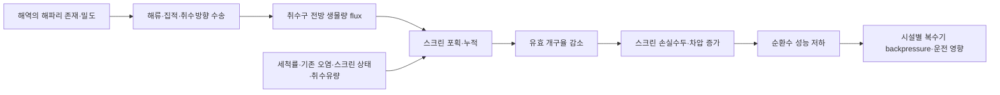
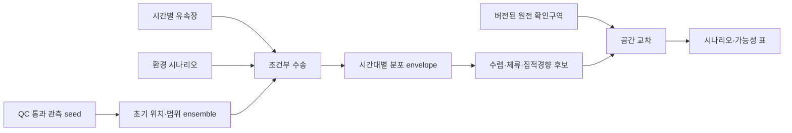
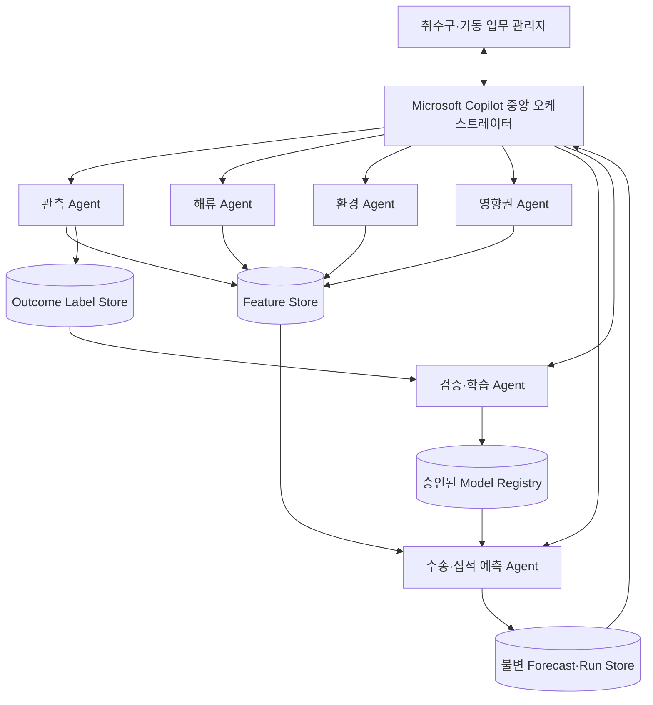
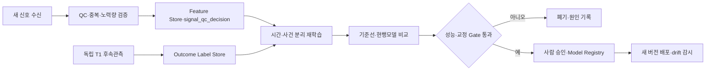
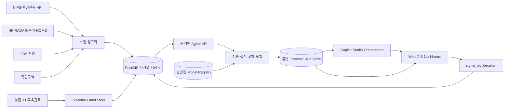

# 원전 취수구 해파리 위험 대시보드 서비스 계획서

> [!summary] 개선된 서비스 정의
> **해파리 관측정보와 실시간 해류·환경자료를 결합해 군집의 현재 분포와 시간대별 이동·집적 가능성을 추정하고, 검증된 면 유동장이 확보된 해역에 한해 원전별 확인구역과의 교차 결과를 지도와 가능성 표로 제공하여 취수구 및 가동 업무 관리자가 원전 운영에 참고할 위험정보를 쉽게 조회하도록 돕는 대시보드 서비스.**

> [!important] 이번 개편의 결정
> 제품의 중심을 `원전 업무·매뉴얼 조정`에서 `해파리 측정·군집 판단·이동 및 집적 예측·영향권 교차`로 되돌린다. 원전 조직의 업무 범위는 `평시 조회`와 `신호 수신·검증`까지만 다루며, 그 이후 대응은 해당 조직의 기존 절차에 맡긴다.

> [!success] 2026-08-22 팀 결정 — MVP 대상 부지
> MVP는 **한울 원전**을 대상으로 한다. 한울 인근의 `HB_0007 한수원_온양`, `HB_0008 한수원_덕천`, `HB_0009 한수원_나곡` 점관측에서 유향·유속·수온을 받을 수 있어 후보 부지 중 가장 가까운 공개 해상자료로 현재 상태와 모델을 검산할 수 있기 때문이다. 단, 이 점관측은 한울 앞바다의 시간변화 면 유동장을 대신하지 않는다. 이동영역 계산에는 별도로 검증된 KHOA ROMS 같은 면 유동장이 필요하다.

> [!warning] 출력 경계
> 공개·현재 확보 데이터만으로는 정확한 해파리 생물량, 수층 두께, 취수구 유입량, 스크린 차압, 원전 정지확률을 산출할 수 없다. 대상 해역을 덮는 면 유동장이 없으면 수송·교차 계산도 수행하지 않는다. MVP는 직접관측과 조건부 이동 시뮬레이션을 분리해 표시하고, 독립 관측으로 교정되기 전에는 앙상블 교차비율을 `확률`이라고 부르지 않는다.

---

## 0. 팀 피드백 해석과 변경사항

### 0.1 피드백을 제품 요구사항으로 번역

| 팀 피드백 | 기존 문서의 문제 | 이번 개편 결정 |
| --- | --- | --- |
| 매뉴얼과 원전 소통에 지나치게 집중 | 과제·승인·SOP·교대·복구 흐름이 제품보다 커짐 | 업무 상태머신·대응카드·manual adapter 삭제 |
| 해파리 관측이 작게 묘사됨 | 관측이 여러 근거 중 하나로만 표현됨 | 관측 위치·범위·강도·방법·품질을 첫 번째 핵심 모듈로 확대 |
| 해파리 측정·위험구역 판단이 가장 커야 함 | 지도보다 Evidence-to-Action 패널이 중심 | 화면의 60~70%를 군집·수송·영향권 지도에 배정 |
| 특정 조건에서 취수구 주변 해파리가 많아질 가능성 필요 | 단순 입자수송 또는 업무 인계만 존재 | `관측 → 군집 상태 → 수송·집적 → 확인구역 교차` 예측 플로우 설계 |
| 대응 흐름은 1·2단계까지만 필요 | 기존 문서는 8단계 전체를 설계 | `평시 준비상태 확인`, `신호 수신·검증`까지만 제품 흐름으로 유지 |
| Copilot 중앙 오케스트레이터와 하위 에이전트 | Copilot이 문서검색·업무초안 중심 | 관측·해류·환경·영향권·예측 에이전트를 조정하고 결과를 종합 설명 |
| 에이전트가 데이터를 관리·학습 | 온라인 입력이 즉시 모델을 바꾸는 것처럼 읽힐 위험 | 원자료 축적 → QC → 라벨 성숙 → 오프라인 재학습 → 검증 → 승인 배포로 정의 |
| 가능성을 확률표로 확인 | 기존 문서는 확률을 전면 금지해 발전경로가 없음 | MVP의 시나리오 표와, 라벨 확보 뒤의 교정 확률표를 단계적으로 분리 |

### 0.2 유지할 최소 운영 연결점

제품은 원전 가동 업무 전체를 설계하지 않는다. 사용자는 다음 두 역할로만 정의한다.

- **취수구 업무 관리자:** 해파리 관측·군집·접근 정보를 확인하고 기존 계측·현장정보와 대조한다.
- **원전 가동 업무 관리자:** 위험정보의 근거·신선도·불확실성을 확인하고 조직의 기존 운전업무에 참고한다.

서비스 밖으로 나가는 유일한 인계는 다음이다.

> 사용자가 대시보드의 위험정보를 검증한 뒤, 실제 대응 여부와 방법은 운영사의 기존 승인 절차에서 판단한다.

---

## 1. 사용자가 대시보드에서 답해야 할 질문

1. 지금 해파리가 **어디에서, 어느 범위로, 어느 정도 강도로** 관측됐는가?
2. 직접관측과 광역 보고 중 무엇이 최신이며, 관측되지 않은 구역은 어디인가?
3. 현재 해류·기상·환경 조건에서 군집이 **어느 방향으로 이동하거나 모일 수 있는가?**
4. 향후 시간창별 예상 분포가 한울 원전 확인구역과 얼마나 겹치는가?
5. 이 결과는 관측·실측·모델·가정 중 무엇에 근거하며, 어떤 데이터가 빠졌는가?
6. 새 관측이 들어오면 이전 예측과 비교해 유효·기각·보류 중 무엇으로 기록해야 하는가?

핵심 Job-to-be-Done은 다음과 같다.

> **한울 원전 취수구 및 가동 업무 관리자가 분산된 해파리·해양자료를 개별 탐색하지 않고, 현재 군집과 시간대별 한울 접근 시나리오를 한 화면에서 근거와 함께 확인한다.**

---

## 2. 해파리 유입위험의 인과모델

### 2.1 차압과 “해파리가 두꺼워진다”의 정확한 해석

차압은 해파리가 많아지는 원인이 아니다. 해파리와 다른 부유물이 스크린에 포획·누적되어 물의 흐름 저항이 커질 때 나타나는 **후행 설비상태 신호**다.



“두꺼워짐”은 아래 세 변수를 혼용하지 않는다.

| 변수 | 의미 | 관측방법 | 현재 확보상태 |
| --- | --- | --- | --- |
| 수층 군집 두께 | 해파리가 분포하는 수직 깊이 범위(m) | 다층 음향·소나·수직 채집 | 미확보 |
| 수중 농도·생물량 | 개체/m³, kg/m³ 또는 개체/m² | 표준 목시·트롤·음향+보정 | 경북 실시간 정량자료 미확보 |
| 스크린 적층·폐색 | wet kg/m², 피복률, 포획량 | 스크린 영상·수거량·차압·세척로그 | 시설자료 미확보 |

따라서 제품 문구는 `해파리 군집이 두꺼워진다`보다 다음이 정확하다.

> **고밀도·대부피 해파리 군집이 취수 방향으로 이동하고 국지적으로 집적되어 스크린 누적부하를 높일 수 있다.**

제품의 1차 입력군은 팀 결정에 따라 종을 세분하지 않은 `해파리`로 통합한다. 다만 2021년 한울의 반복 운전영향은 해파리가 아니라 살파 유입 사례이므로 해파리 학습라벨로 사용하지 않고, “차압·정지가 해파리 양 하나의 함수”라는 단선 인과를 막는 문제경계 근거로만 보존한다.

### 2.2 예측대상 사다리

| 단계 | 예측대상 | 필요한 라벨 | 현재 제품 상태 |
| --- | --- | --- | --- |
| Y0 관측 | 특정 위치·시간의 해파리 관측과 강도 | 사진·목시·채집·센서·신고 | 과거 좌표자료와 광역보고 사용 가능 |
| Y1 위치 | 격자·시간창 내 해파리 탐지 또는 존재 | 노력량이 있는 독립 후속관측과 방법별 탐지확률 | 조건부 이동 시뮬레이션 가능, 확률 미교정 |
| Y2 집적 | 고밀도 기준 이상 군집 | 표준화된 면적/체적별 밀도 | 라벨 확보 뒤 학습 가능 |
| Y3a 공간노출 | 분포 envelope가 원전 확인구역과 교차 | 독립 후속 위치·zone | 정량농도 없이도 교차 시뮬레이션 가능 |
| Y3b 고유입 flux | 유입 flux가 사전고정 기준을 초과 | 체적농도+국지유동+유효단면 | 정량 입력 확보 뒤에만 연구 가능 |
| Y4 설비부담 | 차압·유량 기준 초과 | 차압·유량·스크린·세척·수거량 | 시설자료 연계 뒤에만 연구 가능 |

MVP의 핵심은 `Y0 → Y1 → Y3a의 조건부 시뮬레이션`이다. Y2는 관측 강도 등급과 환경상 집적경향으로만 보조하고, Y3b·Y4는 향후 검증 목표로 분리한다.

---

## 3. 세 파이프라인의 현재 상태와 목표

> [!danger] 현재 저장소 감사 결과
> 세 파이프라인이 동등한 수준으로 완성된 상태는 아니다. 해류 파이프라인은 수집 프로토타입이 있으나, 해파리 위치파악은 조사·데이터계약 단계이고 원전 영향권 설정은 독립 구현 파일을 확인하지 못했다. 문서에서는 이를 `보유 구현`과 `목표 모듈`로 구분한다.

| 파이프라인 | 현재 자산 | 현재 한계 | 제품화 목표 |
| --- | --- | --- | --- |
| 해파리 군집 위치파악 | 35·36번 조사, 과거 좌표형 출현보고, 관측 스키마 | 최신 한울 점좌표·정량밀도·수심·독립 후속관측 부족 | 실시간 관측수신, footprint·강도·QC, 현재 분포면 생성 |
| 해류 실시간 조회 | `경북해류수집.py`, 한울 인근 HB_0007·0008·0009 점관측, 샘플 CSV, 설계문서 | 점관측은 있으나 한울을 덮는 면 유동장과 방향 정의·과거범위 미검증 | 점관측 nowcast·검산, ROMS 수집·시공간 정렬, u/v 격자, 결측·커버리지, 앙상블 수송 |
| 원전 영향권 설정 | 기존 문서의 FacilityZone 개념 | 독립 파일·출처·승인자·버전 미확인 | 공개 또는 DEMO 확인구역의 버전·출처·기하와 공간교차 API |

### 3.1 현재 데이터에서 보존할 것

- 좌표형 해파리 출현보고 36,826행 중 경북 문자열 3,177행과 울진 원전 근해 라벨 136행
- NIFS 주간 모니터링·특보의 최신 광역 해역 신호
- 트롤·목시 데이터의 조사노력·개체수·밀도 스키마
- 한울 인근 `HB_0007·HB_0008·HB_0009` 점관측의 유향·유속·수온과, 코드 검증용 포항항 `HF_0071` 98개 표층 격자
- 원자료 출처·시각·좌표·단위·QC·모델버전을 보존하는 데이터계보

### 3.2 P0 기술부채

1. 현재 HF 면격자는 포항항 부근만 덮어 한울 수송 계산에 사용할 수 없다.
2. `crdir`의 toward/from 정의를 공급자 문서와 테스트 벡터로 확정해야 한다.
3. 한울 근해의 면 유동장으로 KHOA ROMS를 실호출·검증해야 한다. `HF_0073`은 실호출 결과 위치·유향·유속이 비어 있어 후보에서 제외한다.
4. 원전 확인구역은 출처·목적·버전이 있는 공개/승인 데이터 또는 `DEMO` 워터마크가 필요하다.
5. 공개 저장소의 하드코딩된 API 인증키를 폐기·재발급하고 환경변수/비밀저장소로 이동해야 한다.
6. 수온·풍·파랑은 해파리 발생·집적의 보조 특징이지 직접 관측이나 단일 원인이 아니다.
7. 격자 밖을 먼 부이 최근접값으로 채우지 않고 `계산 불가`로 표시해야 한다.
8. HB_0007·0008·0009는 legacy 경로에서 확인됐으므로, 폐기 이후 대체 endpoint·관측수심·갱신주기·결측률을 확인해야 한다.

---

## 4. 핵심 1 — 해파리 관측·군집 측정 파이프라인

### 4.1 관측 입력의 우선순위

| 등급 | 입력 | 제품에서의 의미 |
| --- | --- | --- |
| O3 정량 직접관측 | 표준 면적/체적 목시·트롤·교정 음향·소나 | 위치·범위·밀도와 탐지한계가 있는 가장 강한 입력 |
| O2 증거 직접관측 | 사진·영상·GPS·시각이 있는 제보·카메라 | 존재와 대략적 footprint·강도 확인 |
| O1 일반 위치보고 | 날짜·좌표·밀집여부가 있는 과거 신고 | 종을 묶은 역사 위치 seed, 노력량·실시각 한계 표시 |
| O0 광역 신호 | NIFS 주간 시·군/도 보고·특보 | 조사 개시와 광역 prior, 점좌표·밀도처럼 표시 금지 |

### 4.2 관측 API 계약

```yaml
observation_id:
observed_at:
received_at:
geometry:
  type: point|track|polygon|coastal_segment
  coordinates:
depth_range_m:
method: visual|photo|video|camera|acoustic|sonar|trawl|report
presence: detected|not_detected|unknown
count:
density_value:
density_unit:
ordinal_intensity: trace|scattered|dense|very_dense|unknown
footprint_area_m2:
size_class:
effort:
  duration_min:
  track_length_km:
  searched_area_m2:
evidence_uri:
source_id:
source_record_id:
qc_status: received|validated|held|rejected
qc_reasons:
```

### 4.3 “작은 점”을 군집 전체로 오인하지 않는 표현

지도는 다음을 서로 다른 심볼로 표시한다.

- **점:** 정확 좌표가 있는 목시·제보
- **선:** 선박 항로·조사 transect
- **면:** 드론·표준 목시·신고가 말한 실제 관측범위
- **해안구간:** NIFS 광역 보고
- **수직 막대:** 수심범위를 가진 음향·소나·채집
- **빗금:** 관측이 없거나 센서 커버리지가 없는 영역

`not_detected`는 관측노력과 커버리지가 기록됐을 때만 **미탐지 라벨**로 사용한다. 단순 미신고와 데이터 결측은 `unknown`이다. 미탐지는 실제 부재와 같지 않으므로, 반복·표준조사로 방법·시야·해상상태별 탐지확률을 추정하기 전에는 `P(존재)`가 아니라 `P(해당 방법으로 탐지)`를 학습대상으로 둔다.

### 4.4 현재 군집상태 생성

관측 에이전트는 원자료를 표준화하고 다음을 만든다.

1. 최신 직접관측점·범위
2. 관측 강도 등급과 원 단위
3. 동일 사건의 중복·상충관측 묶음
4. 마지막 관측 이후 경과시간
5. 조사된 음성영역과 미관측영역
6. 수심자료가 없을 때 `수직두께 미관측` 표시

정량 농도가 없는 관측 강도 등급을 kg/m³나 개체/m³로 변환하지 않으며, 수송 입자의 질량 가중치로 자동 사용하지 않는다.

---

## 5. 핵심 2 — 해류·환경 및 이동·집적 파이프라인

### 5.1 해류 에이전트의 입력·출력

입력:

- HF-RADAR 격자 유향·유속
- 해양관측부이·한수원 부이의 점 유향·유속
- 향후 KHOA ROMS 표층 예측장
- 해안선·수심 마스크

출력:

```yaml
field_id:
provider:
run_time:
valid_time:
depth_m:
grid_spacing_m:
lat:
lon:
u_ms:
v_ms:
coverage_geometry:
missing_rate:
direction_convention:
qc_status: ready|degraded|stale|blocked
```

### 5.2 환경 에이전트의 역할

| 변수 | 사용할 수 있는 역할 | 금지할 해석 |
| --- | --- | --- |
| 수온·염분 | 수괴·성층·환경 맥락, 후속 모델 특징 후보 | 수온만으로 발생·위치 확정 |
| 풍향·풍속 | 모델 forcing 확인, 표층 민감도 시나리오 | 검증 없이 임의 windage를 실제값으로 고정 |
| 파고·파향·주기 | 관측가능성·표층혼합·Stokes 후보 | 파고만으로 이동방향 확정 |
| 수렴·발산 | 관측 seed의 집적·분산 후보 | 생물량을 무에서 생성 |
| 조석·취수유동 | 근해 접근·flux의 향후 핵심 입력 | 광역 표층류로 국지 취수흐름 대체 |

ROMS가 이미 바람 forcing을 포함한다면 KMA 풍장을 다시 더해 이중계산하지 않는다. 수렴·전선·Stokes 항은 독립 관측으로 개선효과를 검증한 뒤 승격한다.

### 5.3 이동·집적 계산 단계



MVP 기준선과 후보모델:

- B0: 마지막 관측 위치 유지
- B1: 고정 반경 확산
- B2: 해류만 사용하는 조건부 수송
- B3: 해류+확산 앙상블
- B4: 검증 뒤 환경·수직행동을 추가한 후보

복잡한 모델은 독립 후속관측에서 단순 기준선을 이길 때만 채택한다.

집적은 다음 두 수준으로 나눈다.

- **정량 초기농도 $C_0$가 없을 때:** 수렴·체류시간·입자 겹침으로 `환경상 집적경향`과 상대 확인후보만 표시한다. 이것은 고밀도 군집 관측이나 생물량 증가가 아니다.
- **정량 $C_0$가 있을 때:** 개체수·질량을 보존하는 advection–diffusion 또는 가중입자로 $C(x,y,z,t)$를 계산한다. 사전에 고정한 $C^*$를 넘는 사건만 Y2 고밀도로 정의한다.

수치 ensemble은 초기 위치·범위·가중치, forcing·확산·행동 가정의 샘플링 방법을 버전으로 기록한다. 입자 수를 늘렸을 때 교차비율이 안정되는지 resampling 검사를 수행한다.

### 5.4 수송 결과의 표현

- 직접관측점과 모델 envelope를 같은 색으로 표시하지 않는다.
- `3/6/12시간`은 사용자가 선택한 계산창이지 검증된 선행시간이 아니다.
- 가중 ensemble member 또는 수치입자 100개 중 40개가 zone을 통과했다면 `가중 ensemble 교차비율 40/100`으로 표시한다. 이는 초기분포·가중치·forcing 가정에 조건부인 수치비율이며, 독립 라벨로 교정되기 전에는 확률이 아니다.
- 관측깊이와 수심별 유속이 없으면 `표층조건부` 배지를 붙인다.
- 유속격자 밖, 육상통과, 오래된 seed는 해당 셀을 `계산 보류`로 만든다.

---

## 6. 핵심 3 — 원전 확인구역·취수 노출 판단

### 6.1 영향권 파이프라인의 정확한 역할

원전 영향권 에이전트는 해파리를 예측하지 않는다. 버전된 공간영역을 관리하고 예측 분포와 결정론적으로 교차한다.

```yaml
zone_id:
site_id:
purpose: public_reference|verification|demo
geometry:
source:
owner:
approver:
version:
effective_at:
access_class:
status: approved|demo|expired|blocked
```

공개 범위에서 상세 취수구 구조·유량·보호계통 취약점을 새로 추정하지 않는다. 실제 승인구역이 없으면 `DEMO 확인구역` 워터마크를 사용한다.

#### 6.1.1 고정 구역에서 동적 연결영역으로의 확장

버전된 고정 geometry는 시설 위치·접근통제·데모 경계를 관리하는 용도로만 남긴다. 실제 해상 확인 우선순위는 [[38) 동적 취수구 유입 위험영역 산정 설계]]의 방법에 따라, 취수구 또는 공개 MVP의 가상 감시 게이트에 일정 시간 안에 도달한 앙상블 비율로 매 시각 다시 계산한다. 검증 전 출력명은 `막힘 확률`이 아니라 `조건부 연결 비율`이며, 공개 표층자료만 사용한 경우 `표층조건부 현장확인 후보영역`으로 제한한다.

### 6.2 단계별 산출 가능 범위

| 입력 수준 | 허용 출력 | 금지 출력 |
| --- | --- | --- |
| 위치만 있음 | zone 교차 여부·상대 확인우선순위 | 생물량·flux·차압 |
| 위치+관측범위 | 겹치는 면적·시간창 | 절대 유입량 |
| 위치+정량농도+국지유동 | 조건부 유입 flux 연구값 | 시설 처리여유 |
| 위 입력+취수유량·스크린·세척·차압 라벨 | 시설부담 모델 연구 가능 | 검증 전 운전경보·정지확률 |

체적농도와 국지 유동이 있을 때, 취수 전방 제어단면을 통과하는 유입 flux와 스크린에 포획되는 flux를 분리한다.

$$
J_{in}(t)=\int_{A_{control}} C_{vol}(x,t)\max(\vec{u}_{local}(x,t)\cdot\vec{n},0)dA
$$

$$
J_{capture}(t)=\eta(t)J_{in}(t)
$$

- $C_{vol}$: 개체/m³ 또는 kg/m³인 위치·깊이별 체적농도
- $\vec{u}_{local}$: 제어단면의 해류·조석·취수유도 흐름을 포함한 국지속도
- $\vec{u}_{local}\cdot\vec{n}$: 취수방향 법선속도
- $A_{control}$: 취수구 전방에 정의한 유효 제어단면
- $\eta$: 스크린 포획·적층 효율

$J_{in}$의 단위는 $C_{vol}$에 따라 개체/s 또는 kg/s이고, $J_{capture}$는 그중 포획되는 양이다. 개체/m² 같은 수직적분 면적농도를 $C_{vol}$ 자리에 넣으면 차원이 맞지 않으므로, 수직분포를 복원하지 못하면 flux를 계산하지 않는다.

현재는 $C_{vol}$, $\vec{u}_{local}$, $\eta$, $A_{control}$이 확보되지 않았으므로 이 식은 데이터 계약이지 MVP 출력식이 아니다.

### 6.3 차압 데이터가 연결된 이후

시설 데이터 에이전트는 다음을 입력받을 수 있을 때만 추가한다.

- 스크린 전후 차압 또는 수위차와 변화율
- 취수유량·펌프 조합
- 스크린 상태·세척주기·rake 동작
- 수거량·종 또는 영상확인
- 계획정비·센서이상·기존 오염

차압 상승은 해파리 단독 양성라벨로 자동 변환하지 않는다. 같은 신호가 다른 부유물, 기존 오염, 세척장치 상태로도 발생할 수 있기 때문이다.

---

## 7. Copilot 중앙 오케스트레이터와 하위 에이전트

### 7.1 설계 원칙

Microsoft Copilot은 중앙 오케스트레이터다. 다만 각 하위 에이전트는 모두 자유생성 LLM이 아니라 다음의 결합이다.

> **데이터 커넥터 + 품질검사 + 결정론/통계모델 + 설명용 에이전트 인터페이스**

수치계산·모델학습·공간교차·확률교정은 재현 가능한 코드가 담당하고, Copilot은 필요한 에이전트를 호출하고 결과·상충·결손을 종합한다.



### 7.2 에이전트별 책임

| 에이전트 | 관리 데이터 | 계산·모델 | 학습 또는 개선 | 핵심 출력 |
| --- | --- | --- | --- | --- |
| 관측 Agent | NIFS·제보·사진·목시·트롤·센서 | 정규화, 중복·좌표·신선도 QC | 사람 검증과 후속관측으로 출처 신뢰도 개선 | 관측점·범위·강도·품질 |
| 해류 Agent | HF-RADAR·부이·ROMS | 단위·방향 변환, 시공간 유속장·커버리지 | 부이·ADCP 잔차로 bias correction 후보 평가 | u/v 격자와 데이터 건강 |
| 환경 Agent | 바람·파랑·수온·염분·조석 | 시간정렬·특징량·민감도 시나리오 | 독립 라벨이 쌓인 뒤 특징 증분가치 평가 | 환경 context와 결측 |
| 영향권 Agent | 원전별 확인구역 | 버전·권한 검증, 공간교차 | 학습하지 않음 | zone·교차·계산 가능 여부 |
| 예측 Agent | 위 에이전트의 버전 고정 결과 | 위치수송·집적후보·교차표 | 후속관측으로 위치·고밀도 모델 재학습·교정 | 시간대별 envelope와 가능성 표 |
| 검증·학습 Agent | 예측·후속관측·평가셋 | 기준선 비교·교정·drift 탐지 | challenger 평가 후 승인요청 | 성능·교정상태·배포후보 |
| 시설부담 Agent(향후) | 차압·유량·스크린·세척·수거량 | 차압 변화·시설영향 모델 | 원인확인 라벨로 오프라인 학습 | Y4 연구값, 없으면 N/A |

### 7.3 공통 에이전트 계약

```yaml
run_id:
agent_id:
site_id:
as_of:
forecast_window:
status: ready|degraded|stale|blocked
input_refs:
output_ref:
schema_version:
spatial_coverage:
missing_rate:
latency_sec:
model_id:
model_version:
calibration_status: none|experimental|calibrated|failed
uncertainty:
warnings:
lineage_id:
```

### 7.4 중앙 Copilot의 종합판단 규칙

Copilot은 다음을 수행한다.

1. 사용자의 원전·시간창 질문에 필요한 에이전트를 선택한다.
2. 모든 결과의 기준시각·공간범위·단위·버전을 맞춘다.
3. 직접관측, 조건부 시뮬레이션, 환경 context를 분리한다.
4. 필수 에이전트가 `blocked`이면 종합 위험값 대신 `계산 불가`와 원인을 표시한다.
5. 예측 Agent의 숫자를 변경하지 않고 주요 영향요인·상충근거·결손을 설명한다.
6. “왜 이 구역인가?”, “무슨 데이터가 오래됐나?”, “어떤 가정에서 달라지나?”에 답한다.

Copilot은 다음을 하지 않는다.

- 자유생성 확률·ETA·kg/h·차압·정지확률 작성
- 임의 가정계수·zone·임계값 선택
- 물리 시뮬레이션 또는 모델 가중치 직접 계산
- 입력 제보 한 건으로 운영 모델을 즉시 재학습
- 출력조정·감발·정지·설비제어 권고

검증·학습 Agent는 Copilot에 성능·교정상태를 읽기 전용으로 제공한다. 재학습 실행, challenger 승격, 모델 승인·배포는 Copilot 도구로 노출하지 않고 별도의 오프라인 검증·사람 승인 절차에서만 수행한다. 모든 하위 에이전트의 설명 인터페이스도 Forecast/Run Store의 원 수치를 변경하지 않고 참조값과 run ID를 그대로 반환해야 한다.

### 7.5 학습 루프

`에이전트가 학습한다`는 의미는 프롬프트 기억이 아니라 다음 MLOps 흐름이다.



실시간 자동학습은 데이터 오염·제보 오류·재현성 상실 위험 때문에 MVP에서 제외한다.

사용자의 `유효·기각·보류`는 입력 신호의 품질을 판정하는 `signal_qc_decision`이다. 예측의 정답인 `outcome_label`은 이후 별도로 수행한 T1 관측에서 관측방법·노력량·커버리지와 함께 생성한다. 두 값을 같은 학습 라벨로 사용하지 않는다.

---

## 8. 시간대별 가능성·확률표

### 8.1 MVP 시나리오 표

독립 라벨로 교정되기 전에는 아래처럼 표현한다.

| 대상 원전·구역 | 현재 관측 | +3h | +6h | +12h | 출력 성격 | 데이터 상태 |
| --- | --- | --- | --- | --- | --- | --- |
| DEMO 확인구역 A | 직접점 2건·해안구간 1건 | 가중 ensemble 교차 18/100 | 가중 ensemble 교차 37/100 | 격자 밖 | ensemble 교차비율 | 표층조건부·미교정 |
| 확인구역 B | 관측 없음 | 계산 보류 | 계산 보류 | 계산 보류 | 데이터 부족 | 유속격자 미확보 |

표의 숫자는 UI 형식 예시이며 실제 데모에서는 계산결과 또는 `가상 데이터` 워터마크를 사용한다.

### 8.2 학습 뒤 확률표

독립된 양성·음성 후속관측과 충분한 표본으로 교정 Gate를 통과하면 다음 구조로 승격한다.

| 구역·시간창 | P(방법별 탐지 Y1) | P(고밀도 Y2≥C*) | P(공간노출 Y3a) | P(고유입 flux Y3b≥J*) | P(차압 Y4≥ΔP*) | 교정상태 | 데이터 충분도 |
| --- | --- | --- | --- | --- | --- | --- | --- |
| site-zone-horizon | 값 또는 N/A | 값 또는 N/A | 값 또는 N/A | 정량농도·국지유동 없으면 N/A | 시설자료 없으면 N/A | experimental/calibrated | coverage·표본수 |

규칙:

- $C^*$, $J^*$, $\Delta P^*$는 학습 전에 연구계획 또는 운영자가 버전 고정한 기준이며, held-out test 결과를 본 뒤 선택하지 않는다.
- 표준화된 반복조사로 방법별 탐지확률을 모델링하기 전에는 `P(존재)`로 승격하지 않고 `P(해당 방법으로 탐지)`로 제한한다.
- 각 셀에는 예측구간·모델버전·기준시각·마지막 관측·상위 영향요인을 표시한다.
- 위험 가능성과 데이터 신뢰도를 별도 열로 둔다.
- 미교정 앙상블 비율을 보정된 확률처럼 표시하지 않는다.
- 표본이 부족하면 수치를 비워 두고 `N/A` 사유를 표시한다.

---

## 9. 대시보드 정보구조

### 9.1 메인 화면 — 관측과 예측이 70%

#### 상단 상태바

- 대상 원전/DEMO 구역
- 현재시각·마지막 갱신시각
- 관측·해류·환경·영향권·예측 Agent 상태
- 계산 가능/부분 가능/보류
- 실데이터/과거재생/가상시나리오 모드

#### 중앙 지도

- 직접관측점·선·면·해안구간·수심범위
- 관측 강도와 원 단위
- 직접 관측범위 또는 관측 seed 기반 envelope
- +3/+6/+12시간 조건부 이동 envelope
- 해류 벡터·수렴/체류 후보
- 원전별 확인구역과 교차영역
- 데이터 커버리지 밖·미관측 마스크
- 시간 슬라이더와 모델 비교

#### 우측 가능성 패널

- 시간대별 시나리오/확률표
- 조건부 시나리오 최초 교차 시간창(`ETA` 아님)
- 주요 영향요인과 반대신호
- 모델·교정상태·데이터 충분도
- `왜 이 구역인가?` Copilot 질의

#### 하단 시계열

- 관측 건수·강도·범위 변화
- 해류속도·방향·수온·풍·파랑
- zone 교차 시나리오 비율 변화
- 향후 시설연계 시 차압·유량을 **관측값**으로 별도 표시

### 9.2 상세 화면

1. **관측 상세:** 원문증거·geometry·방법·노력량·QC·수정이력
2. **해류·환경:** 격자·벡터·결측·보간·toward/from·관측소 거리
3. **모델 비교:** B0~B4 결과·민감도·오류·교정상태
4. **Agent 상태:** 입력·출력·버전·지연·경고·실패원인
5. **예측 검증:** 이전 예측과 독립 후속관측 비교

### 9.3 제품 사용 흐름 — 두 단계

#### 1. 평시 준비상태 확인

`사이트 선택 → 에이전트 데이터 건강 확인 → 현재 관측·군집 확인 → 시간슬라이더로 이동·교차 조회 → 근거·불확실성 확인`

#### 2. 신호 수신·검증

`새 관측 수신 → 관측 QC → 관련 에이전트 갱신 → 예측 재실행 → Copilot이 일치·상충·결손 설명 → 사용자가 signal_qc_decision(유효/기각/보류) 기록`

제품 흐름은 여기서 끝난다. 확인 결과가 실제 원전 운영에 어떻게 반영되는지는 운영사의 기존 업무와 절차가 결정한다.

---

## 10. 실시간 처리·기술 아키텍처



권장 구성:

- Backend: Python/FastAPI
- 공간저장·연산: PostgreSQL/PostGIS
- 시계열: TimescaleDB 또는 동일 스키마
- 모델: 재현 가능한 Python 서비스, 승인 모델용 Model Registry, 실행결과용 불변 Forecast/Run Store
- 지도: MapLibre/Mapbox GL + deck.gl 또는 동등 기술
- 오케스트레이션: Microsoft Copilot Studio connected agents + 승인된 REST/MCP 도구
- 이벤트: 스케줄러 또는 메시지 큐
- 감사: 원자료 checksum, feature snapshot, model/run ID, 응답 계보

Microsoft 문서는 connected agents를 각각 독립 지식·도구·오케스트레이션을 가진 전문 에이전트로 설명하며, 별도 에이전트는 권한·도메인 경계가 실제로 다를 때 사용하라고 권고한다. 계산은 API/MCP/결정론 workflow로 노출하고, Copilot은 단일 사용자 응답을 담당한다.

---

## 11. Act MVP

### 11.1 필수 수직 슬라이스

1. 한울 근해 과거 좌표형 관측 1건 또는 `가상` 워터마크를 붙인 seed 1건
2. 한울 인근 `HB_0007·0008·0009` 점관측의 신선도·단위·결측 조회와, 신규 ROMS가 통과하면 한울 bbox 면 유동장 재생
3. 검증된 면 유동장이 있을 때만 B0 위치유지와 B2 해류수송을 동일 입력에서 비교. 없으면 B2를 `계산 보류`하거나 `cached/synthetic`로 명시
4. 버전된 `DEMO 확인구역` 1개와 결정론적 공간교차
5. 관측·해류·예측/교차를 제공하는 결정론적 API 3개
6. 단일 Copilot 오케스트레이터가 세 API를 호출해 근거·결손을 설명
7. 지도, 가중 ensemble 교차표, 데이터 부족 시 `계산 보류` 상태
8. 실행 입력·모델버전·결과와 `signal_qc_decision` 저장

### 11.2 여유가 있을 때의 확장

- B1 고정반경과 B3 해류+확산 비교
- 실시간 polling과 PostGIS/시계열 저장소
- 환경 Agent 및 여러 Copilot connected agents
- Outcome Label Store, Model Registry, 오프라인 학습·교정 파이프라인
- 한울 ROMS 면 유동장 실호출과 복수 시간창·확인구역

### 11.3 데모 선택

| 선택 | 조건 | 발표 범위 |
| --- | --- | --- |
| A. 한울 실데이터 모드 | Day 0에 ROMS 한울 bbox 실호출·커버리지 통과 | 한울 인근 점관측으로 데이터 상태를 검산하고, ROMS로 조건부 수송·DEMO zone 교차 계산 |
| B. 한울 제한데모 모드 | ROMS 권한·커버리지 실패 | 한울 인근 점관측은 실제 조회, 수송은 비활성 또는 한울 `cached/synthetic` 워터마크, 데이터 요구계약과 UI 시연 |

MVP 대상과 이야기는 두 모드 모두 **한울로 고정**한다. 현재 기본안은 신규 ROMS 실호출 전까지 **B**이고, G2 통과 시 A로 승격한다. 포항 실데이터와 원전 가상화면을 섞은 이중 데모는 기본안에서 제외한다.

### 11.4 3일 안에 증명할 것

- 세 목표 파이프라인의 공통 계약과 연결 가능성
- 데이터 신선도·결측·커버리지에 따라 계산을 중단하는 안전한 동작
- 동일 입력에서 재현되는 수송·zone 교차
- Copilot의 올바른 에이전트·도구 선택과 숫자 원본 일치
- 사용자가 현재 관측·예상구역·근거·결손을 빠르게 찾는지

### 11.5 3일 안에 증명하지 못할 것

- 실제 해파리 군집의 수직 두께·절대 생물량
- 한울 취수구 도착확률·정확 ETA
- 취수구 유입 kg/h·스크린 폐색률·차압·유량
- 원전 감발·정지확률 또는 안전 향상
- 기존 특보·순찰보다 높은 예측정확도
- 교정된 운영 확률표

---

## 12. 검증계획과 확률 제공 Gate

### 12.1 파이프라인·모델 검증

| 대상 | 기준선·정답 | 지표 |
| --- | --- | --- |
| 관측 Agent | 사람이 만든 오류·중복·좌표 QC 세트 | 오류검출 precision/recall, 필드 완성률, 지연 |
| 해류 Agent | 공급자 정의·부이/ADCP·테스트 벡터 | 방향·단위 일치, 결측률, coverage, 잔차 |
| 영향권 Agent | 고정 geometry fixture | 교차 재현성 100%, zone 버전 추적률 |
| 위치예측 | 입력과 다른 독립 T1 관측 | hit@K, 최소거리, coverage, CRPS |
| 고밀도예측 | 표준화된 밀도 양·음성 | PR-AUC, 고정 오경보율의 recall, lead time |
| 확률교정 | 시간·사건 분리 holdout | Brier score, log-loss, ECE, reliability curve |
| Copilot | 사전등록 질문·도구선택 세트 | 도구선택률, 숫자 원본일치, 출처·버전 포함률 |
| UX | 팀원/대리사용자 과업테스트 | 상태·근거 찾는 시간, 오류율, 화면전환 |

### 12.2 학습·확률 승격 Gate

1. 동일 관측을 seed와 정답에 동시에 쓰지 않는다.
2. 시간·사건·공간을 분리하고 표준화된 반복 노력량을 기록한 후속관측을 확보해, 방법별 탐지확률 또는 탐지모델을 정의한다.
3. 단순 기준선보다 held-out 성능이 반복해서 개선된다.
4. 확률 calibration과 표본수를 함께 공개한다.
5. source drift·계절 drift·센서변경을 별도로 감시한다.
6. 승인된 모델버전만 운영 UI가 호출한다.
7. $C^*$, $J^*$, $\Delta P^*$는 held-out test 전에 고정하며 test 결과를 본 뒤 조정하지 않는다.
8. Gate 실패 시 `미교정 ensemble 교차비율` 표현으로 되돌린다.

### 12.3 P0 중단조건

- 시각·좌표가 있는 해파리 seed가 없으면 위치시뮬레이션을 실행하지 않는다.
- 대상 구역을 덮는 면 유속격자가 없으면 수송·교차 패널을 비활성화한다.
- 유향 정의와 단위가 확인되지 않으면 벡터를 그리지 않는다.
- zone 출처·버전이 없으면 `DEMO` 이외의 원전 영향권으로 부르지 않는다.
- 수직관측·수심별 유동이 없으면 `표층조건부`를 숨기지 않는다.
- 정량농도가 없으면 flux·생물량을 계산하지 않는다.
- 시설 라벨이 없으면 차압·유량·운전영향을 예측하지 않는다.
- Copilot이 숫자를 바꾸거나 막힌 에이전트를 무시하면 해당 응답을 차단한다.

---

## 13. 구현 우선순위

### Day 0 — 사실과 보안

- API 키 폐기·재발급, 비밀저장소 전환
- 세 파이프라인 실제 파일·소유자·입출력 확인
- 한울 ROMS 커버리지·유향 정의·갱신주기 실호출과 HB 점관측 대조
- 원전 확인구역의 공개/DEMO geometry 확정
- 실데이터·과거재생·가상시나리오 표시규칙 확정

### Day 1 — 관측·해류·지도

- 관측 API·QC·geometry 구현
- 해류 수집 스케줄·u/v 변환·coverage mask
- 지도에 직접관측·해류·확인구역·결손 표시
- PostGIS 스키마와 원자료 계보 저장

### Day 2 — 필수 수송·교차·Copilot

- B0·B2 조건부 수송과 DEMO zone 교차
- 시간 슬라이더·ensemble 교차표
- 관측·해류·예측/교차 API
- 단일 Copilot 오케스트레이터와 응답계약
- 여유가 있을 때만 B1·B3 및 connected agents 추가

### Day 3 — 검증·발표

- 기준선 비교·결측·격자밖·오래된 seed 테스트
- Copilot 숫자 원본일치·도구선택 테스트
- 대리사용자 조회 과업테스트
- 실데이터와 가상데이터 워터마크·금지문구 점검
- 데모 실패경로와 `계산 보류` 시연

---

## 14. 제품 범위에서 삭제한 것

- 원전 대응 매뉴얼 생성·검색·추천
- 담당자·승인자·기한·작업함 설계
- 교대 인수인계와 복구·회고 워크플로우
- 원전 조직 전체의 상태머신
- 감발·정지·설비조작 권고
- 자동제어·실시간 CCTV·보안민감 내부 도면

이 항목을 삭제한 이유는 중요하지 않아서가 아니라, **우리 제품이 해결할 문제와 권한이 아니기 때문**이다.

---

## 15. 발표 가능 문장과 금지 문장

### 발표 가능

- “해파리 직접관측과 조건부 수송결과, 환경정보를 분리해 원전 확인구역과의 교차 시나리오를 보여줍니다.”
- “현재 MVP는 도착확률이 아니라 앙상블 시나리오 중 확인구역과 겹친 비율을 표시합니다.”
- “Copilot은 전문 에이전트를 호출하고 결과의 근거·상충·결손을 종합하지만 물리값과 확률을 만들지 않습니다.”
- “차압은 향후 시설데이터가 연결될 때 해파리 집적예측을 검증할 결과변수이며, 현재 공개자료로 예측하지 않습니다.”
- “원전 담당자는 이 위험정보를 조회·검증한 뒤 기존 운전업무에 참고합니다.”

### 금지

- “해파리가 82% 확률로 6시간 뒤 취수구에 도착합니다.”
- “수온과 해류만으로 해파리 대량발생을 예측합니다.”
- “군집 두께와 시간당 유입톤수를 실시간 계산합니다.”
- “해파리 양만으로 차압 상승과 원전 정지를 예측합니다.”
- “Copilot이 위험확률을 생성하고 원전 대응을 결정합니다.”
- “현재 확보된 포항항 격자로 한울을 예측합니다.”
- “데이터가 없으므로 위험이 낮습니다.”

---

## 16. 핵심 근거

### 해파리·취수·차압 경계

- [ASNR Gravelines 2025 사건](https://reglementation-controle.asnr.fr/controle/actualites-du-controle/installations-nucleaires/avis-d-incident-des-installations-nucleaires/arrets-automatiques-des-reacteurs-2-3-4-et-6-de-la-centrale-nucleaire-de-gravelines): 대량 해파리, 드럼필터 막힘, CRF 설비 보호와 정지의 사건 흐름. SEC는 계속 가용했고 INES 0.
- [ASNR 2025 사후검사 서한](https://reglementation-controle.asnr.fr/content/download/205362/download_file/INSSN-LIL-2025-0991.pdf): 해파리 외 기존 필터 오염과 세척램프 누수 등 설비상태가 세척효율에 영향을 준 반례.
- [NRC St. Lucie 2011 사건](https://www.nrc.gov/reading-rm/doc-collections/event-status/event/2011/20110823en): 해파리 유입이 순환수 성능을 저하시켜 복수기 backpressure 상승과 수동정지로 이어진 사례. 이 복수기 backpressure는 스크린 전후 차압과 같은 값이 아니라, 순환수 성능 저하 뒤 나타날 수 있는 별도의 downstream 결과다.
- [IAEA SSG-77](https://www-pub.iaea.org/MTCD/publications/PDF/PUB1991_web.pdf): 해파리 등 수중 생물학적 위해와 취수구 감시의 국제 지침.

### 관측·위치·수송

- [[35) 해파리 군집 위치 탐지 방법과 정보 결합 Investigate]]
- [[36) 기존 해파리 직접관측 수신 데이터 감사]]
- [NIFS 해파리 OpenAPI](https://www.nifs.go.kr/openApi/actionOpenapiInfoList.do)
- [해파리 출현보고 파일](https://www.data.go.kr/data/15147963/fileData.do)
- [해파리 트롤조사 파일](https://www.data.go.kr/data/15147957/fileData.do)
- [KHOA ROMS 표층 유향·유속·수온](https://www.data.go.kr/data/15142227/openapi.do)
- [노무라입깃해파리 광역 입자추적 연구](https://www.sciencedirect.com/science/article/pii/S0924796309003030)
- [노무라 음향 target strength 연구](https://academic.oup.com/icesjms/article/71/3/597/639548)

### Copilot·다중 에이전트

- [Microsoft Copilot Studio 다중 에이전트 패턴](https://learn.microsoft.com/en-us/microsoft-copilot-studio/guidance/multi-agent-patterns): connected agent의 전문성·권한·도메인 분리와 중앙 응답 원칙.
- [Copilot Studio Connected agents](https://learn.microsoft.com/en-us/microsoft-copilot-studio/agents-experience/authoring-add-other-agents): 독립 도구·지식·오케스트레이션을 가진 연결 에이전트.
- [Copilot Studio agent tools](https://learn.microsoft.com/en-us/microsoft-copilot-studio/agents-experience/tools-available): connector·MCP·결정론 workflow의 역할.
- [Copilot Studio agent evaluation](https://learn.microsoft.com/en-us/microsoft-copilot-studio/analytics-agent-evaluation-intro): 테스트셋·응답·activity map 기반 평가.

---

## 17. 결정 전 남은 질문

1. 팀이 말한 해파리 위치파악·영향권 파이프라인의 실제 파일·코드·소유자는 어디에 있는가?
2. 한울을 덮는 ROMS 면 유동장을 Day 0에 확보할 수 있는가?
3. 한울 확인구역은 공개구역, 팀 가상구역, 운영사 승인구역 중 무엇인가?
4. 해커톤 동안 위치·시각·강도를 가진 새 해파리 관측을 최소 한 건 받을 수 있는가?
5. 관측 강도를 어떤 공통 순서형 등급으로 통일할 것인가?
6. Copilot connected agents 기능과 한국어 도구선택을 실제 테넌트에서 사용할 수 있는가?
7. 후속 단계에서 차압·유량·수거량을 비민감 집계로 제공받을 파트너가 있는가?
8. ROMS Gate가 실패하면 한울 수송 패널을 비활성화할지, `cached/synthetic` 한울 수송으로 시연할지 어느 쪽을 택할 것인가?

---

## 최종 개발 원칙

> **측정되지 않은 해파리 양을 만들어내지 않는다. 커버리지 밖을 예측하지 않는다. 미교정 시나리오를 확률로 부르지 않는다. Copilot은 숫자를 만들지 않고 전문 에이전트의 근거를 조율한다. 이 네 경계를 지키면서 관측·군집·수송·영향권 판단을 제품의 가장 큰 부피로 만든다.**
