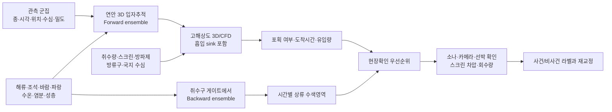

# 동적 취수구 유입 위험영역 산정 설계

> [!summary] 한 문장 결론
> 취수구의 위험지역은 고정 반경이 아니라, **현재 시각의 해류·조석·파랑·수심별 유동·취수운전과 대상 생물의 수직분포를 조건으로, 일정 시간 안에 취수구 전면 포획면에 연결되는 입자의 비율**로 매번 다시 그려야 한다.

## 1. 먼저 바로잡을 것

사용자가 제시한 예시는 방향은 맞지만 다음처럼 판정해야 한다.

- 취수구 남쪽에 해파리 군집이 있고, 같은 수심의 흐름이 취수구에서 더 남쪽으로 향한다면 **그 시각·그 예측시간의 유동 연결성은 낮아질 수 있다.**
- 그러나 이것만으로 안전지역이 되지는 않는다. 조석 역전, 수심별 반대 흐름, 파랑의 Stokes drift, 방파제 주변 재순환, 취수 흡입류, 해파리의 수직이동 때문에 다시 연결될 수 있다.
- 수온이 낮다는 이유만으로 이미 관측된 군집의 위험을 0으로 만들면 안 된다. 종별 온도 반응이 다르고, 노무라입깃해파리 현장연구에서는 수온보다 염분·해수밀도와의 관련성이 더 뚜렷했으며 수온 관계는 유의하지 않았다.
- 따라서 수온은 `생존 가능/불가능` 스위치가 아니라 **종별 서식·수직분포·행동 시나리오의 보조 변수**로 쓴다.

핵심 질문은 “취수구에서 몇 km 이내인가?”가 아니라 다음 두 가지다.

1. **지금 이 위치·수심의 물체가 앞으로 H시간 안에 취수구 쪽으로 연결되는가?**
2. **취수구에 H시간 안에 들어올 수 있는 물체는 현재 어느 위치·수심에서 출발할 가능성이 큰가?**

## 2. ‘위험지역’을 세 종류로 분리한다

‘위험지역’ 한 장으로 모든 것을 섞으면 관측되지 않은 밀도와 시설 고장 가능성을 만들어내게 된다. 화면과 데이터 모델에서 다음을 분리한다.

### 2.1 배경 연결영역 Source footprint

현재 시각 `t₀`, 예측시간 `H`, 대상 유형 `k`에 대해 위치 `x,z`에서 출발한 입자 중 취수구 전면의 포획면 `G`를 통과한 비율을 계산한다.

$$
C_k(x,z,t_0,H)=\frac{\sum_s w_s\,\mathbf{1}[T_{k,s}(x,z)\cap G \text{ within }H]}{\sum_s w_s}
$$

- `s`: 해류 예보 멤버, 난류확산, 수직행동 등 서로 다른 시나리오
- `wₛ`: 각 시나리오 가중치
- `G`: 운영모델에서는 실제 취수구·스크린, 공개 MVP에서는 그보다 바깥의 가상 감시 게이트
- `C`: 검증 전에는 `확률`이 아니라 **조건부 연결 비율** 또는 **앙상블 도달 비율**

동적 구역은 다음 등치선으로 표현할 수 있다.

$$
\Omega_k(c;t_0,H)=\{(x,z)\mid C_k(x,z,t_0,H)\ge c\}
$$

`c`는 임의의 빨강/노랑 기준이 아니다. 현장 확인 가능 인력, 센서 범위, 놓쳤을 때의 비용을 반영한 행동 기준이어야 한다. 운영자 근거가 없으면 10·50·90% 등치선을 나란히 보여주고 임의 등급을 붙이지 않는다.

### 2.2 관측 조건부 활성영역 Active threat footprint

실제 관측 또는 예측된 군집 분포 `Dₖ(x,z,t₀)`와 연결영역이 겹치는 곳이다.

$$
A_k(x,z,t_0,H)=D_k(x,z,t_0)\times C_k(x,z,t_0,H)
$$

이 식은 **같은 시공간 해상도의 보정된 밀도장 `Dₖ`가 있을 때만** 의미가 있다. 주간·해역 단위 보고를 시간별 세격자 `C`와 곱하면 존재하지 않는 정밀도와 관측노력 편향을 만든다. 따라서 공개 MVP에서는 `Aₖ`라는 합성점수를 계산하지 않는다.

단, `Dₖ`가 국립수산과학원의 주간 출현율뿐이면 밀도가 아니다. 이 경우에는 곱셈으로 예상량을 만들지 말고 다음처럼 따로 표시한다.

- `직접 관측`: 시간·위치·종·수심·면적·개체수/생체량이 있는 신호
- `출현 보고`: 해당 해역에 존재할 수 있다는 사전 신호
- `모델 연결`: 관측과 독립적으로 계산된 유입 가능 경로

직접 관측 영역과 높은 연결영역이 겹치는 곳이 현장확인 1순위다. 모델 연결만 있는 곳은 수색 후보이지 현재 해파리가 있다는 주장이 아니다.

또한 `C`만 단독으로 빨간 위험지도로 내보내면 개체가 전혀 없는 해역도 위험처럼 보인다. 대표 화면은 언제나 `물리적 연결성`, `관측 존재·나이`, `관측노력/미관측`을 서로 다른 레이어로 유지한다.

### 2.3 예상 유입량과 설비위험 Facility exposure

체적밀도·크기·생체량과 시설자료가 있을 때만 계산한다.

$$
\widehat M_k(H)=\sum_i m_i\,\mathbf{1}[T_i\cap G \text{ within }H]
$$

또는 연속장이라면 취수구 단면을 지나는 상대유속의 법선 성분으로 유입 flux를 적분한다.

$$
\widehat L_k(t)=\int_G D_k(x,z,t)\,\max(\mathbf{u}_{rel}\cdot\mathbf{n},0)\,b_k\,dA
$$

- `bₖ`: 종·크기·손상·스크린 간격에 따른 막힘 계수
- `u_rel`: 해류·취수유동·생물 이동의 상대속도

`Dₖ`, 실제 취수량, 스크린 유효면적, 막힘계수 중 하나라도 없으면 `막힘 확률`, `예상 kg/h`, `출력감발 시점`으로 승격하지 않는다.

## 3. 물체 유형별 이동모델

‘부유물’과 ‘유영생물’을 하나의 바람계수로 처리하면 물리적으로 틀린다.

| 유형 | 최소 이동항 | 주의점 |
|---|---|---|
| 표층 쓰레기·해조류 | 표층 해류 + 직접 풍압 + 파랑 Stokes drift + 확산 | 물체별 노출면적에 따라 windage가 다름 |
| 수중 수동입자·살파 | 3차원 해류 + 난류혼합 + 부력/침강 | 표층 바람 2% 규칙을 직접 적용하지 않음 |
| 해파리 | 3차원 해류 + 난류혼합 + 종별 수직분포/주야이동 + 유영 민감도 시나리오 | 단일 유영속도·단일 수심으로 고정하지 않음 |
| 취수구 근접 모든 대상 | 위 항목 + 취수량 `Q(t)`에 의한 흡입 + 구조물 재순환 | 광역 격자로는 계산 불가 |

외해·연안 입자의 개념식은 다음과 같다.

$$
d\mathbf X=[\mathbf u_{current}+\mathbf u_{Stokes}+\alpha_w R(\theta_w)\mathbf U_{10}+\mathbf u_{bio}]dt+\sqrt{2K_h}\,d\mathbf W
$$

해파리에서는 직접 풍압 `αw`를 기본 0으로 두고, 바람이 해류와 파랑에 미친 효과를 우선 사용한다. 표층 노출이 입증된 종·상태에서만 별도 민감도 시나리오를 둔다. 해류모델이 이미 파랑·바람 효과를 포함했는지도 확인해 중복 적용을 막는다.

## 4. 두 규모를 연결하는 모델 구조

### 4.1 Far-field: 연안 수송

- 범위: 수백 m–수십 km, 6–72시간
- 도구 후보: ROMS/FVCOM/SCHISM 등의 3D 유동장 + OpenDrift/Parcels 입자추적
- **Forward**: 관측 군집에서 입자를 방출해 감시 게이트 진입 비율과 도착시간 분포를 계산
- **Backward**: 감시 게이트에서 역방향 앙상블을 방출해 지금 확인해야 할 상류·상조류 후보영역을 계산
- 역추적은 확산·사망·증식이 시간가역적이지 않으므로 `기원 확률`이 아니라 `후보 기원영역`으로 해석하고, 후보영역에서 다시 forward를 돌려 일관성을 확인한다.

### 4.2 Near-field: 실제 포획

- 범위: 취수구 주변 수 m–수백 m
- 외해모델의 수위·유속·파랑을 경계조건으로 연결
- 펌프별 취수량 `Q(t)`를 스크린/개구부의 흡수 경계로 입력
- 개구 유속은 `Uq(t)=Q(t)/Aeff(t)`이며, `Aeff`는 트래시랙·스크린·지지대와 부분 막힘을 반영한 순유효면적
- 입자가 실제 스크린 면을 통과하면 capture=1로 기록하고 도착시간과 유입량 히스토그램을 만든다.

간단한 설명용 검산으로 균일 횡류 `U`, 수심 `H`, 점흡입 `Q`라면 상류 포획띠 폭은 대략 `Q/(UH)`로 커진다. 다만 조석 역전·방파제·수심 변화가 있는 실제 취수구의 위험경계를 이 식으로 그리면 안 된다.

## 5. 48시간 공개데이터 MVP 알고리즘

> [!warning] MVP의 정확한 명칭
> 공개자료만 쓰는 버전은 **‘가정 조건부 물리적 도달 가능 영역’ 또는 ‘현장확인 후보영역’**이다. `원전 취수구 막힘 위험예보`가 아니다.

### 5.1 입력

1. 관측 시드
   - 직접 관측이 있으면 시간·폴리곤·종·수심과 함께 사용
   - NIFS 주간보고는 출현 사전신호로만 사용하고 밀도로 변환하지 않음
   - 실제 시드가 없으면 `가상 시나리오` 또는 `과거 재현`이라고 명시
2. KHOA ROMS 표층 유향·유속·수온 API
3. KMA 단기 바람, 연안/지역 파랑 예측
4. KHOA 150 m 수심과 국가 해안선으로 land mask 구성
5. 발전소 외해에 `가상 감시 게이트` 설정

### 5.2 실행

1. 모든 자료의 발표시각·유효시각·좌표계·결측을 검사한다.
2. 공개 MVP의 대상은 **표층 수동입자**로 한정한다. 표층 유속만으로 40–60 m 해파리의 수직행동을 계산하지 않는다.
3. 수온은 화면의 환경문맥으로만 표시하고 궤적·안전점수의 가중치로 넣지 않는다. 직접 풍압과 Stokes drift도 표층 부유물 자료가 확보된 별도 시나리오에서만 추가한다.
4. 관측 시드 또는 전체 후보격자에서 6·12·24·48시간 forward 입자추적을 실행한다. 공개 MVP에서는 backward 추적을 빼고, 운영형의 탐색 보조로 남긴다.
5. 감시 게이트의 위치·폭·수심을 2–3개로 바꾸어 결과가 얼마나 변하는지 민감도를 계산한다.
6. 시나리오별 게이트 교차 비율, 최초 도착시간 p10/p50/p90, 입자 분산폭을 저장한다.
7. `연결성`, `관측 존재·나이`, `관측 노력 또는 미관측`을 합산하지 않고 나란히 보여준다.
8. 출력 폴리곤에는 모델버전, 입력시각, 대상 유형, 표층가정, 게이트 위치·형상, 앙상블 수를 붙인다.

### 5.3 화면의 네 상태

| 지도 상태 | 의미 | 권장 행동 |
|---|---|---|
| 관측 + 높은 연결성 | 실제 신호와 모델 경로가 겹침 | 현장 센서·선박 확인 1순위 |
| 관측 + 낮은 연결성 | 현재 흐름상 멀어지는 시나리오가 우세 | 역전 시각까지 추적 유지 |
| 미관측 + 높은 연결성 | 물체가 있다면 들어올 수 있는 수역 | 수색·센서 배치 후보, 존재 주장 금지 |
| 자료 부족 | 해류·수심·시드가 불충분 | 녹색 안전표시 금지, 결손 공개 |

### 5.4 공개자료 MVP의 한계

- 공개 ROMS API 카탈로그에는 한울·월성 영역의 실제 격자간격과 최대 예측시간이 명시돼 있지 않으므로 키 발급 후 응답 좌표와 lead time을 실측해야 한다.
- 공개 ROMS는 표층 정보 중심이므로 취수 깊이의 흐름과 성층을 대표하지 못한다.
- 공개 수심 150 m 격자는 방파제·수로·스크린 형상을 분해하지 못한다.
- NIFS 출현율은 응답자 중 발견자 비율이지 개체밀도나 생체량이 아니다.
- 한울은 인근 죽변 연안부이로 풍랑·수온 nowcast를 보조할 수 있지만 유속·염분은 없다. 월성은 인접 공개센서 공백이 더 크다.

따라서 이 단계에서는 실제 취수 흡입을 모델링하지 않고, 시설에서 떨어진 감시 게이트까지의 **조건부 연결 시나리오**만 시연한다.

공개 MVP의 평가는 적중률이 아니라 자기 일관성으로 제한한다. 보고할 수 있는 지표는 데이터 신선도·결측률, 시나리오별 영역 변화율, 앙상블 분산, 게이트 형상 민감도다. 시설 유입 라벨 없이 적중률·도착시간 MAE를 주장하지 않는다.

## 6. 운영 수준으로 가려면 필요한 비공개·현장자료

| 영역 | 필수 자료 | 없을 때 생기는 오류 |
|---|---|---|
| 취수시설 | 정확 좌표·깊이·방향, 수로/방파제 형상, 펌프별 `Q(t)`, 스크린 유효면적·간격, 방류구 | 실제 흡입·재순환·포획 계산 불가 |
| 해양 | 취수구 전면 ADCP 수심별 유속, CTD 수온·염분·밀도, 국지 파랑·난류 | 표층 흐름을 취수 깊이에 오적용 |
| 생물 | 종, 크기, 같은 수심의 개체밀도/생체량, 수직분포, 주야이동, 유영·부력 | 도착량·깊이 겹침 계산 불가 |
| 설비결과 | 스크린 차압, 세척·회수 kg/h, 펌프전류·유량, 사건/비사건 시각 | 막힘 위험과 행동 임계치 교정 불가 |
| 운영 | 필요한 선행시간, 허용 미탐/오경보, 확인 자원 | 폴리곤 기준과 알림 수준 결정 불가 |

## 7. 검증 계획

### 7.1 유동과 궤적

- 조위·ADCP·HF radar에 대한 유속·유향 RMSE, 조석 위상오차
- 표류부이/무해 모사체의 궤적 분리거리와 감시 게이트 도착시간 오차
- 대조기·소조기·폭풍·계절, 취수 on/off를 분리 검증

### 7.2 사건 결과

- 사건뿐 아니라 **비사건**도 포함한 leave-one-event-out 검증
- 직접 관측 뒤 스크린 도착 여부, 최초 도착시간 오차
- 예측 flux와 스크린 회수 생체량·차압 변화의 상관
- 교정 뒤 Brier score·reliability, 희귀사건에는 PR-AUC와 고정 오경보율의 recall

### 7.3 모델 절제시험

1. 표층 수동입자
2. 3차원 수동입자
3. 종별 수직분포 포함
4. 취수 근접유동 포함

각 단계가 실제 사건 판별을 얼마나 개선하는지 비교한다. 복잡한 생물행동 항을 추가했다고 자동으로 더 정확한 것으로 간주하지 않는다.

## 8. 구현 우선순위

### Hackathon

1. 실제 API 응답으로 한울·월성 격자와 예측시간 확인
2. 한 곳을 골라 가상/과거 관측 시드 생성
3. 표층 수동입자 forward ensemble
4. 6·12·24·48시간 연결 폴리곤과 데이터 신선도 표시
5. 동일 위치에서 해류 방향·시간창·감시 게이트 형상을 바꿔 폴리곤이 달라지는 비교 시연
6. `관측`, `관측노력/미관측`, `모델 연결`, `자료부족`을 다른 레이어로 표시
7. 화면에 `이 구역의 확인은 다른 구역의 확인을 늦출 수 있음`이라는 자원배분 트레이드오프 표시

### 현장 PoC

1. 취수구 전면 ADCP·CTD·소나/카메라와 운전자료 계약
2. 실제 구조를 반영한 nested 3D near-field 모델
3. 사건/비사건 재현과 스크린 회수량으로 교정
4. 현장확인 우선순위 임계치를 운영자와 공동 결정
5. 자동정지와 분리된 승인형 확인 워크플로우로 평가

## 9. 팀이 결정해야 할 질문

1. 해커톤에서 다룰 대상은 `해파리`인가, `표층 부유물`인가? 두 유형은 이동모델이 다르다.
2. 시연 장소는 공개 관측 보조가 상대적으로 나은 한울인가, 데이터 공백을 문제로 보여줄 월성인가?
3. 감시 게이트는 시설로부터 얼마나 떨어진 어디에 둘 것인가? 이는 실제 취수구 경계가 아니라 데모 경계임을 표시할 수 있는가?
4. 제품의 사용자는 원전 운전원이 아니라 해상 확인팀·환경감시팀인가?
5. 성공을 `막힘 예측`이 아니라 `어디를 언제 확인할지 좁히는 시간`으로 측정할 것인가?

## 10. 금지 문장과 안전 경계

- `해파리가 반경 10 km 안에 있으므로 위험하다` — 유동 연결성 없음
- `수온이 낮으므로 안전하다` — 종별·수심별 근거 없음
- `NIFS 출현율 50%이므로 밀도가 높다` — 지표 오독
- `표층 해류가 멀어지므로 유입되지 않는다` — 역전·수직전단·흡입 미반영
- `연결 비율 70%이므로 실제 막힘 확률 70%다` — 교정 전 의미 과장
- `주간 해역 출현율 × 시간별 격자 연결비율 = 위험점수` — 시공간 해상도와 관측노력 불일치
- `표층 해류로 40–60 m 해파리 이동을 예측했다` — 해당 수심의 유동장 없음
- `모델이 빨간색이면 출력감발/정지한다` — 설비계측·현장확인·운영절차보다 앞설 수 없음

이 지도는 **자동정지 판단이 아니라 현장확인 자원배치와 데이터 결손 발견을 위한 의사결정 보조**로 제한한다.

## 11. 직접 근거

### 취수구·입자추적

- Fu et al. (2023), 원전 냉각수 취수구를 TELEMAC-3D와 실제 취수량 경계로 모델링하고 조석·수심·취수량별 impingement를 계산: [Frontiers in Marine Science](https://doi.org/10.3389/fmars.2023.1133187)
- Qin et al. (2022), SCHISM에서 실제 스크린과 취수 sink를 표현하고 forward/backward 입자추적으로 취수 유입과 기원영역을 계산: [Journal of Marine Science and Engineering](https://doi.org/10.3390/jmse10091299)
- Lee et al. (2013), 해파리 bloom 연결성을 해류와 확산을 사용한 Lagrangian 입자모델로 분석하고 행동·사망 미포함 한계를 명시: [Journal of the Royal Society Interface](https://doi.org/10.1098/rsif.2012.0920)
- Batchelder (2006), 확산·사망·증식이 역시간 가역적이지 않아 역추적을 이전 위치의 가능성으로 해석하고 forward 검증해야 함: [Journal of Atmospheric and Oceanic Technology](https://doi.org/10.1175/JTECH1874.1)
- Li et al. (2023), 30 m 연안 모델과 current·wave·Stokes·windage 조합별 취수구 연결영역이 크게 달라짐을 보인 연구: [Frontiers in Marine Science](https://doi.org/10.3389/fmars.2023.1100000)

### 해파리 생태와 국내 사례

- Honda et al. (2009), 노무라입깃해파리 태그 관측에서 0–176 m, 기록의 68%가 40 m 이내였고 야간에 더 깊은 경향: [Fisheries Science](https://doi.org/10.1007/s12562-009-0114-0)
- 2020–2024 동중국해 음향·트롤 조사, 주 분포수심 40–60 m 및 염분·해수밀도 관련성, 수온의 유의한 관계는 확인되지 않음: [Biology](https://doi.org/10.3390/biology15070570)
- 울진 2003년 살파 유입 연구, 표층 난류와 수직분포를 함께 본 국내 사례: [KIOST ScienceWatch](https://sciwatch.kiost.ac.kr/handle/2020.kiost/4486)

### 국내 공개자료

- [KHOA ROMS 수치예측 해수유동 API](https://www.data.go.kr/data/15142227/openapi.do)
- [KHOA 수치조류도 API](https://www.data.go.kr/data/15039006/openapi.do)
- [KHOA 자연과학용 수심 API](https://www.data.go.kr/data/15142498/openapi.do)
- [KMA 단기예보 API](https://www.data.go.kr/data/15084084/openapi.do)
- [KMA 국지연안파랑 CWW3](https://www.data.go.kr/data/15043592/fileData.do)
- [NIFS 해파리 모니터링 체계](https://www.nifs.go.kr/portal/pcon0000061/systA/actionConts.do)

## 12. 현재 판정

> [!success] 가능한 것
> 고정 반경 대신 해류 방향과 크기, 시간변화, 파랑, 대상별 이동가정으로 **시간별 비대칭 감시영역**을 만드는 방법은 선행연구가 있고 구현 가능하다.

> [!caution] 아직 불가능한 것
> 공개자료만으로 한울·월성 취수구의 실제 흡입 포획영역, 해파리 도착 생체량, 스크린 막힘 확률과 정지시점을 산출하는 것은 불가능하다.

따라서 해커톤에서 정직하고 강한 주장은 다음이다.

> **“해류와 관측이 바뀔 때마다 원전 앞바다에서 어디를 먼저 확인해야 하는지 다시 그리는 동적 연결영역 엔진을 만들고, 현장자료가 연결되면 실제 취수 포획·유입량 모델로 확장한다.”**
